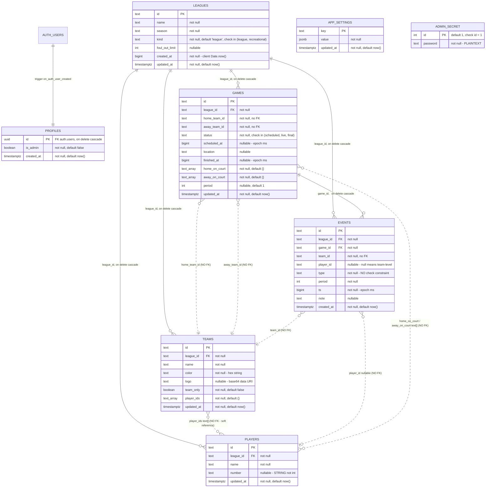

# APP_CONTEXT: iTala

> Complete rebuild specification. Generated 15/08/2026 from commit 
> Written to be self-sufficient: the reader has no access to the original source.

---

## 0. Read Me First

### How to use this document

iTala is a **React Native / Expo mobile app for live basketball stat-keeping**, with an optional Supabase backend for multi-device sync and spectator viewing. It is a single-binary client app: there is no server the team owns beyond a Supabase project provisioned from one SQL file.

Read in this order:

1. **Section 1** for what the app is and who it serves.
2. **Section 2** for the vocabulary. The domain has a small number of terms used with precision (event, period, on-court, team-only, recreational). Getting these wrong poisons everything downstream.
3. **Section 7 first, before writing any code.** The single most important architectural fact about this app is that **box scores, scores, standings and career stats are never stored - they are recomputed from an append-only event log on every render**. Section 7 contains the exact aggregation rules. If you get section 7 wrong, every number in the app is wrong.
4. **Section 4** for the data model, then **Section 5** for interfaces.
5. **Section 11.1** before any cutover. There is live production data behind a real Supabase project, keyed on client-generated IDs.

Conventions used here:

- Unmarked statements are **facts read directly from source**.
- `[INFERRED]` marks a deduction, always with the citation it was deduced from.
- `[NEEDS HUMAN INPUT]` marks something not determinable from code, phrased as a specific answerable question, unless an answer directly answers it right after the sentence.
- Citations are `filename:line-range`. The original repository layout was reconstructed (see "A note on file paths" below).

### A note on file paths

The source was delivered as 44 flat documents without directory structure. The real repository layout is recoverable from the import statements and is reproduced in section 14. Throughout this document citations use the **bare filename plus line numbers** (e.g. `stats.ts:78-111`), because that is what can be verified against the delivered artefact. The reconstructed full path for each file is given once, in section 14.

---

### Manifest (Pass 0 counts)

All counts are by enumeration, not estimate.

| Category | Count | Notes |
|---|---|---|
| **Routes / endpoints** | **25 distinct remote operations** | The app exposes no HTTP API of its own. This counts every distinct network call site against Supabase (PostgREST table ops, Auth, RPC, Realtime) plus 1 external CI-driven HTTP call. Full table in section 5.1. |
| **Screens / views** | **17** | 13 registered navigation stack screens + 4 modal/overlay surfaces (Substitution, Play-by-play, Timeout, Password). Full inventory in section 5.2. |
| **Database tables** | **8** | `profiles`, `leagues`, `teams`, `players`, `games`, `events`, `app_settings`, `admin_secret`. Plus Supabase-managed `auth.users`. |
| **Database functions / triggers** | **5 functions, 1 trigger** | `handle_new_user()`, `is_admin()`, `elevate_to_admin(text)`, `lock_admin()`, `ping()`; trigger `on_auth_user_created`. |
| **Background jobs / scheduled tasks** | **1** | GitHub Actions "Supabase keep-alive ping", cron `0 9 */3 * *` (every 3 days at 09:00 UTC). |
| **Queue consumers / webhook handlers** | **0 webhooks, 6 realtime subscriptions** | No inbound webhooks exist. One Realtime channel (`itala-sync`) with 6 `postgres_changes` listeners. |
| **External services** | **6** | Supabase (Postgres/PostgREST, Auth, Realtime), Expo/EAS, GitHub Actions, Google Fonts (build-time bundle), Apple App Store Connect, Google Play Console. |
| **Environment variables** | **5** | 2 app runtime, 2 CI secrets, 1 dev-only. Full table in section 9. |
| **Distinct user roles** | **3** | anonymous-unauthenticated (no data access), signed-in spectator (read-only), admin (read/write). |
| **LLM call sites** | **0** | No AI/LLM usage anywhere in the codebase. Section 8 documents this negative finding. |
| **Discrete features** | **44** | F-1 to F-44. Tier counts below. |
| **Locale files** | **0** | No i18n. English hardcoded throughout. Dates/times use device locale via `toLocaleDateString`. |
| **Binary / licensed assets** | **6** | 4 PNG image assets + 2 Google Font families (5 weights total). |
| **Reducer actions (state mutations)** | **19** | Full list in section 7.1. |
| **Event types (persisted enum)** | **15** | Full list with semantics in section 4. |
| **Team colour palette entries** | **8** | Hardcoded, index-assigned. |
| **Source files read** | **44 of 46** | See "Not read" below. |

#### Per-tier feature counts

| Tier | Count | |
|---|---|---|
| **must-have** | **17** | F-1, F-2, F-5, F-7, F-12, F-16, F-17, F-18, F-21, F-24, F-25, F-27, F-29, F-30, F-34, F-40, F-41 |
| **should-have** | **15** | F-3, F-4, F-6, F-8, F-10, F-11, F-13, F-14, F-19, F-20, F-22, F-23, F-26, F-32, F-39 |
| **nice-to-have** | **12** | F-9, F-15, F-28, F-31, F-33, F-35, F-36, F-37, F-38, F-42, F-43, F-44 |

Total 44. The rubric is applied strictly: features earn must-have only by appearing in a section 5.3 critical journey, owning persisted data other features depend on, or breaking auth/data integrity in their absence. Note that a large share of this app's surface (sharing, badges, leaderboards, profiles) is genuinely optional polish and is rated accordingly.

---

### Reconciliation

Walked item by item after the final pass. Every enumerated item appears in the document:

| Manifest item | Where it appears | Status |
|---|---|---|
| 25 remote operations | 5.1 table, rows 1-25 | ✅ all 25 present |
| 17 screens/views | 5.2, S-1 to S-13 + M-1 to M-4 | ✅ all 17 present |
| 8 database tables | 4.2, one subsection each | ✅ all 8 present |
| 5 functions + 1 trigger | 4.6 and 9.1 | ✅ all present |
| 1 scheduled job | 9.2 and 10.6 | ✅ present |
| 6 realtime subscriptions | 5.1 row 24, and 7.9 | ✅ present |
| 6 external services | 9.1, one subsection each | ✅ all 6 present |
| 5 environment variables | 9.3 table | ✅ all 5 present |
| 3 user roles | 9.4 | ✅ all 3 present |
| 0 LLM call sites | Section 8 | ✅ negative finding recorded |
| 44 features | Section 3, F-1 to F-44 | ✅ all 44 present (**45 headings** - see note below) |
| 0 locale files | 10.7 | ✅ negative finding recorded |
| 6 binary/licensed assets | 6.6 | ✅ all 6 present |
| 19 reducer actions | 7.1 table | ✅ present (**20 table rows**: 19 domain mutations + `HYDRATE`, which is a hydration channel rather than a mutation; explained in 7.1) |
| 15 event types | 4.3 table | ✅ all 15 present |
| 8 team colours | 6.1 | ✅ all 8 present |
| 7 critical journeys | 5.3, J-1 to J-7 | ✅ all 7 present |
| 12 continuity constraints | 11.3, C-1 to C-12 | ✅ all 12 present |
| 8 correctness holes | 7.13, H-1 to H-8 | ✅ all 8 present |

Counts above were verified mechanically against the finished document, not by impression.

**Known misses / partial coverage:**

- **Section 3 contains 45 `F-` headings, not 44.** The extra is **F-16b (drop-in game setup)**, which is documented in full but shares its priority rating with F-3 rather than carrying its own, because it is the setup half of the same recreational-games capability. The manifest count of 44 discrete features is therefore correct; a reader counting headings will find one more.

- **Repo-root `README.md` is missing from this document.** The project contained two documents named `README.md`; the path resolves only to the `.expo/README.md` boilerplate (Expo's own generated explainer about the `.expo` folder). The real project README - which `SettingsScreen.tsx:43` explicitly directs users to ("See README") - could not be retrieved. This is the single largest gap. See Open Questions.
- **`package-lock.json` was deliberately not read.** It is a dependency lock file; every dependency that matters is enumerated from `package.json` with its version range in section 11. The lock file would add exact transitive pins with no behavioural information. Flagged rather than silently skipped.

---

### Not read

| Item | Why |
|---|---|
| `package-lock.json` | Deliberate. Dependency lock; all direct dependencies and their declared ranges are captured from `package.json:18-40`. Exact transitive resolutions are not load-bearing for a rebuild on a different stack. |
| Repo-root `README.md` | **Could not be read.** The project namespace contains two `README.md` entries and the path resolves to the `.expo/` boilerplate one, which contains only Expo's generic explanation of the `.expo` folder. The substantive project README is unreachable in this snapshot. |
| Git history, commit messages, branches | **Do not exist in this snapshot.** No `.git` directory was supplied. Every "what has the team fought with repeatedly" finding in section 12 is therefore derived from defensive code and code comments only, not from commit clusters. |
| Test files | **None exist.** No test files, no test runner, no test script in `package.json:5-13`. This is a finding, not an omission. |
| Agent-directive files (`CLAUDE.md`, `AGENTS.md`, `.cursorrules`, MCP config, skills) | **None exist** in the 46-document set. Section 8 records this. |
| Migration files | **None exist.** `schema.sql` is a single idempotent bootstrap script, not a migration series. Section 4.7 explains what that implies. |
| `assets/` directory listing | Only 4 PNGs were supplied as project files. Whether the real repo contains more (e.g. an `adaptive-icon.png` at the exact path `app.json:31` references) is unverified. |

---

### Confidence

**Solid (read directly, high confidence):**

- Section 4 (Data model) - `schema.sql` and `types.ts` are both complete and explicit.
- Section 7 (Logic that must be preserved) - `stats.ts` and the `StoreProvider.tsx` reducer are fully read; the maths is unambiguous.
- Section 5.2 (Screens) - all 13 screens read line by line.
- Section 6 (Design tokens) - `theme.ts` is a complete, commented token file.
- Section 9 (Integrations, env, auth) - `supabase.ts`, `AdminProvider.tsx`, `schema.sql` and `DEPLOYMENT.md` corroborate each other.

**Leans on inference:**

- Section 10 (Non-functional). Almost nothing is measured or asserted anywhere. Most of this section is `[NEEDS HUMAN INPUT]` by design - see the rule about not inventing numbers.
- Section 12 (Critique). Explicitly labelled AI opinion. Without git history I am reading defensiveness in the code as a proxy for pain, which is directionally reliable but not evidence of frequency.
- Section 3 priority ratings. The rubric is mechanical, but "does this appear in a critical journey" is my judgement of which journeys are critical.

**The three I trust least, and why:**

1. **Section 10 (Non-functional requirements).** There is no observability, no error tracking, no analytics, no performance budget, no SLO, no load test, and no test suite anywhere in this codebase. I can tell you the handful of timeouts and throttles that are hardcoded, and nothing else. Any statement about scale, traffic, or user count would be invention.
2. **Section 11.1 (Migration and continuity).** I can read the ID scheme, the storage key, the enum strings and the live Supabase project ref exactly. What I cannot read is **how much real data exists, and whether the live project has been modified outside `schema.sql`** - for example whether the admin password was actually rotated as `DEPLOYMENT.md:49-54` recommends. A cutover planned against `schema.sql` alone may not match production.
3. **Section 12 (Critique of v1).** No git history, no issue tracker, no tests. The critique is inference from code smells and unusually defensive comments. It is well-evidenced but it is still one reader's opinion.

**One feature that got one line and deserves ten:** none, deliberately - but the closest call is **F-41 (cross-device sync)**. It is documented at length in sections 7.8-7.10, but the honest summary is that its conflict semantics are "last write wins with a known unrepaired hole in undo" and the full consequences of that are hard to enumerate exhaustively. A rebuilder should treat section 7.10 as a warning, not a spec to reimplement.

**Could someone rebuild this app from this document alone? Where would they get stuck?**

Yes, for the app itself. The data model, every screen, every stat formula, every user-facing string and every state transition are here. A competent engineer could produce a functionally equivalent app on any stack.

They would get stuck on exactly four things:

1. **The logo and brand mark.** The iTala mark (section 6.6) is a bespoke piece of vector artwork. It is described here in detail and the raster PNGs exist, but it cannot be recreated from this document. The vector source must be obtained from the owner. I have the png I can upload it too
2. **The exact production Supabase state.** Section 11.1 tells them what to preserve; it cannot tell them what is actually in the live database today. DOnt worry about that I want a completely new app and new database
3. **Anything about scale, cost or SLA.** Not evidenced anywhere. See Open Questions.
4. **The missing project README**, which was the app's own pointer for sync setup instructions. This is the git repo where you can read the readme https://github.com/heeaaa/iTala

**Did I reproduce every LLM prompt in full, verbatim?** Yes - vacuously. There are zero LLM call sites and zero prompts. Section 8 documents the search that established this.

---

### Open questions (all `[NEEDS HUMAN INPUT]`, consolidated)

**Provenance and history**

1. What commit SHA does this snapshot correspond to? Nothing. But this is the git repo https://github.com/heeaaa/iTala
2. Can the repo-root `README.md` be supplied? `SettingsScreen.tsx:43` directs users to it for sync setup. Sure
3. Is there a git history available? Section 12's pain-point analysis would be far stronger with commit clusters. This is the git repo: https://github.com/heeaaa/iTala

**Scale, usage and cost**

4. How many leagues, teams, players, games and events exist in the live database today? (Drives the section 7.5 O(n) performance concern, and the cutover export plan.) I don't want to migrate. Just start database again from start
5. How many concurrent scorekeepers and spectators does a typical game day involve? `DEPLOYMENT.md:42-44` cites Supabase free-tier limits (500 MB DB, 200 concurrent realtime connections, 2M realtime messages/month) as adequate - is the project still on free tier? Yes still on free tier. Usually 2-3 scorekeepers and spectators, not a lot, probably 20 at most at a given time.
6. What is the actual device mix (iOS/Android, OS versions, tablet vs phone)? iphones and android phones for normal users, ipad tablets for scorekeepers and admins, 
7. Is there any budget constraint on the rebuild's infrastructure? Yes, I want free tiers and open source. We don't have budget at the moment.

**Security and continuity**

8. **Was the admin password rotated from the seeded default?** `schema.sql:196` seeds `'bp***de'` and `AdminProvider.tsx:18` hardcodes the identical value as a local fallback. `DEPLOYMENT.md:49-54` recommends changing it. Which is live? The password in the database is still bp***de and I havent rotated it and I dont want to rotate it. Keep it that way but remove any hardcoded password in the code or repo. I want it only in the database so it's easier to rotate in the future.
9. Is the Supabase project at ref `dsoogiyfgsagbetlumnc` (from `.env:11`) the live production project, and is the committed anon key still valid? The JWT payload decodes to `iat` 1780503355 / `exp` 2096079355 (expiry in 2036). Yes it's still the same supabase. We havent gone live yet and the app is not publish so it's just test data.
10. Has the live database schema drifted from `schema.sql`? Were any columns, policies or functions changed by hand in the Supabase dashboard? No, that sql is current. This is the repo: https://github.com/heeaaa/iTala
11. Are the App Store / Play Store listings live? `app.json:21,28` declares bundle id `com.bpbl.itala` on both platforms. If published, this ID is permanent. Not yet published. I want to do the v2 so we iterate the mobile app to a better version before publishing
12. Is there an EAS project ID linked? `DEPLOYMENT.md:136-138` mentions a `REPLACE_WITH_YOUR_EAS_PROJECT_ID` placeholder but the delivered `app.json` has no `extra.eas.projectId` key at all. Yes, this is the eas project id: "eas": {
        "projectId": "bf4508b7-20f9-4342-a315-9b6f6121aef9"
      }

**Compliance and legal**

13. `DEPLOYMENT.md:28-30` states iTala stores everything "on-device only (no accounts, no analytics, no network)" and instructs declaring "Data Not Collected" to Apple. **This is no longer true** once Supabase sync is enabled - player names are transmitted and stored on a third-party server. Have the store privacy declarations been updated? Is there a privacy policy? No privacy policy yet. Is this needed? If so also do it and suggest. 
14. Player names are personal data. Are any players minors? Is there consent for storing their names and performance data? Create one if needed
15. What jurisdiction's privacy law applies (the org is New Zealand-based; the Supabase region is unknown)? Supabase region is Primary Database East US (North Virginia) us-east-1. And the users are not from NZ. The users will be mainly from BC, Canada, and the Philippines.
16. Is there a data retention or deletion policy? None exists in code. Not at the moment. Defer this to future.

**Product direction (section 0.1)**

17-20. See section 0.1 below.

---

## 0.1 v2 Objectives and Non-Negotiables  [NEEDS HUMAN INPUT - ask the human]

*This section is deliberately blank for you to fill. These are the questions whose answers change the shape of everything else. Please answer before the rebuild starts.*

**17. What does "better" mean for this rebuild?** Rank these, or add your own:

- Lower running cost
- Faster to ship features
- Simpler codebase to maintain
- Zero major bugs. Few minor bugs
- Higher scale (more leagues / concurrent games / spectators)
- A compliance deadline
- A team that only knows one language or stack

**18. What must v2 keep *exactly*?** Candidates, from what v1 does:

- The two-tap stat pad interaction (arm a stat, tap a player or if it can be done vice versa and both but maintain the 2 taps) - this is the app's core ergonomic bet
- Offline-first behaviour (a game must survive losing signal mid-quarter)
- The visual brand based on the logo with light and dark feature
- The single shared admin password model
- The share-card image format

**19. What is v2 allowed to drop?** Candidates:

- The `oreb`/`dreb`/`tov` legacy event types (see section 4.3 - `tov` in particular is aggregated and displayed but can no longer be logged)
- Opponent-as-team mode (F-7 `teamOnly`)

**20. Specific decisions v1 punted on that v2 should settle: The answer are at the end of the sentences**

- Should scorekeeping be **per-user accounts** instead of one shared password? `DEPLOYMENT.md:99-101` explicitly flags this as the upgrade path. Yes it should be per user account that is from a shareable invite code.
- Should there be a **game clock**? v1 has periods but no clock; timeouts ask the user to *type* the time remaining (`LiveGameScreen.tsx:319-350`). No game clock. Game clock is from outside the app.
- Should **offensive/defensive rebounds** come back? `types.ts:12` says the split was "deferred to a later version". No it should still be deferred.
- Should **turnovers** be loggable again? The column exists and displays but has no button (section 12). Turovers should be logged when Track turnover setting is turned on in the league settings.
- Should **head-to-head tiebreakers** be implemented? `stats.ts:105` says they were "omitted for brevity". Sure, implement it if it's not complicated

---

## 1. The App in One Page

### 1.1 Elevator pitch

iTala is a mobile app that replaces the paper scoresheet at amateur basketball games. One person - the scorekeeper - taps a stat and then taps a player, and the app derives the live score, the box score, the team fouls, the standings and every player's career averages from that single stream of taps. Anyone else with the app can watch the same game update live on their own phone, without an account.

The name is Filipino: *itala*, "to record". The product tagline used in the UI and on every share card is **"Record. Track. Elevate."** (`LeaguesScreen.tsx:42`, `BoxScoreScreen.tsx:219`, `PlayerProfileScreen.tsx:289`).

### 1.2 Who uses it, and the job they hire it to do

There are three distinct people, and only one of them can write data.

| Who | Job to be done | How the app serves it |
|---|---|---|
| **The scorekeeper** (courtside, one per game, holds the admin password) | "Keep an accurate stat sheet for a live game without missing plays, using one hand, on a phone, while watching the court." | The two-tap stat pad (F-18), the on-court five as large tappable rows (F-18), one-tap undo (F-21), automatic foul-out (F-25). Everything is optimised for taps-per-play and glanceability, not for completeness of data entry. |
| **The league organiser** (before/after games, also holds the password) | "Set up my league once, then have standings and leaders maintained for me forever without a spreadsheet." | League/team/player CRUD (F-1, F-7, F-12), automatic standings (F-34) and leaderboards (F-35) that need no maintenance because they are derived. |
| **The spectator** (a parent, a player, a coach on the bench, anywhere) | "Follow the game I care about, right now, without signing up for anything." | Anonymous sign-in happens silently at launch; the live game appears in a banner on the home screen (F-4); tapping it opens a read-only live view (F-39) that updates within about a second. |

The scorekeeper and the organiser are frequently the same person. The app makes no attempt to distinguish them: there is exactly one privileged role.

### 1.3 The 3-5 things it must do well, in priority order

1. **Log a stat in two taps and never lose it.** This is the entire product. Every architectural decision - local-first storage, autosave on every mutation, derive-don't-store - exists to serve it. `StoreProvider.tsx:402-407` autosaves on every single state change with the comment "persist every mutation so a live game never dies".
2. **Show a correct live score, instantly, on the scorekeeper's device.** Score is recomputed from events synchronously in the same render pass (`LiveGameScreen.tsx:50`), so it can never lag behind the last tap.
3. **Survive a bad network without any user-visible degradation.** Sync is entirely optional and entirely fire-and-forget; the app is fully functional with no backend at all (`supabase.ts:21`, `sync.ts:1-12`).
4. **Turn a finished game into standings and player careers with zero extra work.** No "confirm the box score" step, no reconciliation. Finishing a game is a single status flip (`StoreProvider.tsx:217-225`) and everything downstream recomputes.
5. **Let anyone watch, with no account.** Anonymous Supabase auth plus read-for-all row-level security (`schema.sql:143-153`).

### 1.4 What it deliberately does NOT do, and why

| Not done | Evidence | Why (stated or inferred) |
|---|---|---|
| **No game clock.** Periods exist; a running clock does not. | `types.ts:52` stores only `period: number`. Timeouts ask the user to type the remaining time as free text (`LiveGameScreen.tsx:319-350`). | `[INFERRED]` A clock would need to be started, stopped and kept in sync across devices, which conflicts with the fire-and-forget sync model. The timeout note field is the pragmatic substitute. |
| **No offensive/defensive rebound split.** One combined `reb` button. | `types.ts:12` comment: "combined rebound (O/D split deferred to a later version)". Legacy `oreb`/`dreb` are still aggregated if present (`stats.ts:26-28`). | Explicitly deferred. Speed of entry beat granularity. |
| **No per-user accounts.** One shared password for all scorekeepers. | `schema.sql:186-232`, `AdminProvider.tsx:18`. | `DEPLOYMENT.md:99-101`: "Suitable for a small trusted scorekeeper crew. If you need per-user accounts later, replace the `elevate_to_admin` RPC with Supabase email auth". A deliberate scope choice. |
| **No multi-tenancy.** Every signed-in user sees every league in the database. | `schema.sql:150` grants SELECT on every domain table to anyone with `auth.uid() is not null`. `sync.ts:57-64` fetches every row of every table with no filter. | `[INFERRED]` The app is built for one organisation running its own Supabase project. This is the single largest constraint on the current design - see section 7.11. |
| **No push notifications, no social feed, no photos/highlights, no scheduling ahead of time.** | No such code exists. `DEPLOYMENT.md:201-202` refers to "if you later add the social feed" as future work. `GameStatus` includes `'scheduled'` but nothing in the app ever creates a game in that state (see section 7.4). | Future scope. |
| **No analytics, no crash reporting, no telemetry of any kind.** | No such dependency in `package.json:18-40`; no such call site anywhere. | Implement if not complicated
| **No web app.** `npm run web` exists but the app is phone-shaped throughout. | `package.json:12`. | Expo gives web for free; nothing is designed for it. | Design and implement if easy and not complicated.

### 1.5 Known scale and constraints - evidenced only

**Evidenced:**

- **Maximum 9 periods per game.** `theme.ts:82` `MAX_PERIOD = 9`. Enforced in the UI at `LiveGameScreen.tsx:118, 121, 180`.
- **Maximum 5 players on court per team.** `theme.ts:83` `LINEUP_SIZE = 5`. Enforced in `StoreProvider.tsx:158`, `LiveGameScreen.tsx:442`, `SelectLineupScreen.tsx:63`.
- **Foul-out at 5 personal fouls, with legacy values capped down.** `theme.ts:84` `DEFAULT_FOUL_OUT = 5`; `stats.ts:7-11` caps any stored value above 5.
- **Realtime throttled to 10 events per second.** `supabase.ts:38`, with the comment "throttle so a burst of stats doesn't hammer the channel".
- **Auth/RPC timeouts:** `getSession` 5000 ms, `signInAnonymously` 6000 ms, `elevate_to_admin` 8000 ms, `lock_admin` 5000 ms, `readAdminFlag` 5000 ms (`AdminProvider.tsx:120, 137, 141, 157-161, 91-96`).
- **Initial sync wait:** up to 5000 ms polling every 200 ms for an auth session before the first pull (`StoreProvider.tsx:308-316`).
- **Font load timeout:** 3000 ms before falling back to system fonts (`App.tsx:59-64`).
- **Team logos are stored as base64 data URIs inside the row**, captured at `quality: 0.4`, 1:1 aspect (`EditTeamScreen.tsx:37-44`). `schema.sql:60` comments "data URI; small base64 thumbs OK".
- **Supabase free-tier figures cited by the team as sufficient:** 500 MB database, 200 concurrent realtime connections, 2M realtime messages/month, described as covering "two simultaneous live games with spectators easily" (`DEPLOYMENT.md:42-44`).
- **Supabase free projects pause after 7 days idle**, which the keep-alive job exists to prevent (`schema.sql:250-252`, `supabase-keepalive.yml:3-5`).

**Not evidenced anywhere - do not guess. Refer to the answer at the end of the sentences **

- Actual number of leagues, teams, players, games, events in production. We dont need this. We will not migrate and we will start with new database
- Actual concurrent user counts, or peak game-day load. Not yet released so no user counts.
- Any SLA, SLO, uptime target or alert threshold. None exist in code or config. Set up what is prefferred and best practice if necessary
- Any budget figure. The only costs stated anywhere are store fees: Apple $99/year, Google Play $25 one-time (`DEPLOYMENT.md:17-18`). Yes just that. We don't have budget so we always choose free tiers and open source
- Any compliance obligation. Nothing in the codebase references GDPR, the NZ Privacy Act, COPPA, or any other regime. Should there be? If so, let me know

---

## 2. Domain Model and Vocabulary

### 2.1 Glossary

Defined precisely, because several of these terms are used in the code in ways that differ from their ordinary basketball meaning.

| Term | Precise definition in this app |
|---|---|
| **League** | The top-level container and the **only unit of data isolation that exists**. Holds its own teams, its own player pool, its own games and its own events. A player belongs to exactly one league; the same human playing in two leagues is two `Player` records with two IDs and two separate career stat lines. Has a `name`, a `season` string, and a `kind`. `types.ts:56-66`. |
| **Season** | A free-text string on the league (e.g. "Spring 2026", "Drop-In"). It is a **label, not a time period**. There is no season rollover, no archiving, and no way to have two seasons of one league. To run a second season you create a second league. `types.ts:58`. |
| **Kind** | A league is either `'league'` (normal) or `'recreational'`. Exactly one recreational league is expected to exist per install; it acts as the single container for all ad-hoc drop-in games. `types.ts:59`, `RecGameScreen.tsx:12-14`. |
| **Team** | A named, coloured group of player IDs within one league. Owns an optional logo (base64 data URI) and an optional `teamOnly` flag. `types.ts:20-27`. |
| **Team-only team** (a.k.a. "opponent") | A team created with `teamOnly: true`. It has no players; stats are logged against the team as a whole (`playerId: null`) and only the score is meaningful. Used when you are tracking your own team's stats against an opponent you do not have a roster for. Labelled "opponent" in the UI. `types.ts:26`, `ManageRosterScreen.tsx:52`, `LiveGameScreen.tsx:211`. |
| **Player** | A name plus an optional jersey number, scoped to a league. Membership in a team is expressed by the **team** holding the player's ID in `playerIds`, not by the player holding a team ID. A player not in any team's `playerIds` is displayed as a "Free agent". `types.ts:14-18`, `PlayerProfileScreen.tsx:74`. |
| **Game** | A fixture between two teams of the same league, with a status, an optional location, an optional scheduled timestamp, a current period, and two on-court lists. `types.ts:38-50`. |
| **Event** | **The atomic unit of truth in the entire system.** One recorded occurrence: a made shot, a rebound, a foul, a timeout. Append-only, immutable once written, with a client-generated ID. Every number the app displays is a fold over events. `types.ts:29-37`. |
| **Event type** | One of 15 string constants. Persisted verbatim as text in the database with no DB-side constraint, so **the strings are a permanent contract**. `types.ts:3-13`, `schema.sql:88`. |
| **Period** | An integer from 1 to 9 representing a quarter, half or overtime segment. Stored on the game so it survives navigation, and stamped onto every event. **Team fouls reset each period; personal fouls do not.** `types.ts:49`, `stats.ts:264-275`. |
| **On court** | The list of player IDs currently playing for one side of one game, maximum 5. Persisted on the game (`homeOnCourt` / `awayOnCourt`) so it survives app restarts. The stat pad only offers the on-court players as targets. `types.ts:47-48`, `LiveGameScreen.tsx:221-238`. |
| **Lineup** | The starting five, chosen once before tip-off. Mechanically identical to "on court" - selecting a lineup just sets the on-court array. `SelectLineupScreen.tsx:29-33`. |
| **Substitution** | Replacing one on-court player with one bench player, or filling an empty on-court slot. Records **no event** - it mutates the game row only, so there is no substitution history. `StoreProvider.tsx:149-164`. |
| **Armed stat** | Transient UI state: the stat type the scorekeeper has selected but not yet assigned to a player. The defining interaction of the app. Cleared after every log. Never persisted. `LiveGameScreen.tsx:43, 84-102`. |
| **Fouled out** | A player who has accumulated `foulOutLimit` (effectively 5) personal fouls in a single game. Automatically removed from the court and blocked from re-entry for the rest of that game. Not a stored flag - it is derived by counting `pf` events. `stats.ts:278-287`, `StoreProvider.tsx:175-193`. |
| **Team fouls** | The count of `pf` events for one team **within the current period only**. Displayed on the scoreboard as bonus-tracking context. Resets to zero when the period advances, purely because the query filters on period. `stats.ts:271-275`. |
| **Box score** | The per-player stat table for one team in one game, plus a team total row. Computed on demand, never stored. Roster players with no events are seeded with a zero line so they still appear. `stats.ts:38-64`. |
| **Line score** | Points per period per team, i.e. the "by quarter" strip. Computed from scoring events grouped by period. `stats.ts:289-314`. |
| **Standings** | Win/loss/points-for/points-against/differential/streak per team, computed only from games with status `final`. `stats.ts:73-126`. |
| **Streak** | A string like `W3` or `L1`, or the em-dash `—` if the team has played no final games. Derived by walking final games in `finishedAt` order. `stats.ts:120-126`. |
| **Leaderboard** | League-wide per-game averages per player, sorted by points per game descending. `stats.ts:128-164`. |
| **Career stats** | A player's aggregate across all final games **within their one league**. Despite the name there is no cross-league career. `stats.ts:172-252`. |
| **Badge** | A derived achievement string awarded by inspecting each of a player's game lines. Five exist. Not stored; recomputed every time the profile is opened. `stats.ts:232-237`. |
| **Admin** | The single privileged role. Granted by typing the shared password, enforced server-side by the `profiles.is_admin` boolean and row-level security. Per-device. `AdminProvider.tsx:42-130`, `schema.sql:143-153`. |
| **Spectator** | A signed-in (anonymous) user who is not an admin. Can read everything; can write nothing. Also a per-screen mode flag: `LiveGame` takes a `spectator` route param that renders the tracker read-only. `navigation.ts:14`, `LiveGameScreen.tsx:36-37`. |
| **Synced mode / Local-only mode** | Whole-app operating modes determined at build time by whether both Supabase env vars are present. Local-only is fully functional, single-device. `supabase.ts:8-21`. |
| **Track misses** | A single global boolean setting that shows or hides the three miss buttons on the stat pad, and switches the box score between "makes-attempts" and "makes only" column formats. Stored server-side in `app_settings` so it applies to every device. `types.ts:69-71`, `SettingsScreen.tsx:51-56`, `BoxScoreScreen.tsx:276-281`. |

### 2.2 Core entities and how they relate, conceptually

Before storage, the model is a **containment tree with one derived layer hanging off it**:

```
League  (the isolation boundary; owns everything below)
 ├── Player[]      the league's flat player pool
 ├── Team[]        each holding an ordered list of Player ids
 ├── Game[]        each referencing exactly two Team ids from this league
 └── Event[]       each referencing one Game, one Team, and optionally one Player
                   ── APPEND-ONLY. This is the only source of truth for numbers.
```

Three conceptual points that matter more than the storage details:

**1. Teams own players, not the other way round.** `Team.playerIds` is the membership edge. `Player` has no team pointer. Consequences: a player can in principle appear in two teams' `playerIds` simultaneously (nothing prevents it), and "which team is this player on?" is answered by a scan (`stats.ts:154`, `PlayerProfileScreen.tsx:20`) which returns the *first* matching team.

**2. Events are the ledger; everything numeric is a fold.** `types.ts:1` states this as the model's governing rule: *"Box scores & standings are DERIVED from events, never stored as truth."* No aggregate is cached anywhere - not the score, not the standings, not a player's PPG. This makes correction trivial (delete an event, every number updates) and makes reads O(events) (see section 12).

**3. Player identity is league-scoped, and this is the model's sharpest edge.** The same person playing in the Tuesday league and the Saturday league is two unrelated `Player` rows. There is no global person entity. `careerStats(league, playerId)` (`stats.ts:188`) takes a league as its first argument, and `LastGameStat.leagueName` (`stats.ts:168`) exists precisely because a "career" is always within one league. If v2 wants real cross-league player careers, that is a **data model change, not a feature** - see section 13.

### 2.3 Terms that are absent, and must not be assumed

A rebuilder coming from other sports apps will look for these. They do not exist:

- **No Season entity.** "Season" is a string on the league.
- **No Venue entity.** Location is an optional free-text string on the game.
- **No Official/Referee, no Coach, no Roster-version, no Contract, no Injury.**
- **No Fixture/Schedule generator.** Games are created one at a time by a human, always starting immediately.
- **No Organisation/Tenant.** See section 7.11 - this is the big one.
- **No Substitution record, no Possession, no Shot location, no Assist-to attribution** (an assist is logged against the passer with no link to the shot).
- **No Clock, no Shot clock.**


## 3. Feature Inventory

### Priority rubric

Applied mechanically to all 44 features:

- **must-have**: appears in a section 5.3 critical journey, **OR** owns persisted data other features depend on, **OR** its absence breaks auth, billing, compliance or data integrity.
- **should-have**: real user value, but v2 can ship without it.
- **nice-to-have**: everything else.

Result: 17 must / 15 should / 12 nice. Most of this app's surface is polish around a small hard core, and the ratings reflect that.

A note on "Data touched" throughout: because the app holds one denormalised `AppState` tree in memory and writes the whole thing to local storage on every change (`StoreProvider.tsx:402-407`), **every** mutating feature technically writes the entire local state blob. The "Data touched" lines below name the *logical* entities affected, plus the specific remote tables written by the sync layer.

---

### F-1: Create a league

- **What it does**: Collects a league name and a season label, creates an empty league, and drops the user straight into roster management for it.
- **Why it exists**: A league is the root container; nothing else can exist without one.
- **Trigger**: Admin taps "+  New League" on the home screen (`LeaguesScreen.tsx:140`).
- **Flow**:
  1. Screen shows two fields: "League name" (placeholder "Sunday Run, Office League…") and "Season" (placeholder "Spring 2026").
  2. The "Create & add teams" button is disabled until the name is non-blank after trimming.
  3. On tap, a new ID is generated client-side, `ADD_LEAGUE` is dispatched, and navigation **replaces** the current screen with `ManageRoster` for the new league (so Back does not return to the empty form).
- **Rules**:
  - Name is trimmed; if empty it falls back to `'New League'`. Season falls back to `'Season 1'`. (`StoreProvider.tsx:46`) Note the UI already prevents an empty name, so these fallbacks only fire for a whitespace-only season.
  - `kind` defaults to `'league'`; `foulOutLimit` defaults to `DEFAULT_FOUL_OUT` (5). (`StoreProvider.tsx:47-48`)
  - `createdAt` is the client's `Date.now()`.
  - New leagues are **prepended** to the list, so newest appears first (`StoreProvider.tsx:51`).
- **Edge cases**: No uniqueness check on league name - two identically named leagues are allowed. No validation of the season string. If the remote upsert fails, the league still exists locally and is not retried (see section 7.10).
- **Data touched**: writes `League`. Remote: `leagues` upsert.
- **Priority**: **must-have** - owns the root persisted entity that every other feature depends on.
- **Source**: `CreateLeagueScreen.tsx:1-29`, `StoreProvider.tsx:44-52`, `sync.ts:103-113`

### F-2: League list / home dashboard

- **What it does**: The app's entry screen. Shows the wordmark and tagline, an admin lock control, a live-game resume banner if any game is live, a pinned card for the recreational league, and a card per normal league summarising teams, players and games played.
- **Why it exists**: It is the only navigation root; every journey starts here.
- **Trigger**: App launch, or Back from anywhere.
- **Flow**:
  1. Header: `Wordmark` at size 40, subtitle "Record. Track. Elevate.".
  2. Top right: a settings gear (**admin only**) and a lock/unlock button (always visible).
  3. If admin: a pill reading "ADMIN MODE — stat tracking unlocked".
  4. If any league has a live game: the resume banner (F-4).
  5. List header: the recreational league card, if one exists (F-3).
  6. List body: every league whose `kind !== 'recreational'`, each a card showing name, season, a "N teams" pill, and pills for "N players" and "N games played" (games played counts `status === 'final'` only).
  7. Footer buttons (**admin only**): "🏀  Recreational / Drop-In Game" (ghost) and "+  New League" (primary).
- **Rules**:
  - Recreational leagues are excluded from the main list and surfaced only as the header card (`LeaguesScreen.tsx:89, 93`).
  - The empty state renders only once the store reports `ready`, so a hydrating app does not flash "No leagues yet" (`LeaguesScreen.tsx:116`).
- **Edge cases**:
  - **Empty**: "No leagues yet" / "Create your first league to start tracking games."
  - **Loading**: nothing rendered in the list area until `ready`.
  - **Permission-denied**: a non-admin sees no create buttons and no gear. The list itself is always visible.
  - **Offline**: fully functional from local storage.
- **Data touched**: reads all leagues, games, teams, players.
- **Priority**: **must-have** - the root of every critical journey in 5.3.
- **Source**: `LeaguesScreen.tsx:9-155`

### F-3: Recreational / drop-in league container

- **What it does**: Provides a single implicit league that holds all ad-hoc games, created lazily on first use, and surfaces it as a distinct pinned card rather than a normal league.
- **Why it exists**: Pickup games have no standings and no persistent teams, but the data model requires every game to live in a league. This is the workaround.
- **Trigger**: Admin taps "🏀  Recreational / Drop-In Game" on home, and completes F-16b (drop-in setup).
- **Flow**:
  1. On starting a drop-in game, the app looks for an existing league with `kind === 'recreational'`.
  2. If none exists, it dispatches `ADD_LEAGUE` with name `'Recreational / Drop-In Games'`, season `'Drop-In'`, kind `'recreational'`.
  3. All subsequent drop-in games reuse that same league.
  4. On home, it renders as a card titled "🏀 Recreational / Drop-In" with subtitle "Ad-hoc games outside a league", a teal border, and either a LIVE pip or a "N played" pill.
- **Rules**: Exactly one recreational league is assumed. `findRecLeagueId` returns the **first** match (`RecGameScreen.tsx:12-14`); if two ever exist, the second is unreachable from home (the header card only renders the first found) but still appears nowhere else, since the main list filters recreational leagues out entirely.
- **Edge cases**: Deleting the recreational league is possible in principle (no UI path exists on the Leagues screen, but `DELETE_LEAGUE` exists as an action) and would orphan nothing - a new one is recreated on next use with a new ID.
- **Data touched**: writes `League` (lazily). Remote: `leagues` upsert.
- **Priority**: **should-have** - real value for pickup organisers, but leagues alone are a coherent product.
- **Source**: `RecGameScreen.tsx:9-14, 55-63`, `LeaguesScreen.tsx:92-115`, `StoreProvider.tsx:44-52`

### F-4: Resume live game banner

- **What it does**: If any league anywhere has a game with status `live`, the home screen shows a prominent tappable banner that jumps straight into that game.
- **Why it exists**: A live game that the scorekeeper has navigated away from (or that survived an app kill) must be one tap away. This is the "never lose a game" promise made visible.
- **Trigger**: Automatic, on every render of the home screen.
- **Flow**:
  1. Scan leagues in order; scan each league's games in order; return the first game with `status === 'live'`.
  2. Render a card with a teal border, a teal vertical accent stripe, a pulsing LIVE pip, the label "Live now", the league name, and a "▶" chevron.
  3. On tap, navigate to `LiveGame` with `spectator: !isAdmin` - so an admin resumes in control, and anyone else opens read-only.
- **Rules**: Only the **first** live game found is offered. If two games are live simultaneously (the two-court scenario the deployment guide explicitly supports), the second is only reachable via league → date → game.
- **Edge cases**: If the live game's teams have since been deleted, `LiveGameScreen` will crash on the non-null assertion at `LiveGameScreen.tsx:67-68` (see section 12, Gaps).
- **Data touched**: reads leagues and games.
- **Priority**: **should-have** - a large convenience, but the game is reachable without it.
- **Source**: `LeaguesScreen.tsx:15-22, 66-86`

### F-5: Admin unlock (password gate)

- **What it does**: Prompts for a shared password and, on success, elevates this device to admin for the session, unlocking every write action in the app.
- **Why it exists**: Anyone may watch; only the scorekeeper crew may write. One shared secret is the lowest-friction way to achieve that with no accounts.
- **Trigger**: Tapping the 🔒 button on home, or choosing "Admin" when opening a live game as a non-admin (F-39).
- **Flow (synced mode)**:
  1. Password modal appears: title "Admin access", message "Enter the admin password to unlock stat tracking (Start Game and live editing)."
  2. On submit, ensure a Supabase session exists (sign in anonymously if not).
  3. Call the `elevate_to_admin(password_attempt)` RPC, guarded by an 8000 ms timeout.
  4. The database compares the attempt against `admin_secret.password` (a table with **no RLS policies at all**, so it is unreadable via the API by anyone) and, on match, sets `profiles.is_admin = true` for the calling `auth.uid()`.
  5. Client sets `isAdmin` true; the modal closes; admin-only UI appears everywhere.
- **Flow (local-only mode)**: The password is compared against the hardcoded constant `'bp***de'` (`AdminProvider.tsx:18, 72-77`). No network.
- **Rules**:
  - **Every Supabase call in this module is timeout-guarded.** The module comment states this as a hard rule: *"NO Supabase call is ever awaited without a timeout. supabase-js auth methods can hang in React Native when storage/locks stall, and a hung await silently freezes the unlock flow (which is the bug we hit)."* (`AdminProvider.tsx:12-15`)
  - Admin status is **per device**, not per human. `DEPLOYMENT.md:102-103`: "The lock icon re-locks only the current device."
  - Admin status persists across app restarts because it is read back from `profiles` at boot using the persisted anonymous session (`AdminProvider.tsx:49-66`).
- **Exact user-facing error copy** (all from `AdminProvider.tsx`):
  - Wrong password: `Incorrect password.` (lines 75, 110)
  - No session: `Could not reach the server. Check your connection and that Anonymous sign-in is enabled in Supabase.` (line 85)
  - RPC timeout: `Server did not respond. Check your Supabase config / network.` (line 101)
  - Other RPC error: `Server error: {message}` (line 102)
  - Sync not configured: `Sync not configured.` (line 80)
- **Edge cases**: On timeout the promise resolves with a synthetic `{error: {message: 'timeout'}}` rather than rejecting, so the UI always gets a definite answer. Anonymous sign-in being disabled in the Supabase project is called out explicitly in a console warning (`AdminProvider.tsx:143`).
- **Data touched**: reads `admin_secret` (server-side only), writes `profiles.is_admin`.
- **Priority**: **must-have** - it is the entire authorisation model.
- **Source**: `AdminProvider.tsx:1-173`, `schema.sql:186-232`, `ui.tsx:326-359`, `LeaguesScreen.tsx:24-35, 144-152`

### F-6: Admin re-lock

- **What it does**: Tapping the 🔓 button while admin drops the device back to spectator.
- **Why it exists**: Hand the phone to someone else, or park the app safely between games.
- **Trigger**: Tap the unlocked padlock on home.
- **Flow**: Calls the `lock_admin()` RPC (5000 ms timeout), which sets `profiles.is_admin = false` for the caller, then sets local `isAdmin` false. In local-only mode it just sets the flag false.
- **Rules**: Local state is set false **regardless of whether the RPC succeeded** (`AdminProvider.tsx:115-123`), so the UI always locks even if offline. The server flag may then be stale-true until the next successful lock.
- **Edge cases**: Because the device stays signed in with the same anonymous user, re-locking then re-unlocking is instant.
- **Data touched**: writes `profiles.is_admin`.
- **Priority**: **should-have** - important for handover, but the app is usable without it.
- **Source**: `AdminProvider.tsx:115-123`, `schema.sql:234-245`, `LeaguesScreen.tsx:25`

### F-7: Create a team (including opponent-only teams)

- **What it does**: Adds a named team to a league, optionally flagged as "opponent only" (score tracked, no individual player stats).
- **Why it exists**: Games need two teams. The opponent-only variant exists so a club can track its own players' stats against a visiting team it has no roster for.
- **Trigger**: Admin types a name on `ManageRoster` and taps "Add".
- **Flow**:
  1. Text field plus an "Add" button, plus a custom checkbox labelled "Track as opponent only (score, no player stats)".
  2. On tap, `ADD_TEAM` is dispatched with the name and the `teamOnly` flag; the field clears and the checkbox resets.
- **Rules**:
  - Blank names are rejected before dispatch (`ManageRosterScreen.tsx:19`). In the reducer, a blank name falls back to `` `Team ${l.teams.length + 1}` `` (`StoreProvider.tsx:60`).
  - **Colour is assigned automatically** as `teamColors[teams.length % 8]` - i.e. by insertion order, wrapping after 8 teams (`StoreProvider.tsx:61`). It can be changed later (F-9).
  - New teams are **appended** (unlike leagues, which are prepended).
- **Edge cases**: No name uniqueness check. A `teamOnly` team can still have players added to it via `ADD_PLAYER` (nothing prevents it) but the roster and lineup UIs hide the player controls for such teams, so it cannot happen through the UI.
- **Data touched**: writes `Team`. Remote: `teams` upsert.
- **Priority**: **must-have** - owns persisted data that games and every stat depend on.
- **Source**: `ManageRosterScreen.tsx:18-22, 39-53`, `StoreProvider.tsx:57-65`, `sync.ts:118-127`

### F-8: Rename a team

- **What it does**: Edits a team's name from the Edit Team screen.
- **Why it exists**: Typos, rebrands, and "Team 2" placeholders.
- **Trigger**: Admin opens Edit Team, edits the "Team name" field, then taps the "Save name" text link beneath it.
- **Flow**: Local field state → tap "Save name" → `UPDATE_TEAM` with the new name.
- **Rules**: The name is trimmed; if it trims to empty the **previous name is kept** rather than a placeholder being substituted (`StoreProvider.tsx:73`). This differs from creation, which substitutes `Team N`.
- **Edge cases**: The save is an explicit separate tap, not on blur - a user who edits and navigates away loses the change silently. (See section 12.)
- **Data touched**: writes `Team.name`. Remote: `teams` upsert.
- **Priority**: **should-have**.
- **Source**: `EditTeamScreen.tsx:28, 87-90`, `StoreProvider.tsx:67-78`

### F-9: Choose a team colour

- **What it does**: Presents the 8-colour palette as swatches; tapping one immediately sets the team's colour.
- **Why it exists**: The team colour is used as an identity marker everywhere - scoreboard underline, player chip stripes, badges, lineup selection fill - so a mismatch with the real uniform is jarring.
- **Trigger**: Admin taps a swatch on Edit Team.
- **Flow**: Immediate `UPDATE_TEAM` dispatch. The currently selected swatch is drawn with a 3px white border.
- **Rules**: Only the 8 palette colours are selectable; arbitrary colours are not possible. `theme.ts:54-55` explains the palette deliberately avoids teal and lime because those are reserved for brand UI.
- **Edge cases**: Two teams in one league can share a colour (nothing prevents it), which makes the scoreboard ambiguous.
- **Data touched**: writes `Team.color`. Remote: `teams` upsert.
- **Priority**: **nice-to-have**.
- **Source**: `EditTeamScreen.tsx:93-99`, `theme.ts:54-65`

### F-10: Team logo from the photo library

- **What it does**: Lets an admin pick a square image from the device photo library and store it as the team's logo, displayed anywhere the team appears.
- **Why it exists**: Club identity; makes scoreboards and share cards look real.
- **Trigger**: Admin taps "Add logo" / "Change" on Edit Team.
- **Flow**:
  1. Request media-library permission.
  2. If denied: alert with title `Permission needed`, body `Allow photo access to set a team logo.`
  3. Launch the image picker with editing enabled, a forced 1:1 aspect crop, `quality: 0.4`, and `base64: true`.
  4. On selection, build a data URI `data:image/jpeg;base64,{...}` and dispatch `UPDATE_TEAM` with it. If base64 is unavailable, fall back to the raw local `uri`.
  5. A "Remove" (danger) button appears once a logo exists; it dispatches `logo: null`, which the reducer converts to `undefined`.
- **Rules**:
  - Passing `logo: null` clears; passing `undefined` (i.e. omitting the key) leaves it unchanged. This three-state convention is used for both team logo and player number (`StoreProvider.tsx:75, 108`).
  - `TeamBadge` renders the logo image if present, else a plain coloured dot (`ui.tsx:13-23`).
- **Edge cases**:
  - Picker unavailable / throws: alert with title `Could not open photos`, body `Image picking is unavailable on this device.`
  - **The base64 fallback path stores a device-local `file://` URI**, which will render on the capturing device and be a broken image on every other device after sync.
  - Logos are stored inline in the row and pulled down in full on every single sync refetch - see section 12.
- **Data touched**: writes `Team.logo`. Remote: `teams` upsert (the full base64 payload).
- **Priority**: **should-have** - visible polish that organisers care about, but no behaviour depends on it.
- **Source**: `EditTeamScreen.tsx:30-49, 101-109`, `ui.tsx:13-23`, `app.json:38-45`

### F-11: Delete a team (cascading)

- **What it does**: Removes a team, every game it played in, and every event it recorded.
- **Why it exists**: Correcting setup mistakes.
- **Trigger**: Admin taps "Delete team" (danger button) at the bottom of Edit Team.
- **Flow**: Confirmation alert - title `Delete team?`, body `This deletes {teamName} and its games. This can't be undone.` with Cancel / Delete (destructive). On confirm, `DELETE_TEAM` then `navigation.goBack()`.
- **Rules** (`StoreProvider.tsx:80-87`): removes the team; removes every game where it is home **or** away; removes every event with that `teamId`.
- **Edge cases**:
  - **The opposing team's events for those same games are NOT deleted.** The filter is on `e.teamId !== a.teamId` only. Orphaned events for a deleted game remain in state forever and are invisible (every read path filters by `gameId` against an existing game). Locally they are dead weight; remotely they are removed anyway, because the sync layer only deletes the team row and lets the database cascade `games` → `events` by foreign key. **Local and remote therefore end up in different states until the next full refetch.** (`sync.ts:138-140`, `schema.sql:70, 83`)
  - Players of the deleted team are **not** deleted - they remain in the league's player pool as free agents.
- **Data touched**: deletes `Team`, `Game[]`, `Event[]`. Remote: `teams` delete (DB cascades games and events).
- **Priority**: **should-have**.
- **Source**: `EditTeamScreen.tsx:70-75, 151`, `StoreProvider.tsx:80-87`, `sync.ts:138-140`

### F-12: Add a player

- **What it does**: Creates a player in the league's pool and attaches them to a team, with an optional jersey number.
- **Why it exists**: Players are the subject of every individual stat.
- **Trigger**: Admin types into the inline "#" and "Add player" fields on either `ManageRoster` (per team card) or `EditTeam`, then taps "+" or presses return.
- **Flow**: `ADD_PLAYER` creates a `Player` with a fresh ID, appends it to `league.players`, and appends its ID to the target team's `playerIds`.
- **Rules**:
  - Blank names are rejected in the UI; the reducer falls back to `'Player'`.
  - The number is a **string**, not an integer - so "00" and "0" are distinct, and leading zeros are preserved. The input uses `keyboardType="number-pad"` but no validation is applied.
  - Empty number becomes `undefined` (`ManageRosterScreen.tsx:27`, `EditTeamScreen.tsx:59`).
- **Edge cases**: No duplicate-number check within a team. No duplicate-name check. Two players can share a jersey number.
- **Data touched**: writes `Player`, writes `Team.playerIds`. Remote: `players` upsert **and** a `teams` upsert to persist the changed `playerIds` array (`sync.ts:142-156`).
- **Priority**: **must-have** - owns persisted data every stat depends on.
- **Source**: `ManageRosterScreen.tsx:24-29, 81-94`, `EditTeamScreen.tsx:57-61, 135-146`, `StoreProvider.tsx:89-99`, `sync.ts:142-156`

### F-13: Edit a player's name and number

- **What it does**: Inline editing of existing players on the Edit Team screen.
- **Why it exists**: Fixing typos and jersey changes without deleting and re-adding (which would destroy the player's stat history, since stats are keyed on player ID).
- **Trigger**: Admin edits either field on Edit Team; the change commits on **end-editing** (blur), not on every keystroke.
- **Flow**: Local draft map keyed by player ID → on `onEndEditing`, dispatch `UPDATE_PLAYER` with both name and number.
- **Rules**:
  - Name trims; blank keeps the previous name (`StoreProvider.tsx:107`).
  - Number: an empty string is passed as `null`, which the reducer converts to `undefined`, clearing the jersey number (`EditTeamScreen.tsx:54`, `StoreProvider.tsx:108`).
  - The drafts map is seeded from **every player in the league**, not just this team's (`EditTeamScreen.tsx:20-24`) - harmless, but it means the map is larger than needed.
- **Edge cases**: Because commit is on blur, tapping the hardware Back button while a field is focused may or may not commit depending on platform focus behaviour. Editing a player does **not** rewrite their events - events store only `playerId`, so renames are safely retroactive across all history.
- **Data touched**: writes `Player`. Remote: `players` upsert.
- **Priority**: **should-have**.
- **Source**: `EditTeamScreen.tsx:19-24, 51-55, 115-133`, `StoreProvider.tsx:101-111`

### F-14: Delete a player

- **What it does**: Removes a player from the league pool and from their team, and pulls them out of any on-court lineup in any game.
- **Why it exists**: Roster corrections.
- **Trigger**: Admin taps the red "Delete" text next to a player on Edit Team.
- **Flow**: Confirmation alert - title `Remove player?`, body `Remove {playerName} from {teamName}?` with Cancel / Remove (destructive). On confirm, `DELETE_PLAYER`.
- **Rules** (`StoreProvider.tsx:113-126`): removes from `players`; removes their ID from the named team's `playerIds`; filters their ID out of `homeOnCourt` and `awayOnCourt` **on every game in the league**.
- **Edge cases**:
  - **Their events are NOT deleted.** Every stat they recorded remains in the event log with a `playerId` that no longer resolves. In box scores this surfaces as a row labelled `'Player'` (the fallback in `BoxScoreScreen.tsx:37`); in leaderboards and career stats they are skipped entirely (`stats.ts:155` returns early when the player is not found). This is arguably correct - it preserves team totals and the score - but it is undocumented and surprising.
  - The sync layer responds by re-upserting **every team in the league**, not just the affected one (`sync.ts:166-179`), because the reducer's team-array rewrite makes it hard to know which one changed.
- **Data touched**: deletes `Player`; writes `Team.playerIds`; writes `Game.homeOnCourt`/`awayOnCourt` (locally only - the games are **not** pushed remotely by this action).
- **Priority**: **should-have**.
- **Source**: `EditTeamScreen.tsx:63-68, 129-131`, `StoreProvider.tsx:113-126`, `sync.ts:166-179`

### F-15: Browse and search the roster

- **What it does**: The league's "Roster" tab lists every team as a card with its players, filtered live by a search box that matches on either team name or player name.
- **Why it exists**: Finding a specific player in a large league to open their profile.
- **Trigger**: Open a league, select the "Roster" segment; optionally type in the search field.
- **Flow**:
  1. Search box, placeholder "Search team or player name".
  2. Query is trimmed and lowercased. For each team: if the **team name** matches (or the query is empty), show **all** its players; otherwise show only players whose name matches.
  3. Teams with neither a name match nor any matching player are hidden entirely.
  4. Each team card shows the badge, name, an "opponent" pill for team-only teams, and (**admin only**) an "✎ Edit" chip.
  5. Each player row shows `#number` (or an em-dash), the name, and a "›" chevron; tapping opens their profile.
  6. Below the list (**admin only**): "+ Add / edit teams & players" → `ManageRoster`.
- **Rules**: Matching is case-insensitive substring, not fuzzy. The empty-query case shows everything.
- **Edge cases**:
  - No matches: `No matches` / `Nothing matches "{query}".`
  - Team with no players: the card renders with the text `No players.`
- **Data touched**: reads teams and players.
- **Priority**: **nice-to-have** - a convenience over the plain list.
- **Source**: `LeagueDetailScreen.tsx:120-174`

### F-16: Create a league game

- **What it does**: Picks a home team and an away team from the league, optionally records a location, creates the game **already live**, and moves to lineup selection.
- **Why it exists**: Starting a game is the primary organiser action.
- **Trigger**: Admin taps "▶  Start Game" on the league screen (disabled while the league has fewer than 2 teams).
- **Flow**:
  1. Header "New Game", subtitle "Tap to pick home, then away."
  2. Team cards. Tap logic (`NewGameScreen.tsx:19-24`): first tap sets **home**; tapping the current home clears it; tapping the current away clears it; any other tap sets **away** (replacing any previous away).
  3. Selected cards get a 2px border in the team colour and a right-aligned "HOME" / "AWAY" label.
  4. An optional "Location (optional)" field.
  5. "Next: lineups  ▶" is disabled until both home and away are set. On tap, generate a game ID, dispatch `CREATE_GAME`, and **replace** to `SelectLineup`.
- **Rules**:
  - `CREATE_GAME` sets `status: 'live'` immediately and `scheduledAt: Date.now()` - **there is no scheduled-for-later path** (`StoreProvider.tsx:128-137`).
  - Games are **prepended** to the league's game list.
  - Nothing prevents choosing the same team twice? Actually it does: tapping the current home clears it rather than assigning it as away, so home and away are always distinct.
- **Edge cases**: If the user picks home, then away, then taps home again, home is cleared but away is retained - the button re-disables.
- **Data touched**: writes `Game`. Remote: `games` upsert.
- **Priority**: **must-have** - critical journey J-2.
- **Source**: `NewGameScreen.tsx:1-61`, `StoreProvider.tsx:128-137`, `LeagueDetailScreen.tsx:177-182`

### F-16b: Create a drop-in game (teams and players in one shot)

- **What it does**: A single screen that collects a location, two team names, and each team's players, then atomically creates both teams, all their players, and a live game inside the recreational league.
- **Why it exists**: At a pickup run there is no pre-existing roster; the entire setup must take under a minute.
- **Trigger**: Admin taps "🏀  Recreational / Drop-In Game" on home.
- **Flow**:
  1. Header "Drop-In Game", subtitle "Quick ad-hoc game outside a league. Add a location and two teams with players, then pick your starting fives."
  2. A "Location" field, then two team cards. Each card: a colour dot (fixed to palette index 0 and 1), a team-name field, the list of added players (each removable with an ✕), and an inline "#" + "Add player" row with a "+" button.
  3. "Next: lineups  ▶" is enabled only when **both** team names are non-blank **and both** teams have at least one player.
  4. On tap: find-or-create the recreational league, then dispatch a single `REC_SETUP_GAME` action, then **replace** to `SelectLineup`.
- **Rules**:
  - `REC_SETUP_GAME` is deliberately atomic so the caller knows the game ID up front and can navigate immediately (`RecGameScreen.tsx:69-77`, comment at 70-71).
  - Team colours are assigned as `teamColors[(existingTeamCount + i) % 8]`, so successive drop-in games get different colours (`StoreProvider.tsx:252`).
  - The draft player IDs generated in the screen are **discarded**; the reducer generates fresh IDs (`RecGameScreen.tsx:33` vs `StoreProvider.tsx:245`).
- **Edge cases**: Every drop-in game creates two brand-new teams, so the recreational league accumulates teams without limit. Colours cycle every 4 games (2 teams each).
- **Data touched**: writes `League` (lazily), 2 × `Team`, N × `Player`, 1 × `Game`. Remote: 2 `teams` upserts, N `players` upserts, 1 `games` upsert (`sync.ts:237-260`).
- **Priority**: **should-have** (grouped with F-3).
- **Source**: `RecGameScreen.tsx:1-138`, `StoreProvider.tsx:238-268`, `sync.ts:237-260`

### F-17: Select starting lineups

- **What it does**: Before tip-off, choose up to 5 on-court players for each team.
- **Why it exists**: The stat pad can only assign stats to on-court players, so a game with no lineup cannot record anything.
- **Trigger**: Automatic, immediately after F-16 or F-16b.
- **Flow**:
  1. Header "Starting Lineups", subtitle "Pick the 5 players starting on court for each team. You can sub anytime during the game."
  2. Both teams pre-select their **first 5 roster players** by default (`SelectLineupScreen.tsx:20-24`) - so the fast path is to accept and tap through.
  3. Each team card shows a `selected/target` counter that turns green when full, where `target = min(5, rosterSize)`.
  4. Tapping a player toggles them; selection is capped at 5 (further taps are ignored).
  5. "Tip off  ▶" dispatches `SET_LINEUP` for each non-team-only side and **replaces** to `LiveGame` with `spectator: false`.
- **Rules**: Team-only teams are skipped entirely (no lineup, no dispatch) and show "Opponent tracked at team level — no lineup needed." A team with no players shows "No players on this team yet."
- **Edge cases**: The button requires each non-team-only side to have **at least one** selection (not five), so a 3-a-side game works.
- **Data touched**: writes `Game.homeOnCourt` / `awayOnCourt`. Remote: `games` upsert (one per side).
- **Priority**: **must-have** - critical journey J-2; without it no stat can be logged.
- **Source**: `SelectLineupScreen.tsx:1-92`, `StoreProvider.tsx:139-147`

### F-18: Live stat tracking (the two-tap pad)

- **What it does**: The core screen. A scoreboard, an on-court roster, and a colour-coded stat pad. The scorekeeper taps a stat to "arm" it, then taps a player to log it. Every log immediately updates the score, the player's line and the team fouls.
- **Why it exists**: This is the product.
- **Trigger**: Tip off, the resume banner, or opening a live game from the date list.
- **Flow**:
  1. **Scoreboard**: two side panels (team fouls for the current period, team badge + name, a large score, an underline in the team colour when active) with a centre column showing a pulsing LIVE pip, the word "Period", and −/+ controls around the period number.
  2. **Tapping a side switches the active team.** All logging targets the active team.
  3. **Controls row**: ⇄ Court, 📋 Log, ⏱ Timeout, ↺ Undo, 🔁 Subs (the last three admin-only; Subs also hidden for team-only teams).
  4. **Status line**: shows the armed stat and instruction, or a green flash confirmation, or the last event, or the idle prompt.
  5. **On-court roster**: up to 5 large rows, each flexing to fill the available height, showing a colour stripe, `#number`, the name (auto-shrinking to one line), points, and `N PF` (in red when one foul from fouling out).
  6. **Stat pad**: rows of large buttons. Tapping arms; tapping the armed button again disarms.
  7. **Log**: with a stat armed, tapping a player row logs it, clears the armed stat, and shows a green flash `✓ {label} — {who}`.
  8. **FINISH GAME** button below the pad.
- **The pad layout** (`LiveGameScreen.tsx:13-22`, assembled at 54-56):
  - Row 1 (always): `2PT` (green), `3PT` (green), `FT` (green)
  - Row 2 (**only when "track misses" is on**): `2PT ✗` (red), `3PT ✗` (red), `FT ✗` (red)
  - Row 3: `REB` (teal), `AST` (amber), `STL` (cyan)
  - Row 4: `BLK` (purple), `FOUL` (muted grey)
- **Status line copy** (`LiveGameScreen.tsx:151-156`):
  - Armed: `{label} — tap a {teamName} player`
  - After logging: `✓ {label} — {playerName}` in green
  - Idle with history: `Last: {label} — {playerName}`
  - Idle with no history: `Pick a stat, then tap a player`
  - Spectator (always): `👁  Spectator — read only. Tap a team to view its on-court 5.`
- **Rules**:
  - **The armed stat is always cleared after a log** - the comment at line 99 emphasises "ALWAYS clear the armed stat after logging". Every stat requires a fresh arm; there is no repeat mode.
  - Player rows are disabled unless a stat is armed (`disabled={readOnly || !armed}`).
  - If "track misses" is switched off while a miss stat is armed, the armed stat is cleared (`LiveGameScreen.tsx:59-61`).
  - A team-only team renders a single full-height chip labelled `{teamName} (team total)` which logs with `playerId: null`.
  - Events are stamped with the game's **current period** and `Date.now()`.
- **Edge cases**:
  - **No lineup set**: if the active team has players but none on court, the roster area shows `No lineup set for {teamName}.` and a "Set starting 5" button. Spectators see `No lineup set yet for {teamName}.` with no button.
  - **Fewer than 5 on court**: a dashed placeholder row appears reading `+ Add player to court ({n}/5)`.
  - **Game not found**: the whole screen renders `Game not found.`
  - **Spectator**: the entire pad is replaced by a banner reading `👁  Watching live — scores update automatically`.
  - **Concurrent**: two scorekeepers on the same game will overwrite each other's game-row state; events themselves never collide because IDs are unique. See section 7.10.
- **Data touched**: writes `Event`; may write `Game.homeOnCourt`/`awayOnCourt` (foul-out). Remote: `events` insert, plus a `games` upsert when the event is a foul.
- **Priority**: **must-have** - it *is* the app.
- **Source**: `LiveGameScreen.tsx:35-317`, `StoreProvider.tsx:166-195`, `sync.ts:203-216`

### F-19: "Track missed shots" global setting

- **What it does**: A single boolean that shows/hides the three miss buttons on the stat pad and switches the box score between "made-attempted" and "made only" columns.
- **Why it exists**: Logging misses roughly doubles the taps per possession. Casual leagues want makes only; serious ones want shooting percentages. This is the one dial that changes the app's data richness.
- **Trigger**: Admin toggles it on the Settings screen.
- **Flow**: `SET_SETTINGS` → local state → upsert to `app_settings` under key `trackMisses` with value `{ trackMisses: boolean }`.
- **Rules**:
  - **Global, not per-league and not per-device.** The Settings screen says so: "These apply across all games and devices using this app."
  - Default is `true` (`StoreProvider.tsx:31`).
  - Turning it off does **not** delete existing miss events; historic FGA/FTA remain in the data and are simply not displayed.
  - Box score column behaviour (`BoxScoreScreen.tsx:276-281, 287-291`): on → `FG` / `3P` / `FT` showing `made-attempted`; off → `FGM` / `3PM` / `FTM` showing makes only. The team total row also drops its ` · {fg%} FG` suffix when off.
- **Exact setting copy**: label `Track missed shots`; description `When on, the live tracker shows the 2PT ✗, 3PT ✗, and FT ✗ buttons so you can log missed shots. When off, those three buttons are hidden and only makes and other stats are tracked.`; footnote `The remaining stats (2PT, 3PT, FT makes, REB, AST, STL, BLK, FOUL) are always tracked.`
- **Edge cases**: The state is fetched with `.maybeSingle()` and defaults to `true` when the row is absent or the fetch fails (`sync.ts:82`).
- **Data touched**: writes `AppSettings`. Remote: `app_settings` upsert.
- **Priority**: **should-have** - materially changes the product, but v2 could pick one behaviour.
- **Source**: `SettingsScreen.tsx:49-61`, `StoreProvider.tsx:235-236`, `sync.ts:230-235`, `LiveGameScreen.tsx:52-61`, `BoxScoreScreen.tsx:262-311`

### F-20: Log a timeout with time remaining

- **What it does**: Records a team timeout as an event, with the clock time remaining typed by the user and stored as a free-text note.
- **Why it exists**: Timeouts belong on a scoresheet, and since the app has no clock, the time has to come from the human.
- **Trigger**: Admin taps "⏱ Timeout" in the live game controls.
- **Flow**:
  1. A centred modal: title `Timeout — {teamName}`, body `Period {n}. Enter the time remaining on the clock (e.g. 4:28).`
  2. A centred text input, placeholder `m:ss   (e.g. 4:28)`, keyboard `numbers-and-punctuation`, autofocused.
  3. Cancel (ghost) / "Log timeout" (primary). Return key also submits.
  4. On submit the value is auto-formatted (see below), an event of type `timeout` with `playerId: null` is dispatched against the **active** team, and a flash appears: `✓ Timeout — {teamName} ({time} left)`, or without the parenthetical if blank.
- **Rules** - the auto-format (`LiveGameScreen.tsx:323-329`), reproduced exactly because it is load-bearing:
  ```js
  const pretty = (s: string) => {
    const digits = s.replace(/[^0-9]/g, '');
    if (s.includes(':')) return s;
    if (digits.length === 3) return `${digits[0]}:${digits.slice(1)}`;
    if (digits.length === 4) return `${digits.slice(0, 2)}:${digits.slice(2)}`;
    return s;
  };
  ```
  So `428` → `4:28`, `1045` → `10:45`, anything already containing a colon is passed through untouched, and any other length is stored verbatim.
- **Rendering**: In the play-by-play, timeouts render in **yellow** and read `{teamName} Timeout — {note} remaining`, or just `{teamName} Timeout` when the note is empty (`LiveGameScreen.tsx:550-556`, `BoxScoreScreen.tsx:136-137`).
- **Edge cases**: Timeouts contribute nothing to any stat line - `apply()` in `stats.ts:18-35` has no case for `timeout`, so it falls through silently. There is no limit on timeouts per team per period.
- **Data touched**: writes `Event` (type `timeout`, `playerId: null`, `note`). Remote: `events` insert.
- **Priority**: **should-have**.
- **Source**: `LiveGameScreen.tsx:104-111, 319-350`, `types.ts:13`

### F-21: Undo the last event

- **What it does**: Removes the most recently added event for the current game.
- **Why it exists**: Mis-taps at courtside are constant and must cost one tap to fix.
- **Trigger**: Admin taps "↺ Undo". The button is disabled when the game has no events.
- **Flow**: `UNDO_EVENT` finds the game's events in insertion order, takes the **last** one, and filters it out by ID. The flash message is cleared.
- **Rules**: "Last" means last in the array, which is insertion order, **not** timestamp order. In practice these coincide on a single device.
- **Edge cases**:
  - **Undo does not sync.** This is the single most significant known defect. `sync.ts:217-227` deliberately does nothing for `UNDO_EVENT`, with the comment: *"we can't easily find its id post-hoc here… Simplest: do nothing — the next pull or the next ADD_EVENT will reconcile."* The event remains on the server; the next realtime-triggered refetch will **resurrect it locally**. See section 7.10 - this is a correctness bug, not a nuance.
  - Undo on an empty game is a no-op (guarded).
  - Undo does **not** reverse a foul-out: if the undone event was the fifth foul, the player stays off the court and must be manually subbed back in.
- **Data touched**: deletes `Event` (locally only).
- **Priority**: **must-have** - it is the only in-flow correction mechanism and its absence directly damages data integrity.
- **Source**: `LiveGameScreen.tsx:115, 196`, `StoreProvider.tsx:197-203`, `sync.ts:217-227`

### F-22: Delete an individual event

- **What it does**: Removes any single event by ID from the play-by-play list.
- **Why it exists**: Correcting a mistake discovered several plays later, which Undo cannot reach.
- **Trigger**: Admin taps the red ✕ on a row in the play-by-play modal (live game) or the play-by-play card (box score).
- **Flow**: `DELETE_EVENT` filters the event out by ID; the sync layer issues a real `events` delete by ID.
- **Rules**: In the box score the ✕ is shown **only while `game.status !== 'final'`** (`BoxScoreScreen.tsx:140`). In the live play-by-play modal it is shown whenever the viewer is not a spectator.
- **Edge cases**:
  - There is no confirmation dialog - a single mis-tap permanently deletes a stat.
  - Unlike Undo, this **does** sync correctly, because the event ID is known.
  - Deleting a foul does not restore a fouled-out player to the court.
- **Data touched**: deletes `Event`. Remote: `events` delete.
- **Priority**: **should-have**.
- **Source**: `LiveGameScreen.tsx:301, 571`, `BoxScoreScreen.tsx:140-144`, `StoreProvider.tsx:205-208`, `sync.ts:226`

### F-23: Play-by-play log

- **What it does**: A reverse-chronological list of every event in the game, showing period and a human-readable description.
- **Why it exists**: Auditing what was recorded, and finding the specific bad entry to delete.
- **Trigger**: "📋 Log" in the live game (a bottom-sheet modal), or scrolling down on the box score (an always-visible card).
- **Flow**: Events for this game, reversed, each rendered as: period number in a 28px column, then the description, then (if permitted) a delete ✕.
- **Description rules**:
  - Timeout: `{teamName} Timeout — {note} remaining` or `{teamName} Timeout`, in yellow.
  - Everything else: `{playerName} — {verb}`.
- **The verb map**, reproduced in full (`LiveGameScreen.tsx:29-33`, duplicated identically in `BoxScoreScreen.tsx:14-18`):
  `fg2_make`→`made 2`, `fg2_miss`→`missed 2`, `fg3_make`→`made 3`, `fg3_miss`→`missed 3`, `ft_make`→`made FT`, `ft_miss`→`missed FT`, `reb`→`rebound`, `oreb`→`off. reb`, `dreb`→`def. reb`, `ast`→`assist`, `stl`→`steal`, `blk`→`block`, `tov`→`turnover`, `pf`→`foul`, `timeout`→`Timeout`.
- **Edge cases**: Empty state in the modal is `No events logged yet.`; on the box score it is `No events logged.` A team-level event resolves its name to the literal string `Team` in the modal (`LiveGameScreen.tsx:298`) but to `Team` via a different path on the box score (`BoxScoreScreen.tsx:37`) - both display "Team".
- **Data touched**: reads events, players, teams.
- **Priority**: **should-have** - the audit trail is what makes F-22 usable.
- **Source**: `LiveGameScreen.tsx:294-304, 548-580`, `BoxScoreScreen.tsx:128-148`

### F-24: Substitutions

- **What it does**: A bottom-sheet with two modes - "Sub one" (swap a specific player out for a specific player in) and "Set 5" (choose the whole on-court group at once).
- **Why it exists**: Without substitutions only the starting five ever accumulate stats.
- **Trigger**: "🔁 Subs" in the live controls, the "Set starting 5" button when no lineup exists, or the dashed "+ Add player to court" row.
- **Flow - Sub one mode**:
  1. Section 1 header: `1. Tap who comes OUT` when the court is full, otherwise `On court ({n}/5) — tap to take OUT`.
  2. On-court chips show `#num Name · N PF`, with PF in red when one foul from fouling out. Tapping selects (red fill); tapping again deselects.
  3. Section 2 header: `2. Tap who comes IN` when a slot is free or an OUT is selected, otherwise `2. Select someone to take out first — or open a slot`.
  4. Bench chips are green-bordered and show `· N PF`, or `· fouled out` at 40% opacity for fouled-out players (disabled).
  5. Tapping a bench player dispatches `SUBSTITUTE` immediately and clears the OUT selection.
- **Flow - Set 5 mode**:
  1. Header: `Pick your {target} on court ({selected}/{target})` where `target = min(5, eligibleCount)` and eligible excludes fouled-out players.
  2. All roster players as toggleable chips; fouled-out ones are disabled at 40% opacity and labelled `· fouled out`.
  3. Confirm button reads `Confirm lineup ({n})`, disabled at zero, and dispatches `SET_LINEUP` with fouled-out players filtered out.
- **Rules** - the `SUBSTITUTE` reducer (`StoreProvider.tsx:149-164`) is subtle and load-bearing:
  - If `outId` is on the court, replace it **in place**, preserving the row order.
  - If `outId` is **not** on the court (the screen passes the sentinel `'__none__'` when a slot is free), append `inId` **only if** the court has fewer than 5 and the player is not already on it.
  - Selection in "Set 5" is capped at 5; further taps are silently ignored.
- **Edge cases**: The mode defaults to "Set 5" when the court is empty and "Sub one" otherwise (`LiveGameScreen.tsx:431`). No event is recorded for a substitution, so there is no minutes-played tracking and no substitution history. Bench list empty: `No bench players available.` Court empty in Sub-one mode: `No one is on the court yet — pick from below.`
- **Data touched**: writes `Game.homeOnCourt` / `awayOnCourt`. Remote: `games` upsert.
- **Priority**: **must-have** - critical journey J-2; without it the app records stats for five players only.
- **Source**: `LiveGameScreen.tsx:279-292, 425-546`, `StoreProvider.tsx:139-164`

### F-25: Automatic foul-out

- **What it does**: When a player commits their 5th personal foul in a game, they are automatically removed from the court, blocked from re-entering, and the scorekeeper is told.
- **Why it exists**: It is a rule of the game, and it is exactly the kind of bookkeeping a human scorekeeper forgets under pressure.
- **Trigger**: Logging a `pf` event that brings the player to the limit.
- **Flow**:
  1. Before dispatch, the screen computes `willHave = currentFouls + 1`. If that reaches the limit, it shows an alert: title `Fouled out`, body `{playerName} reached {limit} fouls (FIBA) and was taken off the court. Tap Subs to bring someone in.`
  2. The `ADD_EVENT` reducer independently recomputes the foul count from the new event list and, if at or over the limit, filters the player out of **both** `homeOnCourt` and `awayOnCourt`.
  3. The sync layer notices the action was a `pf` and pushes the updated game row as well as the event.
- **Rules** - the effective limit (`stats.ts:5-11`):
  ```ts
  export function effectiveFoulLimit(league: League): number {
    const stored = league.foulOutLimit;
    if (!stored || stored > DEFAULT_FOUL_OUT) return DEFAULT_FOUL_OUT;
    return stored;
  }
  ```
  with `DEFAULT_FOUL_OUT = 5`. The comment explains: *"FIBA = 5. We cap any legacy stored value (older leagues saved 6) so foul-out always triggers on the 5th foul."* **A stored value below 5 is honoured**; anything above 5, or missing, becomes 5.
  The identical capping logic is duplicated inline inside the reducer at `StoreProvider.tsx:178-179` rather than calling the helper.
- **Edge cases**:
  - **There is no UI anywhere to set `foulOutLimit`.** It is set to 5 at league creation and never changed. The capping exists purely for data written by an older version.
  - Foul-out is derived, not flagged, so undoing or deleting the foul makes the player eligible again - but does **not** put them back on the court.
  - The alert fires before the dispatch, so it appears even if the dispatch subsequently fails.
  - A fouled-out player is excluded from the "Set 5" target count, so a team down to 4 eligible players shows `Pick your 4 on court`.
- **Data touched**: writes `Event`; writes `Game.homeOnCourt`/`awayOnCourt`. Remote: `events` insert + `games` upsert.
- **Priority**: **must-have** - a game-rule invariant; violating it corrupts the record.
- **Source**: `LiveGameScreen.tsx:89-96`, `StoreProvider.tsx:175-193`, `stats.ts:5-11, 264-287`, `sync.ts:212-214`

### F-26: Team fouls per period

- **What it does**: Shows each team's foul count **for the current period only**, above their name on the live scoreboard.
- **Why it exists**: Bonus/penalty tracking. Referees ask; the scorekeeper must know.
- **Trigger**: Automatic on the live game screen.
- **Flow**: Renders `Team Fouls: {n}` in the 10px label style for each side.
- **Rules**: Counted by filtering events on `gameId`, `teamId`, `type === 'pf'`, **and** `period === currentPeriod` (`stats.ts:271-275`). The reset is emergent: advancing the period changes the filter, so the number drops to zero automatically.
- **Edge cases**: Going **back** a period restores the earlier period's count, which is correct behaviour for a correction. There is no bonus threshold indicator - the raw number is shown and the scorekeeper applies the rule.
- **Data touched**: reads events.
- **Priority**: **should-have**.
- **Source**: `LiveGameScreen.tsx:165, 187, 368-382`, `stats.ts:270-275`

### F-27: Advance / rewind the period

- **What it does**: −/+ controls around the period number, each with a confirmation dialog.
- **Why it exists**: The period stamps every event, drives the line score and resets team fouls. It must be advanced deliberately, never accidentally.
- **Trigger**: Admin taps − or + on the live scoreboard.
- **Flow**:
  - **Forward**: if already at 9, nothing happens. Otherwise an alert: title `Advance period?`, body `Move from period {n} to {n+1}? Team fouls reset each period.`, buttons `Cancel` / `Go to {n+1}`.
  - **Back**: if already at 1, nothing happens. Otherwise an alert: title `Go back a period?`, body `Move from period {n} to {n-1}? Team fouls are tracked per period.`, buttons `Cancel` / `Go to {n-1}`.
- **Rules**: Clamped to `[1, MAX_PERIOD]` at both the call site and in the reducer (`Math.max(1, a.period)` at `StoreProvider.tsx:231`; `Math.min(MAX_PERIOD, …)` at the call site). The period is stored **on the game row** specifically so it survives navigating away and back (`types.ts:49` comment, `LiveGameScreen.tsx:72-73`).
- **Edge cases**: The − and + glyphs are rendered in the `line` colour instead of `accent` when at the boundary, giving a disabled appearance without disabling the press target (the press is a no-op). Spectators see the number only, with no controls.
- **Data touched**: writes `Game.period`. Remote: `games` upsert.
- **Priority**: **must-have** - the period is stamped on every event; getting it wrong corrupts the line score and team fouls permanently.
- **Source**: `LiveGameScreen.tsx:117-131, 172-183`, `StoreProvider.tsx:227-233`

### F-28: Swap court sides

- **What it does**: The "⇄ Court" button mirrors which team is shown on the left and right of the scoreboard.
- **Why it exists**: Teams change ends at half time; the scorekeeper's mental model should match what they see on the floor.
- **Trigger**: Tap "⇄ Court". Available to spectators too.
- **Flow**: Toggles a purely local boolean; the left/right team assignments swap. Home/away semantics are unaffected - only the display.
- **Rules**: Not persisted, not synced. Resets on every navigation to the screen.
- **Edge cases**: None. It cannot affect data.
- **Data touched**: none.
- **Priority**: **nice-to-have**.
- **Source**: `LiveGameScreen.tsx:44, 145-149, 193`

### F-29: Finish a game

- **What it does**: Sets the game's status to `final`, stamps `finishedAt`, and navigates to the box score.
- **Why it exists**: `final` is the gate for standings, leaderboards and career stats. Nothing counts until a game is finished.
- **Trigger**: Admin taps "FINISH GAME" at the bottom of the stat pad.
- **Flow**: Confirmation alert - title `Finish game?`, body `This locks the final score and updates standings. You can still edit the box score after.`, buttons `Keep playing` (cancel) / `Finish` (destructive). On confirm, `SET_GAME_STATUS` to `final` and **replace** to `BoxScore`.
- **Rules**:
  - `finishedAt` is set to `Date.now()` **only** when transitioning to `final`; other status changes preserve the existing value (`StoreProvider.tsx:222`).
  - The copy promises editing after finishing, and that is true in one direction: events can still be deleted from the play-by-play **only while not final** (`BoxScoreScreen.tsx:140`). So the promise is, strictly, not kept - see section 12.
  - A finished game can be reopened: the box score shows a "Back to live game" button while `status === 'live'` only, so there is **no UI path to un-finish a game**. `SET_GAME_STATUS` supports it; nothing calls it with `'live'`.
- **Edge cases**: Finishing a 0-0 game is allowed. Ties are possible and are resolved in standings as a **home win** (see section 7.6).
- **Data touched**: writes `Game.status`, `Game.finishedAt`. Remote: `games` upsert.
- **Priority**: **must-have** - it is the state transition that every aggregate depends on.
- **Source**: `LiveGameScreen.tsx:133-141, 274`, `StoreProvider.tsx:217-225`

### F-30: Box score

- **What it does**: The post-game (or mid-game) summary: a score header, a by-period line score, a per-team stat table with a total row, and the full play-by-play.
- **Why it exists**: It is the scoresheet - the artefact the whole app exists to produce.
- **Trigger**: Finishing a game, tapping a final game in the date list, or tapping a live game as a spectator (which routes to the live screen instead - see F-32).
- **Flow**:
  1. Header card: a `FINAL` pill or a pulsing `LIVE` label; then both teams with badges and scores, winner in white and loser muted.
  2. By-period strip: `By period` label, `Q1…Qn` column headers, a `T` total column, and a row per team with the total in teal.
  3. "Share box-score card" (ghost button) - F-31.
  4. A segmented control to switch between the two teams.
  5. The stat table (horizontally scrollable): `Player, PTS, FG, 3P, FT, REB, AST, STL, BLK, TO, PF` (or `FGM/3PM/FTM` when miss tracking is off), one row per player sorted by points descending, then a bold-topped `Team` total row.
  6. The play-by-play card.
  7. While the game is live, a floating "Back to live game" button.
- **Rules**:
  - Roster players with no stats still appear, as zero rows (`stats.ts:45-48`).
  - The team total row header reads `Team · {fg%} FG` when miss tracking is on, otherwise just `Team`.
  - Column widths are fixed pixel values (see section 5.2 for the exact table).
- **Edge cases**:
  - Game not found: `Game not found.`
  - No events: the play-by-play card reads `No events logged.`
  - A live game's box score is fully viewable and updates live.
- **Data touched**: reads events, teams, players, games.
- **Priority**: **must-have** - critical journey J-2's terminal state.
- **Source**: `BoxScoreScreen.tsx:20-311`, `stats.ts:38-71, 289-314`

### F-31: Share a box-score card

- **What it does**: Renders an off-screen 540×720 branded poster of the game result and shares it through the OS share sheet, falling back to a text message if image capture is unavailable.
- **Why it exists**: The "brag" loop - getting the result into the team's group chat is what spreads the app.
- **Trigger**: "Share box-score card" on the box score.
- **Flow**:
  1. Attempt `captureRef` on the hidden card view at PNG quality 1.
  2. If capture succeeds **and** the OS sharing API is available, share the image and return.
  3. Otherwise fall through to `Share.share({ message: textBrag() })`.
  4. Any error (including user cancellation) is swallowed.
- **The card design** (positioned at `left: -9999` so it never displays):
  - 540×720, background `#0A0F18`, `overflow: hidden`.
  - A teal glow: a vertical linear gradient `rgba(18,215,208,0.18)` → transparent over the top 360px.
  - A 6px full-height vertical brand-gradient stripe down the left edge.
  - Header: `MiniWordmark` at size 30; beneath it `{LEAGUE NAME} · {SEASON}` uppercased, 11px, muted. Top right: a pill with a teal border and 12% teal fill reading `FINAL` or `LIVE · P{n}`.
  - Scores: two rows, each a 28px badge + 28px team name + a 76px display-font score, separated by a hairline. Winner in white, loser muted.
  - Star player block: surface card, label `★ PLAYER OF THE GAME` in lime 10px, the player's name at 26px, then three big teal numbers labelled `PTS`, `REB`, `AST`.
  - Footer: a 64×2 gradient rule, then `RECORD · TRACK · ELEVATE` at 11px with 1.2 letter-spacing.
- **The text fallback** (`BoxScoreScreen.tsx:50-56`), reproduced exactly:
  `{'Final: ' if final}{homeName} {homeScore}, {awayName} {awayScore} — {starName} went {pts}/{reb}/{ast} (tracked with iTala 🏀)`
  The star clause is omitted when there is no star.
- **Rules**: The star is the highest-scoring **player** across both teams (team-level lines are excluded by filtering on a non-null `playerId`), chosen by sorting descending on points - so ties resolve to whichever appears first, which is home team first.
- **Edge cases**: `react-native-view-shot` is not available in Expo Go, which is why the text fallback exists (comment at `BoxScoreScreen.tsx:64`). The `LIVE · P{n}` period shown is the period of the **most recent event**, not the game's current period (`BoxScoreScreen.tsx:48`).
- **Data touched**: reads only.
- **Priority**: **nice-to-have**.
- **Source**: `BoxScoreScreen.tsx:39-68, 151-260`

### F-32: Games grouped by date, and the games-on-date list

- **What it does**: The league's "Games" tab groups games into day cards; tapping one opens a list of that day's games with scores.
- **Why it exists**: A season is naturally organised by game day, and a league with 100 games needs a hierarchy.
- **Trigger**: Open a league (Games is the default tab), then tap a day.
- **Flow - grouping** (`LeagueDetailScreen.tsx:31-68`):
  1. For each game, take `finishedAt ?? scheduledAt ?? Date.now()` and reduce it to a local `YYYY-MM-DD` key.
  2. Accumulate per key: total count, live count, final count, and the maximum timestamp seen.
  3. Sort day groups by that max timestamp, newest first.
  4. Each card shows the friendly day label (e.g. `Sat, Mar 8`), `N games` plus ` · N live` if any are live, and either a pulsing LIVE badge or an `N played` pill, then a `›` chevron.
- **Flow - the day list** (`GamesOnDateScreen.tsx`):
  1. Header: the day label, then `{leagueName} · N games`, then a hint line - `Swipe a game left to delete.` for admins, `Tap a live game to watch or enter as admin.` for everyone else.
  2. Each game card: a `LIVE` pip or a `FINAL`/`SCHEDULED` pill; right-aligned date-and-time (e.g. `Mar 8 · 7:30 PM`) and location if set; then two rows of badge + team name + large score, with the winner in white for final games.
  3. Games are sorted within the day by timestamp descending (newest first).
- **Rules**: The day key is computed in **local device time** with no timezone stored anywhere, so a game logged at 11pm in Auckland and viewed on a device set to UTC would group under the previous day. See section 10.5.
- **Edge cases**: Empty day: `No games on this date`. Empty league: `No games yet` / `Tap Start Game to keep stats live.`
- **Data touched**: reads games, teams, events (for scores).
- **Priority**: **should-have**.
- **Source**: `LeagueDetailScreen.tsx:28-69`, `GamesOnDateScreen.tsx:25-29, 65-115`, `format.ts:29-43`

### F-33: Delete a game (swipe)

- **What it does**: Swiping a game card left reveals a red Delete panel; tapping it (after confirming) deletes the game and all its events.
- **Why it exists**: Removing a test game or a duplicate.
- **Trigger**: Admin swipes a card left on the games-on-date screen, then taps Delete, then confirms.
- **Flow**: Confirmation alert - title `Delete game?`, body `Delete {homeName} vs {awayName}? All stats logged for this game will be removed. This can't be undone.`, buttons Cancel / Delete (destructive).
- **Rules**: The swipe row uses `friction: 1.6`, `rightThreshold: 36`, `overshootRight: false`, and a 96px-wide red panel. **Non-admins get a plain non-swipeable card**, so the gesture does not exist for them at all (`GamesOnDateScreen.tsx:108-113`).
- **Edge cases**: Locally, `DELETE_GAME` removes the game and filters events by `gameId`. Remotely, only the game row is deleted and the database cascades events via the `game_id` foreign key (`sync.ts:188-191`, `schema.sql:83`).
- **Data touched**: deletes `Game` and its `Event[]`. Remote: `games` delete (cascade).
- **Priority**: **nice-to-have** - destructive convenience, not core value.
- **Source**: `GamesOnDateScreen.tsx:31-36, 108-113`, `ui.tsx:267-298`, `StoreProvider.tsx:210-215`

### F-34: Standings

- **What it does**: A table of every team in the league with W-L, point differential and current streak, sorted by win percentage then differential.
- **Why it exists**: It is the reason a league exists. It is also the thing organisers currently maintain by hand in a spreadsheet.
- **Trigger**: League screen, "Standings" segment.
- **Flow**: Header row `Team | W-L | Diff | Strk`, then a row per team with the badge, name, `{w}-{l}`, a signed differential (green if positive, red if negative, muted at zero), and the streak string.
- **Rules**: See section 7.6 for the exact algorithm, including the tie-is-a-home-win rule and the streak derivation.
- **Edge cases**: Every team appears, including teams with zero games (shown as `0-0`, diff `0`, streak `—`). Games whose home or away team no longer exists are skipped entirely (`stats.ts:92`).
- **Data touched**: reads games, teams, events.
- **Priority**: **must-have** - critical journey J-3; it is the league organiser's primary payoff.
- **Source**: `LeagueDetailScreen.tsx:71-89`, `stats.ts:73-126`

### F-35: Leaderboards

- **What it does**: A league-wide list of players with per-game averages, sorted by points per game descending. Tapping a row opens the player profile.
- **Why it exists**: Recognition. It is the social pull that makes players care about the app.
- **Trigger**: League screen, "Leaders" segment.
- **Flow**: Header `Player | PPG | RPG | APG`; each row shows the player's name, a sub-line `{teamName} · {gp} GP`, then PPG (in teal), RPG and APG to one decimal.
- **Rules**: See section 7.7. Critically, **games played is only incremented for players who actually recorded something**, so a player who sat on the bench does not dilute their own averages.
- **Edge cases**: Empty state: `No stats yet` / `Play a game to populate the leaderboard.` The `LeaderRow` type carries `spg` and `bpg` which are computed but **never displayed** anywhere.
- **Data touched**: reads games, teams, players, events.
- **Priority**: **nice-to-have** - genuinely valuable, but no other feature depends on it and v2 ships without it.
- **Source**: `LeagueDetailScreen.tsx:91-118`, `stats.ts:128-164`

### F-36: Player profile / career stats

- **What it does**: A per-player page showing season averages, shooting splits, career highs, the best game, the most recent game, and badges.
- **Why it exists**: The individual's record - the thing a player screenshots.
- **Trigger**: Tapping a player anywhere (leaderboard row, roster row).
- **Flow**:
  1. Header: a 56px circle in the team colour containing the jersey number (or the first letter of the name), the player's name, and `{teamName or 'Free agent'} · {gp} games`.
  2. "Share stat card" (ghost) - F-38.
  3. **Season averages** card: PPG / RPG / APG as large teal numbers, a divider, then SPG / BPG / 3PM/G / TOPG / PF/G as smaller numbers.
  4. **Shooting splits** card: FG, 3PT, FT each as `made-attempted` with the percentage in teal beneath.
  5. **Career highs** card: Points/Rebounds/Assists/Steals/Blocks, each row shown **only if the value is greater than zero**, then a `Best night: {n} pts / {n} ast / {n} reb / …` line listing only non-zero categories in that fixed order.
  6. **Last game** card (teal label): the non-zero stats as large numbers with labels, then `{leagueName} · {date}`.
  7. **Badges** card: pills in dim teal.
- **Rules**: See section 7.5 for the full `careerStats` algorithm, including the "touched" gate and the best-game tie-break.
- **Edge cases**:
  - Zero games: everything below the header is replaced by `No games played yet` / `Stats appear after this player's first finished game.`
  - League missing: `Not found.` Player missing: `Player not found.`
  - The file defines **two unused local components** (`Big` and `Avg` at lines 318-334) that shadow the inline ones actually used at lines 40-51 - dead code.
- **Data touched**: reads games, teams, players, events.
- **Priority**: **nice-to-have**.
- **Source**: `PlayerProfileScreen.tsx:13-297`, `stats.ts:166-252`

### F-37: Badges

- **What it does**: Awards up to five distinct achievement labels based on a player's per-game lines.
- **Why it exists**: Lightweight gamification.
- **Trigger**: Computed whenever the player profile renders.
- **The five badges and their exact rules** (`stats.ts:232-237`):
  - Count how many of {points, rebounds, assists, steals, blocks} are ≥ 10 in a single game. **3 or more → `Triple-Double`**; **exactly 2 → `Double-Double`**. (Note: 4+ categories awards Triple-Double, not a "quadruple-double".)
  - **≥ 50 points in a game → `50-Burger`**; else **≥ 30 points → `30+ Game`**.
  - **≥ 5 three-pointers made in a game → `Sharpshooter`**.
- **Rules**: Stored in a `Set`, so each badge appears at most once regardless of how many times it was earned. There is no count, no date, and no "earned on" record. Badges are recomputed from scratch on every profile render.
- **Edge cases**: The double/triple-double check uses `else if`, so a triple-double game does not also award a double-double - but a *different* game with exactly two categories will still add it. Steals and blocks count toward double-doubles, which is unconventional but consistent.
- **Data touched**: reads events.
- **Priority**: **nice-to-have**.
- **Source**: `stats.ts:197, 232-237, 250`, `PlayerProfileScreen.tsx:167-174`

### F-38: Share a player stat card

- **What it does**: The same capture-and-share mechanism as F-31, producing a 540×(≥720) player poster.
- **Why it exists**: The individual brag, complementing the team brag.
- **Trigger**: "Share stat card" on the player profile.
- **The card design**: teal glow and left brand stripe as F-31; `MiniWordmark` + `{LEAGUE} · {SEASON}`; team badge + player name at 38px + `{teamName} · N game(s)`; three `PosterStat` tiles for PPG/RPG/APG (36px teal numerals on surface cards); a secondary row of SPG/BPG/3PM/G; a `★ CAREER HIGH` block showing the highest points total and the best-night breakdown; a `LAST GAME` block; and the same `RECORD · TRACK · ELEVATE` footer.
- **The text fallback** (`PlayerProfileScreen.tsx:25-28`), reproduced exactly:
  `{name} ({teamName}) — {ppg} PPG · {rpg} RPG · {apg} APG · {spg} SPG · {bpg} BPG over {gp} games (tracked with iTala 🏀)`
  All averages to one decimal place. The `({teamName})` clause is omitted for free agents.
- **Rules**: The card is only rendered at all when `gp > 0`.
- **Edge cases**: Same Expo Go limitation and same silent-cancel handling as F-31.
- **Data touched**: reads only.
- **Priority**: **nice-to-have**.
- **Source**: `PlayerProfileScreen.tsx:25-38, 178-294`

### F-39: Spectator mode

- **What it does**: A read-only rendering of the live game screen, plus the flow that lets a non-admin choose between watching and authenticating.
- **Why it exists**: "Live Score Updates - allow coaches, players, families, and fans to follow games live from anywhere" is a headline product claim.
- **Trigger**: A non-admin taps a live game in the date list, or taps the home-screen resume banner while not admin.
- **Flow**:
  1. From the date list, tapping a live game as a non-admin raises an alert: title `Open live game`, body `How do you want to view this game?`, options `Spectator (read-only)` / `Admin` / `Cancel`.
  2. Choosing Spectator navigates with `spectator: true`.
  3. Choosing Admin opens the password modal with the message `Enter the admin password to control this live game. Wrong password? You can still watch as a spectator.` On success it navigates with `spectator: false`.
  4. From the home banner there is no prompt - it navigates with `spectator: !isAdmin` directly.
- **What read-only removes** (`LiveGameScreen.tsx`): the Timeout, Undo and Subs buttons; the period −/+ controls (the number remains); the player-row press targets; the entire stat pad and FINISH GAME button. Two things remain interactive: the ⇄ Court toggle and the 📋 Log viewer (without delete).
- **Rules**: `spectator` is a **route parameter, not a role**. An admin can be handed a spectator-mode screen and vice versa; the parameter and `isAdmin` are independent. The genuine enforcement is server-side RLS.
- **Edge cases**: Final games route to the box score for everyone, bypassing this flow entirely (`GamesOnDateScreen.tsx:40`).
- **Data touched**: reads only.
- **Priority**: **should-have**.
- **Source**: `GamesOnDateScreen.tsx:38-63`, `LiveGameScreen.tsx:36-37, 174-182, 195-197, 202-204, 250-255`, `navigation.ts:14`

### F-40: Offline-first local persistence

- **What it does**: The entire app state is serialised to device storage after every single mutation, and rehydrated at launch before any network call.
- **Why it exists**: A gym has bad signal. A game must not die because the network did.
- **Trigger**: Automatic.
- **Flow**:
  1. At launch, read the key `hoops.state.v1` from AsyncStorage, parse it, and dispatch `HYDRATE`.
  2. On every state change after `ready`, serialise the whole `AppState` and write it back.
  3. Both read and write are wrapped in try/catch that swallows errors - the write comment reads *"best-effort; a failed write should never crash a live game"*.
- **Rules**:
  - The storage key is `hoops.state.v1` - **note it is not "itala"**, a leftover from an earlier product name. This is a continuity constraint (section 11.1).
  - `HYDRATE` backfills missing settings with defaults so states saved by older versions still load (`StoreProvider.tsx:40-42`).
  - Persistence is the **whole tree, every time** - there is no incremental write.
- **Edge cases**: A corrupt JSON blob returns `null` and the app starts empty rather than crashing. There is no schema version check beyond the key suffix, and no migration path.
- **Data touched**: writes the entire `AppState`.
- **Priority**: **must-have** - the app's central reliability promise.
- **Source**: `storage.ts:1-21`, `StoreProvider.tsx:297-301, 402-407`

### F-41: Cross-device sync and realtime updates

- **What it does**: Mirrors every mutation to Supabase, and re-pulls the full state whenever any row changes on any device.
- **Why it exists**: Two scorekeepers on two courts, plus spectators anywhere.
- **Trigger**: Automatic when both Supabase env vars are set at build time.
- **Flow**: See section 7.8-7.10 for the full mechanism. In summary: hydrate locally → wait for an auth session (up to 5s) → pull everything → subscribe to realtime on 6 tables → on any change, re-pull everything; and separately, every dispatched action fires a fire-and-forget push of the affected rows.
- **Rules**:
  - **Conflict policy is last-write-wins**, stated explicitly at `sync.ts:9-12`.
  - The realtime channel is used only as a "something changed" signal; the server is then treated as truth and the whole state is refetched (`StoreProvider.tsx:358-360`).
  - Refetches are coalesced by a boolean guard so a burst of events triggers one refetch, not many (`StoreProvider.tsx:365-368`).
- **Edge cases**: The `UNDO_EVENT` hole (F-21). Realtime echoes the device's own writes back to itself, causing a self-triggered refetch. See section 12.
- **Data touched**: everything.
- **Priority**: **must-have** - spectator mode and multi-court operation both depend on it.
- **Source**: `sync.ts:1-301`, `StoreProvider.tsx:292-400`, `supabase.ts:1-42`

### F-42: Settings screen

- **What it does**: An admin-only screen showing sync status and the one global setting.
- **Why it exists**: Somewhere to put the miss toggle, and a place to confirm sync is actually working.
- **Trigger**: The gear icon on home (admin only).
- **Flow**:
  1. Header "Settings", subtitle `These apply across all games and devices using this app.`
  2. **Sync card**: when synced, `● Connected — changes sync across devices in real time.` in green, plus `Device: {first 8 chars of the anonymous user id}…`. When not synced, `○ Local-only — data stays on this device.` plus `To enable multi-device sync, set EXPO_PUBLIC_SUPABASE_URL and EXPO_PUBLIC_SUPABASE_ANON_KEY before building. See README.`
  3. **Stat tracking card**: the "Track missed shots" toggle (F-19).
- **Rules**: If somehow reached without admin, renders `Admin only` / `Unlock admin mode from the home screen to change settings.`
- **Edge cases**: The `synced` flag reflects only whether the env vars were present at build time - **not whether the connection currently works**. A device with no network still shows "● Connected".
- **Data touched**: reads settings; writes `AppSettings` via the toggle.
- **Priority**: **nice-to-have** - the setting it hosts is should-have; the screen itself is a container.
- **Source**: `SettingsScreen.tsx:1-64`

### F-43: Font loading with a hard timeout

- **What it does**: Loads five Google Font weights at launch, but gives up after 3 seconds and proceeds with system fonts.
- **Why it exists**: Stated in the code: *"Don't block the app forever on font loading. If fonts are slow or fail (e.g. first Expo Go launch on a flaky network), proceed after a short timeout using system fonts so the app always opens."*
- **Trigger**: App launch.
- **Flow**: `useFonts` for `Oswald_600SemiBold`, `Oswald_700Bold`, `DMSans_400Regular`, `DMSans_500Medium`, `DMSans_700Bold`. Ready when loaded **or** errored **or** 3000 ms elapsed. Until ready, a full-screen teal `ActivityIndicator` on the app background colour.
- **Rules**: The timer is unconditional - it starts on mount regardless of load progress.
- **Edge cases**: If the timeout wins, every `fontFamily` reference resolves to a missing font and the platform substitutes its default, so the app is fully usable but visually wrong.
- **Data touched**: none.
- **Priority**: **nice-to-have** - a resilience nicety, though it is exactly the kind of defensive code that reveals a real past incident.
- **Source**: `App.tsx:49-72`

### F-44: Supabase keep-alive

- **What it does**: A GitHub Actions workflow that calls a no-op database function every 3 days so the free-tier Supabase project does not auto-pause.
- **Why it exists**: Stated in both the SQL and the workflow: free projects pause after 7 consecutive idle days, and a weekly league would trip that between game days. `DEPLOYMENT.md:72-73`: *"For a weekly Saturday league, this will absolutely bite you mid-season."*
- **Trigger**: Cron `0 9 */3 * *` (every 3 days at 09:00 UTC), or manual `workflow_dispatch`.
- **Flow**:
  1. Fail fast with a GitHub error annotation if `SUPABASE_URL` or `SUPABASE_ANON_KEY` secrets are unset: `::error::Set SUPABASE_URL and SUPABASE_ANON_KEY repo secrets first.`
  2. `POST {SUPABASE_URL}/rest/v1/rpc/ping` with `apikey` and `Authorization: Bearer` headers and body `{}`.
  3. Echo `HTTP {code} — body: {body}`; fail the job with `::error::ping RPC failed with status {code}` on any non-200.
- **Rules**: `ping()` is a `security definer`, `stable` SQL function that simply `select now()`, granted to `anon` and `authenticated`. It is deliberately non-destructive (`schema.sql:250-259`).
- **Edge cases**: `DEPLOYMENT.md:84-86` documents an alternative: point any uptime monitor at the same endpoint weekly or more often.
- **Priority**: **nice-to-have** - critical to *this* deployment, but it is a workaround for a specific vendor's free tier, not a product requirement. A v2 on a non-pausing backend does not need it.
- **Source**: `supabase-keepalive.yml:1-43`, `schema.sql:247-259`, `DEPLOYMENT.md:70-86`

---

## 4. Data Model

The model exists in two parallel shapes that must be kept in step: the **client TypeScript tree** (`types.ts`) which is what the app actually operates on, and the **Postgres schema** (`schema.sql`) which is a flat relational mirror of it. `schema.sql:30-33` states the intent: *"We use the SAME id strings the client already generates (short base36 ids like 'lmk6f2x9'), stored as text. This means existing local data can be migrated 1:1 without rewriting ids, and offline-created records sync cleanly."*

The two shapes differ in exactly one structural way: **in the client, `teams`, `players`, `games` and `events` are nested inside their league object; in Postgres they are sibling tables joined by `league_id`.** The sync layer flattens on push and re-nests on pull (`sync.ts:26-52, 74-80`).

### 4.1 ER diagram



### 4.2 Per-entity field tables

#### `leagues` (client type: `League`)

| Field (DB / client) | Type | Nullable | Default | Constraints | Meaning |
|---|---|---|---|---|---|
| `id` / `id` | text | no | none | PK | Client-generated base36 ID. See section 7.2. |
| `name` / `name` | text | no | none | | Display name. Trimmed on write; falls back to `'New League'` if blank. |
| `season` / `season` | text | no | none | | Free-text season label. Falls back to `'Season 1'`. **Not a date range.** |
| `kind` / `kind` | text | no | `'league'` | `check in ('league','recreational')` | `'recreational'` marks the single drop-in container. Client type declares it optional; DB makes it non-null with a default, so a legacy row missing it reads back as `'league'`. |
| `foul_out_limit` / `foulOutLimit` | int | yes | none (DB); `5` (client, on create) | | Personal fouls before foul-out. **Values above 5 are ignored at read time** (`stats.ts:7-11`). No UI sets it. |
| `created_at` / `createdAt` | bigint | no | none | | Client `Date.now()` epoch milliseconds. **Not a timestamptz** - deliberately, to round-trip the client value exactly. |
| `updated_at` | timestamptz | no | `now()` | | Server-side only. **Never read by the client.** Set on insert; not maintained by any trigger on update. |
| (client only) `teams`, `players`, `games`, `events` | arrays | - | `[]` | | Nested children, reassembled on pull. |

#### `teams` (client type: `Team`)

| Field (DB / client) | Type | Nullable | Default | Constraints | Meaning |
|---|---|---|---|---|---|
| `id` / `id` | text | no | | PK | Client-generated. |
| `league_id` | text | no | | FK → `leagues.id` **on delete cascade** | Owning league. No client equivalent (implied by nesting). |
| `name` / `name` | text | no | | | Falls back to `Team {n+1}` on create if blank; on update a blank keeps the old name. |
| `color` / `color` | text | no | | | Hex string, assigned as `teamColors[index % 8]`. Only the 8 palette values are ever written by the UI. |
| `logo` / `logo` | text | yes | | | Base64 data URI (`data:image/jpeg;base64,…`), or in the fallback path a device-local `file://` URI. `undefined` client-side when absent. |
| `team_only` / `teamOnly` | boolean | no | `false` | | Opponent-as-team mode. Client stores `true \| undefined` (never `false`) because of the mapping at `sync.ts:33`. |
| `player_ids` / `playerIds` | text[] | no | `{}` | | **Ordered** list of player IDs. Order is the roster display order and the default starting-five order. No FK, no uniqueness. |
| `updated_at` | timestamptz | no | `now()` | | Server only; unused. |

#### `players` (client type: `Player`)

| Field (DB / client) | Type | Nullable | Default | Constraints | Meaning |
|---|---|---|---|---|---|
| `id` / `id` | text | no | | PK | Client-generated. **This is the key every stat is attributed to - it must never change.** |
| `league_id` | text | no | | FK → `leagues.id` cascade | Owning league. Player identity is league-scoped. |
| `name` / `name` | text | no | | | Falls back to `'Player'` if blank on create. **Personal data.** |
| `number` / `number` | text | yes | | | Jersey number **as a string**. `'00'` ≠ `'0'`. No validation, no uniqueness. |
| `updated_at` | timestamptz | no | `now()` | | Server only; unused. |

#### `games` (client type: `Game`)

| Field (DB / client) | Type | Nullable | Default | Constraints | Meaning |
|---|---|---|---|---|---|
| `id` / `id` | text | no | | PK | Client-generated. |
| `league_id` / `leagueId` | text | no | | FK → `leagues.id` cascade | Owning league. Present on the client type too. |
| `home_team_id` / `homeTeamId` | text | no | | **no FK** | Home team. Home/away is semantic only (there is no venue logic) **except** in the standings tie-break, where home wins ties. |
| `away_team_id` / `awayTeamId` | text | no | | **no FK** | Away team. |
| `status` / `status` | text | no | | `check in ('scheduled','live','final')` | See 4.3. |
| `scheduled_at` / `scheduledAt` | bigint | yes | | | Epoch ms. In practice always **the moment the game was created**, because every creation path sets `Date.now()` and there is no scheduling UI. |
| `location` / `location` | text | yes | | | Free text, e.g. "Main Gym, Court 2". |
| `finished_at` / `finishedAt` | bigint | yes | | | Epoch ms, set only on the transition to `final`. Drives standings ordering and date grouping. |
| `home_on_court` / `homeOnCourt` | text[] | no | `{}` | | Up to 5 player IDs, **ordered** (row order on the tracker). |
| `away_on_court` / `awayOnCourt` | text[] | no | `{}` | | As above. |
| `period` / `period` | int | yes | `1` | | Current period 1-9. Persisted so it survives navigation. Pushed as `period ?? 1`. |
| `updated_at` | timestamptz | no | `now()` | | Server only; unused. |

#### `events` (client type: `GameEvent`) - the ledger

| Field (DB / client) | Type | Nullable | Default | Constraints | Meaning |
|---|---|---|---|---|---|
| `id` / `id` | text | no | | PK | Client-generated. **This PK is the only thing preventing duplicate stats** - it is an implicit idempotency guard (section 7.12). |
| `league_id` | text | no | | FK → `leagues.id` cascade | Denormalised owning league, so a league pull is a single flat query. |
| `game_id` / `gameId` | text | no | | FK → `games.id` **cascade** | Owning game. This cascade is what makes remote game deletion clean up events. |
| `team_id` / `teamId` | text | no | | **no FK** | Which team the stat is credited to. Always set, even for player events. |
| `player_id` / `playerId` | text | yes | | **no FK** | The player, or **`null` meaning a team-level event** (timeouts, and everything logged for a `team_only` opponent). |
| `type` / `type` | text | no | | **NO check constraint** - `schema.sql:88` says "EventType union; validated client-side" | See 4.3. **Any string can be written.** |
| `period` / `period` | int | no | | | The period this occurred in. Drives team fouls and the line score. |
| `ts` / `ts` | bigint | no | | | Client `Date.now()` at the moment of logging. **Not used for ordering anywhere** - the app orders by array insertion / DB natural order. |
| `note` / `note` | text | yes | | | Free-form detail. Used only for the timeout time-remaining string. |
| `created_at` | timestamptz | no | `now()` | | Server insert time. Never read by the client. |

#### `app_settings`

| Field | Type | Nullable | Default | Meaning |
|---|---|---|---|---|
| `key` | text | no | | PK. Exactly one key is ever used: `'trackMisses'`. |
| `value` | jsonb | no | | The shape written is `{ "trackMisses": boolean }` - note the key is **nested inside the JSON as well as being the row key** (`sync.ts:231-234`). |
| `updated_at` | timestamptz | no | `now()` | Unused. |

#### `profiles`

| Field | Type | Nullable | Default | Meaning |
|---|---|---|---|---|
| `id` | uuid | no | | PK, FK → `auth.users.id` **on delete cascade**. The Supabase user, including anonymous ones. |
| `is_admin` | boolean | no | `false` | **The entire authorisation model.** Flipped only by the `elevate_to_admin` / `lock_admin` security-definer functions. |
| `created_at` | timestamptz | no | `now()` | |

Rows are created automatically by the `on_auth_user_created` trigger, which calls `handle_new_user()` (`security definer`, `insert … on conflict do nothing`).

#### `admin_secret`

| Field | Type | Nullable | Default | Meaning |
|---|---|---|---|---|
| `id` | int | no | `1` | PK with `check (id = 1)` - a singleton-table idiom. |
| `password` | text | no | | **The shared admin password, stored in plaintext.** Seeded with `'bp***de'`. |

RLS is enabled with **zero policies**, which in Postgres means no API caller can read or write it at all. `schema.sql:191-193`: *"no policies on admin_secret = nobody can read or write it via the API. Only security-definer functions running as the table owner can access it."*

### 4.3 Every enum value and what it means

#### `EventType` - 15 values (`types.ts:3-13`)

**These strings are persisted verbatim in `events.type` with no database check constraint. New code must still parse every one of them, including the legacy ones.**

| Value | Loggable in UI today? | Stat effect (`stats.ts:18-35`) | Meaning |
|---|---|---|---|
| `fg2_make` | ✅ `2PT` button | `pts += 2; fgm++; fga++` | Made two-point field goal. |
| `fg2_miss` | ✅ `2PT ✗` (only when track-misses on) | `fga++` | Missed two-point field goal. |
| `fg3_make` | ✅ `3PT` button | `pts += 3; fgm++; fga++; tpm++; tpa++` | Made three. **Counts in both FG and 3P totals.** |
| `fg3_miss` | ✅ `3PT ✗` (track-misses on) | `fga++; tpa++` | Missed three. |
| `ft_make` | ✅ `FT` button | `pts += 1; ftm++; fta++` | Made free throw. |
| `ft_miss` | ✅ `FT ✗` (track-misses on) | `fta++` | Missed free throw. |
| `reb` | ✅ `REB` button | `reb++` | **Combined rebound.** The current model. Does not increment `oreb` or `dreb`. |
| `oreb` | ❌ **legacy** | `oreb++; reb++` | Offensive rebound. `types.ts:12` calls these "legacy split rebounds, still aggregated if present". |
| `dreb` | ❌ **legacy** | `dreb++; reb++` | Defensive rebound. |
| `ast` | ✅ `AST` button | `ast++` | Assist. No link to the resulting shot. |
| `stl` | ✅ `STL` button | `stl++` | Steal. |
| `blk` | ✅ `BLK` button | `blk++` | Block. |
| `tov` | ✅ `TOV` (only when track-turnover on) | `tov++` | Turnover. `types.ts:11` calls it "legacy turnover, still aggregated if present". Still has a `TO` column in the box score.
| `pf` | ✅ `FOUL` button | `pf++` | Personal foul. Also drives foul-out and team fouls. |
| `timeout` | ✅ via the Timeout modal | **none** - falls through the switch | Team timeout. Always `playerId: null`. `note` holds the typed time remaining. |

#### `GameStatus` - 3 values (`types.ts:39`, `schema.sql:76`)

| Value | Set by | Meaning |
|---|---|---|
| `scheduled` | **Nothing in the app ever writes it.** | Reserved. The DB check constraint permits it and `GamesOnDateScreen.tsx:95` renders a `SCHEDULED` pill for it, so the UI is ready for a future scheduling feature. Any row with this status today came from manual database editing. |
| `live` | `CREATE_GAME`, `REC_SETUP_GAME` (both set it at creation) | In progress. Enables the tracker, the resume banner and the LIVE indicators. Excluded from every aggregate. |
| `final` | `SET_GAME_STATUS` from the Finish Game flow | Completed. **The gate for standings, leaderboards and career stats** - every aggregate filters on `status === 'final'`. |

#### `League.kind` - 2 values (`types.ts:59`, `schema.sql:52`)

| Value | Meaning |
|---|---|
| `league` | A normal league. Appears in the main list. Default. |
| `recreational` | The single drop-in container. Hidden from the main list and rendered as a pinned header card instead. |

#### Badge strings - 5 values (`stats.ts:232-237`)

Persisted nowhere (recomputed on render), but they are user-visible strings: `Triple-Double`, `Double-Double`, `50-Burger`, `30+ Game`, `Sharpshooter`.

#### `app_settings.key` - 1 value

`trackMisses` is the only key ever written or read.

`trackTurnover`
**No turnover button when Settings for TOV is turned off, but show it when settings Track turnover is turned on** The `tov` stat is computed and displayed only when settings for Track turnovers is checked. | `stats.ts:32` handles `tov`; `BoxScoreScreen.tsx:281` renders a TO column; the stat pad `LiveGameScreen.tsx:16-22` should have a turnover TOV button when the settings is turned on. | 

### 4.4 Relationships and cardinality

| From | To | Cardinality | Enforced by | Notes |
|---|---|---|---|---|
| League → Team | 1 : 0..N | FK + cascade | |
| League → Player | 1 : 0..N | FK + cascade | |
| League → Game | 1 : 0..N | FK + cascade | |
| League → Event | 1 : 0..N | FK + cascade | Denormalised for query simplicity. |
| Game → Event | 1 : 0..N | FK + cascade | The cascade that makes remote game deletion clean. |
| Team → Player | 0..N : 0..N **in practice 1 : 0..N** | **Nothing** | Expressed by `teams.player_ids` array. No FK, no uniqueness constraint, no exclusivity. A player *could* appear in two teams' arrays; the app would then report whichever team is found first (`stats.ts:154`). |
| Game → Team (home, away) | N : 1 (twice) | **Nothing** | Dangling references are possible after F-11 and are handled by skipping in standings (`stats.ts:92`) but **crash** the live game screen (`LiveGameScreen.tsx:67-68` uses non-null assertions). |
| Event → Team | N : 1 | **Nothing** | |
| Event → Player | N : 0..1 | **Nothing** | Null means team-level. Dangling references survive player deletion and display as `'Player'`. |
| Game → Player (on-court arrays) | N : 0..5 (twice) | **Nothing** | Cleaned up on player deletion by the reducer. |
| auth.users → profiles | 1 : 1 | FK + cascade + trigger | The only properly enforced relationship involving users. |

**Referential integrity summary: of the 10 relationships above, 5 have real foreign keys and 5 are soft string references with no constraint at all.** This is a deliberate consequence of mirroring a client-side denormalised tree. It is the single biggest data-integrity risk to carry forward - see section 13.

### 4.5 Indexes, and the query each one serves

All five are plain B-tree indexes created at `schema.sql:91-95`.

| Index | Column | The query it exists to serve |
|---|---|---|
| `events_game_id_idx` | `events(game_id)` | Every box score, line score, team-foul and foul-out computation filters events by game. This is by far the hottest access path. |
| `events_league_id_idx` | `events(league_id)` | The initial full pull (`sync.ts:62`) and the client-side regrouping by league. |
| `teams_league_id_idx` | `teams(league_id)` | Re-nesting teams under leagues on pull. |
| `players_league_idx` | `players(league_id)` | Re-nesting players on pull. |
| `games_league_idx` | `games(league_id)` | Re-nesting games on pull. |

**Notable absences**: no index on `events(player_id)`, `events(team_id)`, `events(type)`, or `games(status)`. This is defensible only because **the client never queries by those columns** - it fetches every row and filters in JavaScript (`sync.ts:57-64`). If v2 moves aggregation server-side, all four become necessary.

There is also **no unique constraint anywhere beyond the primary keys**. No `unique(league_id, name)` on teams, no `unique(team_id, number)` on players.

### 4.6 Database functions and the trigger

| Object | Kind | Security | Grants | What it does |
|---|---|---|---|---|
| `handle_new_user()` | trigger fn (plpgsql) | `security definer`, `search_path = public` | (implicit) | Inserts a `profiles` row for a new `auth.users` row, `on conflict do nothing`. |
| `on_auth_user_created` | trigger | - | - | `after insert on auth.users for each row execute handle_new_user()`. Dropped and recreated on every schema run. |
| `is_admin()` | sql fn | `stable`, `security definer`, `search_path = public` | (used by policies) | `select coalesce((select is_admin from profiles where id = auth.uid()), false)`. The predicate behind every write policy. |
| `elevate_to_admin(password_attempt text)` → boolean | plpgsql | `security definer`, `search_path = public` | `anon`, `authenticated` | Returns false if `auth.uid()` is null. Compares the attempt against `admin_secret.password`. On match sets `profiles.is_admin = true` for the caller and returns true. |
| `lock_admin()` → void | plpgsql | `security definer`, `search_path = public` | `anon`, `authenticated` | Sets `profiles.is_admin = false` for the caller. No-op if not signed in. |
| `ping()` → timestamptz | sql | `stable`, `security definer`, `search_path = public` | `anon`, `authenticated` | `select now()`. Exists solely to register activity for the keep-alive job. |

**Security note on `elevate_to_admin`:** the comparison is a plain `=` on a plaintext column. It is not constant-time, and there is **no rate limiting, no attempt logging and no lockout**. Anyone with the anon key (which ships in the app binary and is committed to `.env`) can call it repeatedly. See section 12.

### 4.7 What the migration history reveals

**There is no migration history.** `schema.sql` is a single idempotent bootstrap script (`create table if not exists`, `create or replace function`, `drop policy if exists` before each `create policy`) explicitly designed to be re-run: *"It is idempotent: safe to re-run; existing rows are preserved."* (`schema.sql:3-4`)

This is a real finding with real consequences:

- **There is no record of schema evolution and no way to reproduce the current production schema deterministically.** If anyone has ever added a column in the Supabase dashboard, this file does not know about it. See Open Question 10.
- **Re-running the script cannot remove anything.** A column added by hand persists. A check constraint added by hand persists. The idempotency is one-directional.
- **Deploying schema changes is a manual copy-paste into the Supabase SQL Editor** (`DEPLOYMENT.md:46-48`). There is no CI step, no `supabase db push`, no verification that the deployed schema matches the file.

However, the **code comments preserve the archaeology that migrations would normally carry**, and they are unusually informative. What they reveal the team learned:

1. **Rebounds were once split, then combined.** `types.ts:12` - the O/D split was "deferred to a later version" but the old event types are still aggregated defensively. Someone had already logged `oreb`/`dreb` data before the simplification, and they chose not to lose it.
2. **The foul-out limit was once 6, and is now hard-capped to 5.** `stats.ts:5-6`: *"FIBA = 5. We cap any legacy stored value (older leagues saved 6) so foul-out always triggers on the 5th foul."* Rather than migrating the stored data they added a read-time cap - which means **production almost certainly still contains leagues with `foul_out_limit = 6`**, and any rebuild that reads the column literally will get the wrong rule.
3. **The app was previously named something else.** The AsyncStorage key is `hoops.state.v1` (`storage.ts:4`) while the app is iTala. The `v1` suffix suggests a versioning intent that was never exercised.
4. **Authorisation was once purely client-side.** `schema.sql:141-142`: *"This replaces the client-side password gate with real server-enforced authorization."* The `LOCAL_FALLBACK_PASSWORD` constant in `AdminProvider.tsx:18` is the surviving remnant of that earlier design, and it still holds the same secret.
5. **The admin auth module was rewritten because of a hang.** `AdminProvider.tsx:5, 12-15`: "(rewritten)" plus "a hung await silently freezes the unlock flow (which is the bug we hit)".
6. **The password modal was rewritten because React Native's `<Modal>` misbehaved.** `ui.tsx:323-325`: *"Rendered as an absolute overlay (NOT an RN `<Modal>`, which has had touch-delivery quirks here) with TouchableOpacity buttons (the most reliable touch primitive)."*
7. **The initial pull once returned empty because of an auth race.** `StoreProvider.tsx:292-296`: *"Without waiting, the initial pull would hit row-level security as an anonymous-unauthenticated caller and silently return an empty array — making the device look like it has no data."*
8. **The brand changed from orange/charcoal to teal/lime.** `gen_assets.py` still generates an orange basketball on charcoal, but the shipped PNGs are the teal/lime mark. The script is dead code (section 6.6).

### 4.8 Seed and fixture data

There is **one** seed statement in the entire codebase (`schema.sql:195-197`):

```sql
insert into public.admin_secret (id, password) values (1, 'bp***de')
on conflict (id) do nothing;
```

The comment reads *"Seed with the existing app password if not already set."* - confirming the password predates the server-side auth model and was carried over from the client-only version.

There are **no fixtures, no factories, no demo data and no test data** anywhere. What the single seed reveals about expected shapes: nothing about domain data, but a great deal about the security posture (section 12).

### 4.9 Lifecycle, retention and PII

**Delete semantics: everything is a hard delete.** There is no soft-delete column, no `deleted_at`, no archive table, no tombstone, and no undo for any destructive action beyond F-21's single-event undo.

| Entity | Delete path | What cascades |
|---|---|---|
| League | `DELETE_LEAGUE` action exists but **no UI invokes it**. | DB: teams, players, games, events all cascade. |
| Team | F-11 | Local: team, its games, its own events (but **not** the opponent's events for those games). Remote: team → DB cascade is *not* configured from teams to games (games have no FK to teams), so **remote games survive a remote team delete and become dangling**. This is a real divergence - see section 12. |
| Player | F-14 | Player row, team membership, on-court arrays. **Events are preserved deliberately.** |
| Game | F-33 | Game + events (local filter; remote FK cascade). |
| Event | F-21 (local only, buggy) / F-22 (local + remote) | Nothing. |
| Profile | Cascades from `auth.users` deletion. Nothing in the app deletes users. | |

**Retention: there is none.** No TTL, no archival job, no purge, no season rollover. Data accumulates forever, and every read path scans all of it (section 7.5).

**PII inventory** - what personal data exists and where:

| Data | Where it lives | Sensitivity |
|---|---|---|
| **Player full names** | `players.name` (Postgres, third-party US/EU-hosted Supabase project), device AsyncStorage on every device that has ever synced, and **inside every share card image** the user has exported to a chat app. | Real personal data. Amateur sport rosters routinely include minors. |
| **Jersey numbers** | `players.number` | Low, but identifying in combination with a name and a league. |
| **Team logos** | `teams.logo` - base64 images chosen from the user's photo library. | **Potentially high.** Nothing prevents a user picking a photo of people. These are stored in the database and pulled to every device. |
| **Game locations** | `games.location` - free text, e.g. "Main Gym, Court 2". | Low, but it is location data associated with named individuals at known times (`games.scheduled_at`). |
| **Performance data** | `events` - every named player's complete performance record. | Low individually, but it is a permanent, shareable, public-to-all-signed-in-users record. |
| **Anonymous user IDs** | `profiles.id`, `auth.users` | Pseudonymous. Displayed truncated on the Settings screen. |

**Critical PII finding:** every one of these is readable by **any signed-in user, including anyone who installs the app and gets an anonymous session** (`schema.sql:150`). There is no per-league access control. Anyone who obtains the anon key - which is committed to `.env` in this repository and shipped in the app binary - can read every player name in every league in the database.

`[NEEDS HUMAN INPUT]` See Open Questions 13-16: privacy policy, minor consent, applicable jurisdiction, and retention policy. `DEPLOYMENT.md:29-30`'s instruction to declare "Data Not Collected" to Apple is inaccurate for the synced configuration. If inaccurate, then fix accordingly

---

## 5. Interfaces

### 5.1 API surface

**The app publishes no API of its own.** It is a client that talks to a Supabase project over three protocols: PostgREST (tables), GoTrue (auth), and Realtime (websocket). Everything below is a **call the app makes**, not an endpoint it serves.

Base URL: `https://dsoogiyfgsagbetlumnc.supabase.co` (`.env:11`). Auth: every request carries the anon `apikey` header plus, once signed in, an `Authorization: Bearer {user JWT}`. The supabase-js client attaches both automatically.

#### Summary table - all 25 operations

| # | Operation | HTTP shape | Auth required | Called from | Purpose |
|---|---|---|---|---|---|
| 1 | `leagues.select('*')` | `GET /rest/v1/leagues?select=*` | signed-in | `sync.ts:58` | Initial/refresh pull |
| 2 | `teams.select('*')` | `GET /rest/v1/teams?select=*` | signed-in | `sync.ts:59` | Initial/refresh pull |
| 3 | `players.select('*')` | `GET /rest/v1/players?select=*` | signed-in | `sync.ts:60` | Initial/refresh pull |
| 4 | `games.select('*')` | `GET /rest/v1/games?select=*` | signed-in | `sync.ts:61` | Initial/refresh pull |
| 5 | `events.select('*')` | `GET /rest/v1/events?select=*` | signed-in | `sync.ts:62` | Initial/refresh pull |
| 6 | `app_settings.select('*').eq('key','trackMisses').maybeSingle()` | `GET /rest/v1/app_settings?key=eq.trackMisses` | signed-in | `sync.ts:63` | Pull the global setting |
| 7 | `leagues.upsert(...)` | `POST /rest/v1/leagues` (`Prefer: resolution=merge-duplicates`) | **admin** | `sync.ts:106` | Create/update a league |
| 8 | `leagues.delete().eq('id',…)` | `DELETE /rest/v1/leagues?id=eq.X` | **admin** | `sync.ts:115` | Delete a league (cascades) |
| 9 | `teams.upsert(...)` | `POST /rest/v1/teams` | **admin** | `sync.ts:122, 132, 151, 172, 244` (5 call sites) | Create/update a team |
| 10 | `teams.delete().eq('id',…)` | `DELETE /rest/v1/teams?id=eq.X` | **admin** | `sync.ts:139` | Delete a team |
| 11 | `players.upsert(...)` | `POST /rest/v1/players` | **admin** | `sync.ts:146, 161, 253` (3 call sites) | Create/update a player |
| 12 | `players.delete().eq('id',…)` | `DELETE /rest/v1/players?id=eq.X` | **admin** | `sync.ts:169` | Delete a player |
| 13 | `games.upsert(...)` | `POST /rest/v1/games` | **admin** | `sync.ts:185, 199, 214, 258` (4 call sites) | Create/update a game |
| 14 | `games.delete().eq('id',…)` | `DELETE /rest/v1/games?id=eq.X` | **admin** | `sync.ts:190` | Delete a game (cascades events) |
| 15 | `events.insert(...)` | `POST /rest/v1/events` | **admin** | `sync.ts:208` | **Log a stat.** The hottest write. |
| 16 | `events.delete().eq('id',…)` | `DELETE /rest/v1/events?id=eq.X` | **admin** | `sync.ts:226` | Delete one event |
| 17 | `app_settings.upsert(...)` | `POST /rest/v1/app_settings` | **admin** | `sync.ts:231` | Persist the global setting |
| 18 | `profiles.select('is_admin').eq('id',uid).maybeSingle()` | `GET /rest/v1/profiles?id=eq.X&select=is_admin` | signed-in (own row only) | `AdminProvider.tsx:158` | Read back admin status at boot |
| 19 | `rpc('elevate_to_admin', {password_attempt})` | `POST /rest/v1/rpc/elevate_to_admin` | signed-in | `AdminProvider.tsx:92` | Password check + elevate |
| 20 | `rpc('lock_admin')` | `POST /rest/v1/rpc/lock_admin` | signed-in | `AdminProvider.tsx:120` | Drop admin |
| 21 | `auth.getSession()` | local read (+ refresh) | none | `AdminProvider.tsx:137`, `StoreProvider.tsx:308, 312` | Check for an existing session |
| 22 | `auth.signInAnonymously()` | `POST /auth/v1/signup` (anonymous) | none | `AdminProvider.tsx:141` | Create an anonymous user |
| 23 | `auth.onAuthStateChange(cb)` | local subscription | none | `StoreProvider.tsx:334` | Re-pull when a session appears |
| 24 | `channel('itala-sync').on('postgres_changes', …) × 6 .subscribe()` | WSS `/realtime/v1/websocket` | signed-in | `sync.ts:292-299` | Live change notifications |
| 25 | `rpc('ping')` | `POST /rest/v1/rpc/ping` | anon | `supabase-keepalive.yml:32` (**GitHub Actions, not the app**) | Keep the project awake |

#### Per-operation detail

**Ops 1-6: the full-state pull (`fetchAllState`)**

- **Request**: six queries fired concurrently via `Promise.all`. Five are unfiltered `select *` over an entire table; the sixth filters on one key.
- **Response**: arrays of rows in the snake_case shapes documented in section 4.2.
- **Errors**: If `leagues` errors, the function logs `[sync] fetch leagues error: {message}` and returns `null`. If any of teams/players/games/events errors, it logs `[sync] fetch error: {first non-null message}` and returns `null`. **A settings error is not checked at all** - `sr` is used unconditionally at line 82 and defaults to `trackMisses: true`.
- **Returning `null` means "keep whatever local state you have"** - the caller only dispatches `HYDRATE` when the result is truthy and has a `leagues` array.
- **Side effects**: none server-side.
- **Idempotency**: read-only, trivially idempotent.
- **⚠️ This fetches every row of every table with no pagination, no filtering and no incremental cursor** - and it runs on launch **and again on every single remote change**. See section 12.
- **External consumers**: none.

**Ops 7-17: the mutation pushes (`pushAction`)**

Every one of these is called from `pushAction`, which is invoked **fire-and-forget** (`void pushAction(...)` at `StoreProvider.tsx:398`). The pattern is uniform:

- **Request**: a single row (or a small set of rows) built from the *post-reducer* state, which is computed synchronously so there is no React render gap (`StoreProvider.tsx:385-394`).
- **Response**: ignored except for `.error`.
- **Error handling** (`sync.ts:94-98`): row-level rejections (including every RLS denial) are logged as `[sync] {label} rejected: {message}` and **otherwise ignored**. Network throws are caught by the outer try/catch and logged as `sync push failed: {message}`.
- **Retries**: **none, ever.** There is no queue, no backoff, no dead-letter. `sync.ts:5-7` states the recovery model: *"If a network call fails, the local state stays correct and the next successful operation reconverges things."* In practice reconvergence only happens on the next full pull, which is only triggered by *someone else's* change.
- **Idempotency**: upserts are idempotent by primary key. `events.insert` is **not** an upsert - a duplicate ID would fail with a PK violation, which is precisely the guard that makes double-logging impossible.
- **Status codes**: standard PostgREST - 201 on insert, 200/204 on upsert and delete, 401/403 on RLS denial, 409 on PK conflict.
- **External consumers**: none.

Two push behaviours worth calling out because they are surprising:

- **`ADD_TEAM`, `ADD_PLAYER` and `ADD_EVENT` locate the row they just created by taking the last element of the array** (`sync.ts:120, 144, 206`), not by matching on the action's fields. This is correct only because those reducers append. `ADD_LEAGUE` prepends, and its push correctly looks the league up by ID instead.
- **`DELETE_PLAYER` re-upserts every team in the league** (`sync.ts:170-177`) rather than just the affected one.

**Op 15: `events.insert` - the hot path**

Request body:
```json
{ "id": "…", "league_id": "…", "game_id": "…", "team_id": "…",
  "player_id": "…" | null, "type": "fg2_make", "period": 1,
  "ts": 1760000000000, "note": null }
```
This fires once per stat tap. At a fast pace that is a few requests per minute; there is no batching and no debounce.

**Op 18: `profiles.select`**

- Constrained by RLS to the caller's own row (`schema.sql:137`, policy `"read own profile"` with `using (auth.uid() = id)`).
- Guarded by a 5000 ms timeout that resolves to `{data: null}`, so a slow response silently yields `isAdmin: false`.

**Op 19: `elevate_to_admin`**

- **Request**: `{"password_attempt": "<user input>"}`
- **Response**: `true` or `false` (a bare JSON boolean).
- **Status codes**: 200 in both cases. A wrong password is **not** an HTTP error - it is a successful call returning `false`.
- **Side effects**: on success, `profiles.is_admin = true` for `auth.uid()`.
- **Idempotency**: fully idempotent.
- **Rate limiting**: **none**. See section 12.
- **Timeout**: 8000 ms client-side, resolving to a synthetic `{error: {message: 'timeout'}}`.

**Op 20: `lock_admin`** - no arguments, returns void, 5000 ms timeout, result ignored.

**Ops 21-23: auth**

- `signInAnonymously()` requires **Anonymous sign-in to be enabled** in the Supabase project (`DEPLOYMENT.md:45-47`). If it is not, the call errors and the app logs `[admin] anonymous sign-in failed: {message} — is Anonymous sign-in enabled in Supabase → Authentication → Providers?`
- The session is persisted in AsyncStorage with `autoRefreshToken: true`, `persistSession: true`, `detectSessionInUrl: false` (`supabase.ts:29-36`), so the anonymous user ID is stable across restarts. **This is a continuity constraint** - see section 11.1.

**Op 24: the realtime channel**

- One channel named `itala-sync`, six `postgres_changes` listeners with `event: '*'` on `public.leagues`, `teams`, `players`, `games`, `events`, `app_settings`.
- All six invoke the **same zero-argument callback**, which ignores the payload entirely and triggers a full refetch.
- Throttled to `eventsPerSecond: 10` (`supabase.ts:38`).
- Requires the tables to be in the `supabase_realtime` publication, which `schema.sql:264-286` adds idempotently.
- Teardown: `sb.removeChannel(channel)`.
- **The device receives its own writes back**, causing a self-triggered refetch after every mutation.

**Op 25: `ping`** - see F-44. Called only by CI, never by the app. Returns `now()` as a timestamptz. Expects HTTP 200; the workflow fails the job otherwise.

#### Endpoints with external consumers that must not break

| Surface | Consumer | Constraint |
|---|---|---|
| `POST /rest/v1/rpc/ping` | The GitHub Actions keep-alive workflow, and possibly an external uptime monitor (`DEPLOYMENT.md:84-86`). | **Must keep responding 200 to an anon-key POST with body `{}`.** If v2 changes the backend, either preserve this endpoint or retire the monitor in the same change, or the project silently pauses. |
| `POST /rest/v1/rpc/elevate_to_admin` | Only the app. | But every **already-installed copy of the app** calls it. Until every device updates, this contract is live. |
| All PostgREST table endpoints | Only the app. | Same caveat: installed older binaries keep writing the current column names. |

`[NEEDS HUMAN INPUT]` Is anything else - a dashboard, a script, a Zapier/Make automation, a website - reading this Supabase project directly? Nothing in the repository suggests so, but the anon key is committed and would work from anywhere. Nothing else reads it, Just the iTala mobile app.

---

### 5.2 Screens and views

17 surfaces: 13 registered stack screens (S-1 to S-13) and 4 modals/overlays (M-1 to M-4).

**Navigation container**: a single native stack, dark theme, header background `#0A0F18`, tint `#F4F8FF`, title font `Oswald_600SemiBold`, no header shadow (`App.tsx:35-47, 81-102`).

#### S-1: Leagues (home)

- **Route**: `Leagues`, params `undefined`. `headerShown: false`.
- **Purpose**: app root; league directory and admin gate.
- **Layout**: header row (wordmark + tagline on the left, gear and padlock buttons 44×44 on the right) → admin pill → live banner → FlatList (recreational card as list header, then league cards) → absolutely positioned footer buttons.
- **Data shown**: per league - name, season, team count, player count, count of games with status `final`.
- **Actions**: unlock/lock admin; open Settings (admin); open a league; start a drop-in game (admin); create a league (admin); resume the live game.
- **States**: **Empty** `No leagues yet` / `Create your first league to start tracking games.` (suppressed until `ready`). **Loading** - list area blank. **Error** - none; there is no error surface on this screen. **Permission-denied** - non-admins simply see no gear and no footer buttons.
- **Source**: `LeaguesScreen.tsx:1-155`

#### S-2: Settings

- **Route**: `Settings`, params `undefined`. Title "Settings".
- **Purpose**: sync status and the single global toggle.
- **Layout**: scrolling; H1 + subtitle, Sync card, Stat tracking card, footnote.
- **States**: **Permission-denied** `Admin only` / `Unlock admin mode from the home screen to change settings.` No empty/loading/error states exist.
- **Source**: `SettingsScreen.tsx:1-64`

#### S-3: CreateLeague

- **Route**: `CreateLeague`, params `undefined`. Empty title.
- **Purpose**: create a league.
- **Layout**: scrolling; H1 "New League", two `Field`s, spacer, primary button.
- **Actions**: create (disabled until the name is non-blank).
- **States**: none beyond the disabled button. No error surface.
- **Source**: `CreateLeagueScreen.tsx:1-29`

#### S-4: RecGame (drop-in setup)

- **Route**: `RecGame`, params `undefined`. Empty title.
- **Purpose**: build two ad-hoc teams and start a drop-in game.
- **Layout**: scrolling with keyboard-persist taps; H1 + explainer, Location field, two team cards each containing a colour dot + name input, a removable player list, and an inline `#` / name / `+` add row; absolutely positioned "Next: lineups  ▶".
- **States**: the primary button is disabled until both names and at least one player per team exist. No empty/error states.
- **Source**: `RecGameScreen.tsx:1-138`

#### S-5: LeagueDetail

- **Route**: `LeagueDetail`, params `{ leagueId }`. Empty title.
- **Purpose**: the league hub - four tabs.
- **Layout**: fixed header (league name H1, season, 4-way `Segmented`) over a scrolling body.
- **Tabs**:
  - **Games** - day-group cards (F-32).
  - **Standings** - table `Team | W-L | Diff | Strk`.
  - **Leaders** - table `Player | PPG | RPG | APG`, rows tappable.
  - **Roster** - search box then team cards with player rows.
- **Actions**: switch tabs; open a day; open a player; edit a team (admin); manage roster (admin); start a game (admin, disabled below 2 teams).
- **States**: **Empty (Games)** `No games yet` / `Tap Start Game to keep stats live.` **Empty (Leaders)** `No stats yet` / `Play a game to populate the leaderboard.` **Empty (Roster search)** `No matches` / `Nothing matches "{q}".` **Empty (team)** `No players.` **Not found** `League not found.` **Standings has no empty state** - it renders an empty table. **Permission-denied**: Edit chips, the manage-roster button and Start Game are all hidden for non-admins.
- **Source**: `LeagueDetailScreen.tsx:1-185`

#### S-6: GamesOnDate

- **Route**: `GamesOnDate`, params `{ leagueId, dayKey }`. Empty title.
- **Purpose**: the games played on one calendar day.
- **Layout**: fixed header (day label, `{league} · N games`, a role-dependent hint) over a scrolling list of game cards, each optionally wrapped in a swipe-to-delete row.
- **Data shown per card**: status indicator, date-and-time, location, and both teams with badge, name and score.
- **States**: **Empty** `No games on this date`. **Not found** `League not found.` **Permission-denied**: non-admins get non-swipeable cards and the alternative hint text.
- **Source**: `GamesOnDateScreen.tsx:1-138`

#### S-7: ManageRoster

- **Route**: `ManageRoster`, params `{ leagueId }`. Title "Roster".
- **Purpose**: bulk team and player setup - the screen you land on right after creating a league.
- **Layout**: scrolling; league name + season, an "Add a team" row (input + Add button) with an "opponent only" checkbox, then a card per team with its players and an inline add row; a pinned "Done — go to league" button.
- **Rules**: the Done button renders as `primary` when the league has at least 2 teams **and** at least one non-team-only team, otherwise `ghost` (`ManageRosterScreen.tsx:31, 102`). It navigates either way - the styling is the only signal.
- **States**: **Not found** `League not found.` No empty state - a league with no teams simply shows the add row.
- **Source**: `ManageRosterScreen.tsx:1-106`

#### S-8: EditTeam

- **Route**: `EditTeam`, params `{ leagueId, teamId }`. Title "Edit Team".
- **Purpose**: everything about one team.
- **Layout**: scrolling; badge (44px) + "Edit Team" H1; name field + "Save name" link; colour swatch grid; logo row (preview / Add-Change / Remove); player list with inline editable number and name plus a Delete link; an add-player row; then a "Delete team" danger button.
- **States**: **Not found** `Team not found.` Players section entirely hidden for team-only teams. Logo placeholder reads `none`.
- **Source**: `EditTeamScreen.tsx:1-155`

#### S-9: NewGame

- **Route**: `NewGame`, params `{ leagueId }`. Empty title.
- **Purpose**: pick the two teams.
- **Layout**: scrolling list of team cards + a location field; pinned "Next: lineups  ▶".
- **States**: **Not found** `League not found.` No empty state (the entry button is disabled below 2 teams, so this screen is unreachable with fewer).
- **Source**: `NewGameScreen.tsx:1-61`

#### S-10: SelectLineup

- **Route**: `SelectLineup`, params `{ leagueId, gameId }`. Empty title.
- **Purpose**: choose starting fives.
- **Layout**: scrolling; H1 + explainer; two team cards each with a `n/target` counter and a wrapped grid of player chips; pinned "Tip off  ▶".
- **States**: **Not found** `Game not found.` **Team-only** `Opponent tracked at team level — no lineup needed.` **Empty roster** `No players on this team yet.`
- **Source**: `SelectLineupScreen.tsx:1-92`

#### S-11: LiveGame

- **Route**: `LiveGame`, params `{ leagueId, gameId, spectator? }`. Empty title, **`headerBackVisible: false`** - the back chevron is deliberately removed so a scorekeeper cannot accidentally swipe out mid-game (the OS gesture may still work on iOS).
- **Purpose**: the stat tracker. See F-18 for full behaviour.
- **Layout** (top to bottom, non-scrolling, fills the screen): scoreboard row → controls row → status line → flexible on-court roster → stat pad → FINISH GAME.
- **States**: **Not found** `Game not found.` **No lineup** as described in F-18. **Spectator** - pad replaced by the watching banner. **Loading/error** - none; the screen has no async surface at all.
- **Source**: `LiveGameScreen.tsx:1-580`

#### S-12: BoxScore

- **Route**: `BoxScore`, params `{ leagueId, gameId }`. Title "Box Score".
- **Purpose**: the scoresheet. See F-30.
- **The stat table**, exact columns and pixel widths (`BoxScoreScreen.tsx:273-306`):

  | Column | Width | Content | Notes |
  |---|---|---|---|
  | Player | 120 | name, 1 line | |
  | PTS | 42 | points | rendered in accent teal |
  | FG / FGM | 56 / 48 | `fgm-fga` or `fgm` | width depends on track-misses |
  | 3P / 3PM | 48 | `tpm-tpa` or `tpm` | |
  | FT / FTM | 48 | `ftm-fta` or `ftm` | |
  | REB | 38 | | |
  | AST | 36 | | |
  | STL | 36 | | |
  | BLK | 36 | | |
  | TO | 36 | |  width depends on track-turnover |
  | PF | 32 | | |

  Horizontally scrollable, no scroll indicator. Total row separated by a 2px top border.
- **States**: **Not found** `Game not found.` **Empty play-by-play** `No events logged.` Delete controls hidden once final. A floating "Back to live game" button while live.
- **Source**: `BoxScoreScreen.tsx:1-311`

#### S-13: PlayerProfile

- **Route**: `PlayerProfile`, params `{ leagueId, playerId }`. Empty title.
- **Purpose**: one player's record. See F-36.
- **Layout**: scrolling; avatar circle + name + team/games line; share button; four to five cards.
- **States**: **Empty** `No games played yet` / `Stats appear after this player's first finished game.` **Not found** `Not found.` (league) or `Player not found.` (player).
- **Source**: `PlayerProfileScreen.tsx:1-334`

#### M-1: Substitution sheet

- **Presentation**: RN `<Modal transparent animationType="slide">`, bottom sheet, `maxHeight: 85%`, 20px top corners, `#000B` scrim.
- **Content**: title `{teamName} — Substitutions` + ✕; a `Segmented` with `['Sub one', 'Set 5']`; then mode-specific content (F-24).
- **States**: `No one is on the court yet — pick from below.` / `No bench players available.`
- **Source**: `LiveGameScreen.tsx:425-546`

#### M-2: Play-by-play sheet

- **Presentation**: same bottom-sheet treatment, `maxHeight: 80%`, inner scroll `maxHeight: 460`.
- **Content**: title `Play-by-play` + ✕; rows of `period | description | ✕`.
- **States**: `No events logged yet.`
- **Source**: `LiveGameScreen.tsx:548-580`

#### M-3: Timeout dialog

- **Presentation**: RN `<Modal transparent animationType="fade">`, centred card, `maxWidth: 360`, `#000B` scrim, tap-outside-to-dismiss (an outer `Pressable` calls `onCancel`; an inner no-op `Pressable` swallows taps on the card).
- **Content**: as F-20.
- **Source**: `LiveGameScreen.tsx:319-350`

#### M-4: Password overlay

- **Presentation**: **deliberately NOT an RN `<Modal>`.** An absolutely-positioned `View` over the whole screen with a `KeyboardAvoidingView` and `#000C` scrim. The comment explains why: *"Rendered as an absolute overlay (NOT an RN `<Modal>`, which has had touch-delivery quirks here) with TouchableOpacity buttons (the most reliable touch primitive). The parent decides correctness."*
- **Content**: title, optional message, a `secureTextEntry` field (border turns red on error), an optional red error line, then Cancel and Unlock buttons. The Unlock button reads `Unlocking…` while busy and both buttons dim to 50-60% opacity.
- **Behaviour**: the password field is cleared every time the overlay becomes visible. Return key submits.
- **Used by**: S-1 (home lock icon) and S-6 (admin entry to a live game), with different `message` copy.
- **Source**: `ui.tsx:326-359`

---

### 5.3 Critical user journeys

Seven journeys, end to end. These define which features are must-have.

#### J-1: First run - set up a league and a roster

1. Launch the app. Fonts load (or time out after 3s). Local storage is empty. In synced mode an anonymous session is created in the background and a full pull returns nothing.
2. Home shows `No leagues yet`. **No create button is visible** - the user is not an admin yet.
3. Tap the 🔒 padlock → the password overlay appears → enter the shared password → the RPC elevates the device → the padlock turns teal, the "ADMIN MODE — stat tracking unlocked" pill appears, and the gear plus both footer buttons appear.
4. Tap "+  New League" → enter name and season → "Create & add teams".
5. The app **replaces** to Roster. Type a team name → "Add". Repeat for the second team. (Optionally tick "Track as opponent only" for a team you have no roster for.)
6. For each team, add players with the inline `#` and name fields.
7. Tap "Done — go to league" → League detail, Games tab, showing `No games yet`.

**Failure points**: forgetting to unlock admin is the single most likely stumble, because the empty state gives no hint that a lock is why there is no create button.

#### J-2: The main event - track a live game start to finish

1. From League detail, tap "▶  Start Game" (disabled below 2 teams).
2. Tap the home team, then the away team. Optionally enter a location. "Next: lineups  ▶".
3. Lineups are **pre-filled with each roster's first five**. Adjust if needed; "Tip off  ▶".
4. The live tracker opens at period 1, 0-0, home side active.
5. **For every play**: tap the stat, then tap the player. The green flash confirms. Repeat.
6. Switch the active team by tapping the other side of the scoreboard.
7. On a mis-tap: "↺ Undo" removes the last event.
8. On a substitution: "🔁 Subs" → Sub one → tap who comes out → tap who comes in.
9. On the 5th foul: an alert fires, the player is removed from the court automatically, and Subs must be used to fill the gap.
10. At the end of a quarter: tap "+" → confirm → the period advances and team fouls reset.
11. On a timeout: "⏱ Timeout" → type `428` → "Log timeout".
12. At the end: "FINISH GAME" → confirm → the app **replaces** to the box score.
13. Review the box score, switch teams with the segmented control, scroll to the play-by-play.
14. Optionally "Share box-score card" → the OS share sheet with a poster image (or a text brag in Expo Go).

**Failure points**: forgetting to advance the period (all events land in period 1, corrupting the line score and team fouls); a mis-tapped stat noticed several plays later requires the play-by-play, not Undo; the Undo sync hole means a mid-game undo can be silently reverted on a synced device.

#### J-3: The organiser checks the league

1. Home → tap a league.
2. **Standings** tab: read W-L, differential and streak, sorted by win percentage then differential.
3. **Leaders** tab: read PPG/RPG/APG, sorted by PPG.
4. Tap a leader → their profile: averages, shooting splits, career highs, best night, last game, badges.
5. Optionally "Share stat card".

**Failure points**: none - this journey is entirely read-only and cannot fail beyond an empty state.

#### J-4: The spectator watches from the stands

1. Install the app, launch it. An anonymous session is created silently. A full pull brings down every league in the database.
2. Home shows the live banner if a game is running. Tap it → the tracker opens **read-only** (because `spectator: !isAdmin`).
3. Alternatively: league → day → tap the live game → alert `How do you want to view this game?` → "Spectator (read-only)".
4. The scoreboard, on-court fives and team fouls update automatically as the scorekeeper logs stats (realtime → refetch → re-render).
5. Tap the other team's side to see their on-court five. Tap "📋 Log" to read the play-by-play. Tap "⇄ Court" to mirror the sides.

**Failure points**: the spectator sees *every* league in the database, not just the one they came for. There is no way to follow a specific game other than finding it.

#### J-5: The pickup organiser runs a drop-in game

1. Home (as admin) → "🏀  Recreational / Drop-In Game".
2. Enter a location. Name team 1, add its players one at a time. Name team 2, add its players.
3. "Next: lineups  ▶" → the recreational league is created if it did not exist, both teams and all players are created, and a live game is created, all in one action.
4. Pick lineups → "Tip off  ▶" → then exactly as J-2 from step 5.
5. Afterwards the game lives under the "🏀 Recreational / Drop-In" card on home.

**Failure points**: every drop-in game creates two new permanent teams, so the recreational league's Roster tab becomes very long over time.

#### J-6: Two courts at once

1. Two scorekeepers, two devices, both unlocked as admin.
2. Each starts a different game in the same league.
3. Each logs stats independently. Events carry unique client-generated IDs, so they never collide.
4. Each device receives the other's changes via realtime and refetches the whole state, so both show both games.
5. Spectators see both games in the day list.

**Failure points**: the home-screen resume banner only surfaces the **first** live game found, so the second scorekeeper must navigate league → day → game to resume. `DEPLOYMENT.md:96-98` confirms this scenario is supported and warns that two people on the *same* game is not.

#### J-7: Correcting a mistake after the fact

1. Open the game's box score (from the day list).
2. Scroll to the play-by-play.
3. If the game is **not yet final**, tap the ✕ next to the wrong event. It is deleted locally and remotely, and every derived number updates immediately.
4. If the game **is** final, there is no delete control - the only path is via the live tracker, which is unreachable for a final game.

**Failure points**: this is the journey that does not work. The finish dialog promises "You can still edit the box score after", but finishing removes the delete controls. See section 12.

---

## 6. Design, UX and Assets

### 6.1 Design tokens

All tokens live in one file (`theme.ts`), which opens with an explicit statement of colour *roles*. Reproduced because the rules are the design system, not the hex values (`theme.ts:1-13`):

> ```
> COLOR ROLES (strict — don't reach for the wrong one):
>   teal   = identity / structure  (wordmark, primary scores, headers, focus rings)
>   lime   = live / action ENERGY  (LIVE pip, armed-stat flash, primary CTA gradient)
>   green  = success (made shots)
>   red    = danger  (misses, delete, foul-out warning)
>   yellow = timeout marker in PBP (instantly recognizable)
>   muted  = de-emphasized text / inactive UI
>
> Lime is *rare* on purpose — every place it appears should signal "happening now"
> or "do this." Putting lime on a routine button would burn the eye.
> ```

#### Colour

| Token | Value | Role |
|---|---|---|
| `bg` | `#0A0F18` | Deep near-black ground. Also the app's splash and adaptive-icon background (`app.json:14, 32`). |
| `surface` | `#172033` | Cards, inputs, unarmed stat buttons. |
| `surfaceHi` | `#1F2A40` | Raised pills, image placeholders. |
| `line` | `#243049` | All hairlines and borders. |
| `text` | `#F4F8FF` | Primary text. |
| `muted` | `#8B95B5` | Secondary text, inactive UI, the `FOUL` button. |
| `brandTeal` | `#12D7D0` | Identity. |
| `brandTealBright` | `#0BEFF0` | Declared, **never used**. |
| `brandTealDeep` | `#0E9C9A` | Used only inside `wordmarkGradient`. |
| `brandLime` | `#C7F000` | Live/energy. |
| `brandLimeBright` | `#E0FF3D` | Declared, **never used**. |
| `accent` | `#12D7D0` | Alias of `brandTeal`; the general-purpose accent. |
| `accentDim` | `#0E3F45` | Selected pill background, admin-mode pill, badge pills. |
| `accent2` | `#C7F000` | Alias of `brandLime`. Declared, **never referenced by name**. |
| `accent2Dim` | `#3A4400` | Declared, **never used**. |
| `green` | `#00D084` | Success; made shots; the flash confirmation. |
| `greenDim` | `#0E3A23` | Flash confirmation background. |
| `red` | `#FF4D4F` | Misses, delete, foul-out warning. |
| `yellow` | `#FFC24B` | Timeout rows in the play-by-play. |
| `blue` | `#3A78FF` | Declared, **never used** as `colors.blue` (the same hex appears as team colour 1). |
| `live` | `#C7F000` | The pulsing LIVE pip. |

**Gradients**

- `brandGradient = ['#12D7D0', '#7CE7A5', '#C7F000']` - teal → mint → lime. Used diagonally (`{x:0,y:0}` → `{x:1,y:1}`) on primary buttons, and horizontally on the active segmented tab.
- `wordmarkGradient = ['#0E9C9A', '#12D7D0', '#C7F000']` - deeper and more teal-weighted, described in the source as "quieter than the CTA". Used for the wordmark underline, the share-card left stripe (vertical) and the share-card footer rule (horizontal).

**Team palette** (`theme.ts:56-65`) - 8 entries, deliberately avoiding teal and lime so team identity never competes with brand UI:

| # | Hex | Name in source |
|---|---|---|
| 0 | `#3A78FF` | azure |
| 1 | `#FF6B6B` | coral |
| 2 | `#9B59FF` | purple |
| 3 | `#FFC24B` | amber |
| 4 | `#FF8A3D` | orange |
| 5 | `#22C7D6` | cyan (teal-adjacent, distinct enough) |
| 6 | `#FF4D9D` | pink |
| 7 | `#33C076` | green |

**Stat pad colours** (`theme.ts:68-79`) - semantic, one per stat family:

| Token | Value | Applied to |
|---|---|---|
| `make` | `#00D084` | 2PT, 3PT, FT |
| `makeHi` | `#1DDE96` | declared, **never used** |
| `miss` | `#FF4D4F` | 2PT ✗, 3PT ✗, FT ✗ |
| `missHi` | `#FF6669` | declared, **never used** |
| `reb` | `#12D7D0` | REB |
| `ast` | `#FFC24B` | AST |
| `stl` | `#22C7D6` | STL |
| `blk` | `#9B59FF` | BLK |
| `foul` | `#8B95B5` | FOUL |
| `onText` | `#0A0F18` | text on a filled coloured button |

#### Type

Two families, five weights, loaded from Google Fonts at runtime (`App.tsx:8-12`).

| Role token | Font | Used for |
|---|---|---|
| `display` | `Oswald_700Bold` | Big numbers and headlines - condensed, broadcast-scoreboard feel. |
| `displaySemi` | `Oswald_600SemiBold` | Sub-headings, stat cells, nav titles. |
| `body` | `DMSans_400Regular` | Body copy and inputs. |
| `bodyMed` | `DMSans_500Medium` | Labels, toggle labels, segmented tabs, pills. |
| `bodyBold` | `DMSans_700Bold` | Button labels. |

**Text scale** (`ui.tsx:144-152`) - the complete set; there are exactly seven:

| Kind | Font | Size | Colour | Extras |
|---|---|---|---|---|
| `display` | Oswald Bold | 40 | text | letterSpacing 0.5 |
| `h1` | Oswald Bold | 28 | text | |
| `h2` | Oswald SemiBold | 20 | text | |
| `body` | DM Sans Regular | 15 | text | |
| `label` | DM Sans Medium | 12 | muted | letterSpacing 0.4, **uppercase** |
| `stat` | Oswald SemiBold | 16 | text | |
| `statBig` | Oswald Bold | 34 | text | |

#### Spacing, radius, elevation

- **Spacing**: a single function `space(n) => n * 4`. A 4px base grid. Values used across the app range from `space(1)` (4) to `space(40)` (160, a FlatList bottom pad).
- **Radius**: `sm: 8`, `md: 12`, `lg: 18`, `pill: 999`. Bottom sheets use a bespoke 20px top radius.
- **Elevation**: **there is none.** No `shadow*`, no `elevation` prop anywhere. Depth is expressed purely through the `bg` → `surface` → `surfaceHi` value ladder plus 1px `line` borders. This is a coherent dark-UI choice and should be preserved.

#### Game-rule constants (in the same file, deliberately)

`MAX_PERIOD = 9`, `LINEUP_SIZE = 5`, `DEFAULT_FOUL_OUT = 5`.

### 6.2 Component inventory

Everything lives in one file, `ui.tsx`. Fourteen exports.

| Component | Props | Behaviour |
|---|---|---|
| `TeamBadge` | `logo?`, `color`, `size=12` | Renders the logo image at `borderRadius: size/4` if present; otherwise a perfect circle in the team colour. Used everywhere a team name appears. |
| `GradientText` | `children`, `size=40`, `style` | **Does not actually apply a gradient.** The comment admits the approach was abandoned: it renders flat `brandTeal` text in the display font. Effectively dead - nothing imports it. |
| `LivePip` | `size=8` | A circle in `colors.live` running an infinite opacity loop 1.0 → 0.3 → 1.0, 700 ms each leg, native driver. The app's only animation. |
| `Wordmark` | `size=36` | The full lockup: a lime dot (0.22×size) above a teal vertical stroke (0.16×size wide, 0.62×size tall), then "Tala" in Oswald Bold at full size, with a `wordmarkGradient` underline 3px tall and 2.4×size wide. Note the "i" is **drawn from primitives, not typed**, so the lime dot is a real brand element rather than a tittle. |
| `MiniWordmark` | `size=30` | Same lockup without the underline. For share cards and tight chrome. |
| `Screen` | `children`, `scroll?`, plus ScrollView props | `SafeAreaView` (top edge only) + `KeyboardAvoidingView` (`padding` on iOS, `height` on Android). When `scroll`, a ScrollView with `padding: space(4)`, `paddingBottom: space(16)`, `keyboardShouldPersistTaps="handled"`, `keyboardDismissMode="interactive"`. |
| `Txt` | `k`, `style`, `color`, `numberOfLines`, `adjustsFontSizeToFit`, `minimumFontScale`, `allowFontScaling` | The only text primitive. Applies the scale above, then an optional colour, then a style override. |
| `Button` | `title`, `onPress`, `kind='primary'\|'ghost'\|'danger'`, `style`, `disabled` | **Primary**: a `brandGradient` fill (diagonal) with `colors.bg` text - i.e. dark text on a bright gradient. **Ghost**: transparent, 1px `line` border, `text` label. **Danger**: transparent, 1px `red` border, `red` label. All: 14px vertical / 18px horizontal padding, `radius.md`, 0.4 opacity when disabled, 0.85-0.9 when pressed. |
| `Card` | `children`, `style`, `onPress?` | `surface` fill, `radius.lg`, `space(4)` padding, 1px `line` border. Becomes pressable (0.85 opacity) when given `onPress`. |
| `Pill` | `label`, `color=surfaceHi`, `textColor=text` | A `radius.pill` chip, 10px/4px padding, 12px DM Sans Medium. |
| `Field` | `label`, `value`, `onChangeText`, `placeholder?`, `keyboardType?` | An uppercase label above a `surface` input with a `line` border, `radius.md`, 14/12 padding, 16px body font. `space(3)` bottom margin. |
| `Empty` | `title`, `subtitle?` | Centred, `space(12)` vertical padding, `h2` muted title and a centred `body` muted subtitle. The single empty-state primitive. |
| `Segmented` | `options: string[]`, `value: number`, `onChange` | A `surface` track with 4px padding and a `line` border; the active tab is filled with a horizontal `brandGradient` and its label flips to `colors.bg`. Used for 2-way and 4-way switches. |
| `SwipeableRow` | `children`, `onDelete` | `react-native-gesture-handler` `Swipeable`, `friction: 1.6`, `rightThreshold: 36`, `overshootRight: false`, revealing a 96px red `RectButton` labelled "Delete" that closes the row and fires `onDelete`. |
| `Toggle` | `label`, `description?`, `value`, `onChange` | A 26×26 checkbox with `radius: 7` and a 2px border; filled with `accent` and showing a ✓ in `bg` when on. Label plus optional 13px muted description; the whole row is the press target. |
| `PasswordModal` | `visible`, `title`, `message?`, `error?`, `busy?`, `onSubmit`, `onCancel` | See M-4. |
| `sep` | - | A StyleSheet exporting a single 1px `line` rule. |

**Screen-local components not in the shared library** (worth knowing because they are the app's densest UI): `SideScore`, `MiniBtn`, `PlayerChip`, `SubModal`, `PlayByPlayModal`, `TimeoutModal` (all in `LiveGameScreen.tsx`); `ScoreRow`, `StatBig`, `BoxTable` (`BoxScoreScreen.tsx`); `PosterStat`, `MiniStat`, and the dead `Big`/`Avg` pair (`PlayerProfileScreen.tsx`); `Row` (`GamesOnDateScreen.tsx`); `TeamLineup` (`SelectLineupScreen.tsx`).

### 6.3 Responsive behaviour

The app is **portrait-locked** (`app.json:6`) and phone-first. `supportsTablet: true` is declared for iOS (`app.json:20`) but nothing adapts to a larger canvas - there are no breakpoints, no `Dimensions` queries and no orientation handling anywhere.

Responsiveness is achieved entirely through flexbox, with three specific techniques worth carrying forward:

1. **The live roster fills available height.** Each `PlayerChip` is `flex: 1` inside a `flex: 1` container with `justifyContent: 'space-between'`, so 3 players get taller rows than 5. This keeps the tap targets as large as the screen allows regardless of squad size (`LiveGameScreen.tsx:220-245`).
2. **Text auto-shrinks rather than clipping.** Player names and the mini-button labels use `numberOfLines={1}` + `adjustsFontSizeToFit` + `minimumFontScale={0.7}` + `allowFontScaling={false}`. The comment at `LiveGameScreen.tsx:399` explains: *"name — flexes and auto-shrinks to fit one line so it never clips"*.
3. **`allowFontScaling={false}` on dense stat UI.** A deliberate accessibility trade-off - see below.
4. **The box-score table scrolls horizontally** rather than compressing, with fixed pixel column widths.

### 6.4 Accessibility

This is the weakest area of the app and should be treated as a rebuild requirement rather than a description to copy.

**What exists:**

- `hitSlop` is applied generously to small targets: 8-12px on close buttons, delete ✕s, the padlock and gear (44×44 targets already), and the period +/− controls (`hitSlop={12}`).
- The two primary tap targets - the stat pad buttons (14px vertical padding, full-width thirds) and the player rows (flex-filled) - are very large by design.
- Colour is rarely the *only* signal: fouled-out players are dimmed **and** labelled `· fouled out`; the armed stat both fills with colour **and** changes the status line text; winners are distinguished by colour **and** position.
- `userInterfaceStyle: 'dark'` is declared, and the palette is a genuine dark theme rather than an inverted light one.

**What is missing:**

- **No `accessibilityLabel`, `accessibilityRole`, `accessibilityHint` or `accessibilityState` anywhere in the codebase.** Every `Pressable` is unlabelled to a screen reader. The stat pad, the player rows, the padlock and every ✕ are opaque.
- **`allowFontScaling={false}`** is set on the live-game player chips and mini-buttons (`LiveGameScreen.tsx:359, 398, 405, 413-418`), which **disables OS text-size preferences** on the app's most important screen. Understandable (the layout is tight and must not reflow mid-game) but it is a real exclusion.
- **Contrast concerns**: `muted` `#8B95B5` on `surface` `#172033` is roughly 5.0:1 (passes AA for normal text, fails AAA); the same muted on `bg` `#0A0F18` is better. However **12px uppercase muted labels** are the most common text style in the app and sit at the small end of the scale. The `line` colour `#243049` on `surface` `#172033` is around 1.3:1, so borders are decorative only, which is fine.
- **Emoji as iconography**: 🔒 🔓 ⚙️ ⇄ 📋 ⏱ ↺ 🔁 👁 ▶ ★ ✎ ✕ 🏀. These render inconsistently across platforms and are announced verbosely (or not at all) by screen readers.
- **No reduced-motion handling** for the `LivePip` pulse.
- **No focus management** when modals open or close.

`[NEEDS HUMAN INPUT]` Is there any accessibility requirement for v2 (an organisational standard, a store requirement, a known user need)? Nothing in the repository indicates one. Not really

### 6.5 Voice and tone, and the copy the user reads most

**Voice**: plain, short, second-person, and *instructional at the exact moment of action*. Almost every string tells the user what to do next rather than describing state. There is no marketing language inside the app, no exclamation marks, and no personality beyond the tagline.

Three consistent habits worth preserving:

1. **Destructive confirmations always name the consequence, and usually say it cannot be undone.** "All stats logged for this game will be removed. This can't be undone."
2. **Confirmation buttons restate the action rather than saying "OK".** `Go to 3`, `Log timeout`, `Finish`, `Keep playing`, `Remove`, `Delete`.
3. **Errors tell the user what to check.** "Check your connection and that Anonymous sign-in is enabled in Supabase."

#### The copy the user reads most often, verbatim

**Live tracker status line** (read on essentially every play):

| State | Copy |
|---|---|
| Idle, no history | `Pick a stat, then tap a player` |
| Armed | `{statLabel} — tap a {teamName} player` |
| Just logged | `✓ {statLabel} — {playerName}` |
| Idle, with history | `Last: {statLabel} — {playerName}` |
| Spectator | `👁  Spectator — read only. Tap a team to view its on-court 5.` |
| Spectator pad area | `👁  Watching live — scores update automatically` |

**Stat labels** used in that line (`LiveGameScreen.tsx:24-28`): `+2`, `2PT miss`, `+3`, `3PT miss`, `+1 FT`, `FT miss`, `Rebound`, `O.Reb`, `D.Reb`, `Assist`, `Steal`, `Block`, `Turnover`, `Foul`, `Timeout`.

**Play-by-play verbs** (`LiveGameScreen.tsx:29-33`, duplicated in `BoxScoreScreen.tsx:14-18`): `made 2`, `missed 2`, `made 3`, `missed 3`, `made FT`, `missed FT`, `rebound`, `off. reb`, `def. reb`, `assist`, `steal`, `block`, `turnover`, `foul`, `Timeout`.

**Every confirmation dialog, verbatim:**

| Trigger | Title | Body | Buttons |
|---|---|---|---|
| Advance period | `Advance period?` | `Move from period {n} to {n+1}? Team fouls reset each period.` | `Cancel` / `Go to {n+1}` |
| Rewind period | `Go back a period?` | `Move from period {n} to {n-1}? Team fouls are tracked per period.` | `Cancel` / `Go to {n-1}` |
| Finish game | `Finish game?` | `This locks the final score and updates standings. You can still edit the box score after.` | `Keep playing` / `Finish` |
| Foul out (notice) | `Fouled out` | `{name} reached {limit} fouls (FIBA) and was taken off the court. Tap Subs to bring someone in.` | (default OK) |
| Delete game | `Delete game?` | `Delete {home} vs {away}? All stats logged for this game will be removed. This can't be undone.` | `Cancel` / `Delete` |
| Delete team | `Delete team?` | `This deletes {team} and its games. This can't be undone.` | `Cancel` / `Delete` |
| Remove player | `Remove player?` | `Remove {player} from {team}?` | `Cancel` / `Remove` |
| Photo permission | `Permission needed` | `Allow photo access to set a team logo.` | (default OK) |
| Photo failure | `Could not open photos` | `Image picking is unavailable on this device.` | (default OK) |
| Open live game | `Open live game` | `How do you want to view this game?` | `Spectator (read-only)` / `Admin` / `Cancel` |

**Every empty state, verbatim:**

| Where | Title | Subtitle |
|---|---|---|
| Home | `No leagues yet` | `Create your first league to start tracking games.` |
| League → Games | `No games yet` | `Tap Start Game to keep stats live.` |
| League → Leaders | `No stats yet` | `Play a game to populate the leaderboard.` |
| League → Roster search | `No matches` | `Nothing matches "{query}".` |
| Day list | `No games on this date` | (none) |
| Player profile | `No games played yet` | `Stats appear after this player's first finished game.` |
| Settings, non-admin | `Admin only` | `Unlock admin mode from the home screen to change settings.` |

Inline empties: `No players.`, `No events logged.`, `No events logged yet.`, `No bench players available.`, `No one is on the court yet — pick from below.`, `No players on this team yet.`, `Opponent tracked at team level — no lineup needed.`, `No lineup set for {team}.`, `No lineup set yet for {team}.`

**Not-found states**: `League not found.`, `Game not found.`, `Team not found.`, `Player not found.`, `Not found.`

**Instructional and explanatory copy:**

- Home subtitle: `Record. Track. Elevate.`
- Admin pill: `ADMIN MODE — stat tracking unlocked`
- Live banner: `Live now`
- Recreational card: `🏀 Recreational / Drop-In` / `Ad-hoc games outside a league`
- Drop-in screen: `Quick ad-hoc game outside a league. Add a location and two teams with players, then pick your starting fives.`
- New game: `Tap to pick home, then away.`
- Lineups: `Pick the 5 players starting on court for each team. You can sub anytime during the game.`
- Roster checkbox: `Track as opponent only (score, no player stats)`
- Day list hint (admin): `Swipe a game left to delete.`
- Day list hint (spectator): `Tap a live game to watch or enter as admin.`
- Settings subtitle: `These apply across all games and devices using this app.`
- Settings sync (on): `● Connected — changes sync across devices in real time.`
- Settings sync (off): `○ Local-only — data stays on this device.` and `To enable multi-device sync, set EXPO_PUBLIC_SUPABASE_URL and EXPO_PUBLIC_SUPABASE_ANON_KEY before building. See README.`
- Settings footnote: `The remaining stats (2PT, 3PT, FT makes, REB, AST, STL, BLK, FOUL) are always tracked.`
- Password modal (home): `Enter the admin password to unlock stat tracking (Start Game and live editing).`
- Password modal (game): `Enter the admin password to control this live game. Wrong password? You can still watch as a spectator.`
- Timeout modal: `Period {n}. Enter the time remaining on the clock (e.g. 4:28).` with placeholder `m:ss   (e.g. 4:28)`
- Share cards footer: `RECORD · TRACK · ELEVATE`
- Share card label: `★ PLAYER OF THE GAME`, `★ CAREER HIGH`, `LAST GAME`

**Button labels**: `Create & add teams`, `Done — go to league`, `Next: lineups  ▶`, `Tip off  ▶`, `▶  Start Game`, `+  New League`, `🏀  Recreational / Drop-In Game`, `FINISH GAME`, `Back to live game`, `Share box-score card`, `Share stat card`, `Set starting 5`, `Confirm lineup ({n})`, `+ Add player to court ({n}/5)`, `Add logo`, `Change`, `Remove`, `Delete team`, `Save name`, `+ Add / edit teams & players`, `✎ Edit`, `Unlock` / `Unlocking…`, `⇄ Court`, `📋 Log`, `⏱ Timeout`, `↺ Undo`, `🔁 Subs`.

**Console warnings** (not user-facing, but they are the app's only diagnostics - see section 10.4): `[sync] fetch leagues error:`, `[sync] fetch error:`, `[sync] {label} rejected:`, `sync push failed:`, `[admin] {label} timed out after {ms}ms`, `[admin] elevate_to_admin error:`, `[admin] anonymous sign-in failed: … — is Anonymous sign-in enabled in Supabase → Authentication → Providers?`, `[admin] ensureSession threw:`, `initial Supabase pull failed:`, and `Supabase: no auth session after 5s — initial pull will be skipped. Check Anonymous sign-in is enabled in your project.`

### 6.6 Asset inventory

| Asset | Role | Format / size | Licence | Source / obtainability | Recreatable? |
|---|---|---|---|---|---|
| **`icon.png`** | iOS + general app icon, referenced at `app.json:7`. | PNG, 1024×1024, ~149 KB. **Verified by inspection**: a stylised lowercase "i" on the `#0A0F18` ground. The "i" body is a teal→cyan gradient form that doubles as a basketball (visible seam lines) and as a rising bar chart; above it floats a lime-yellow ball as the tittle; three lime horizontal speed lines trail to the left. | bespoke artwork, ownership and licence not stated anywhere in the repo. This is a logo that we made using AI. Only from the owner. | **Only from the owner.** No vector source (`.svg`, `.ai`, `.fig`) exists in the delivered files. | ❌ **No.** This is original brand artwork. The raster is all that survives; the vector must be obtained. |
| **`adaptiveicon.png`** | Android adaptive icon foreground. `app.json:31` references it as `./assets/adaptive-icon.png` (**hyphenated**) while the delivered file is `adaptiveicon.png` (**unhyphenated**). | PNG, transparent-background variant of the mark. | as above | as above | ❌ No. |
| **`splash.png`** | Launch screen, `resizeMode: contain`, background `#0A0F18` (`app.json:11-15`). | PNG, ~85 KB. Verified: the same mark, smaller, centred on the near-black ground. | as above | as above | ❌ No. |
| **`favicon.png`** | Web favicon (`app.json:36`). | PNG. | as above | as above | ❌ No. |
| **Oswald** (SemiBold 600, Bold 700) | The display/scoreboard typeface - every big number, every heading. | Delivered via `@expo-google-fonts/oswald@^0.4.1`, bundled into the binary. | **SIL Open Font License 1.1** `[INFERRED]` - all Google Fonts in the `@expo-google-fonts` collection ship under OFL; the licence file is not in the delivered documents. | fonts.google.com / the npm package. | ✅ Yes - freely redistributable. |
| **DM Sans** (Regular 400, Medium 500, Bold 700) | Body, labels, buttons. | `@expo-google-fonts/dm-sans@^0.4.1`. | **SIL OFL 1.1** `[INFERRED]`, same reasoning. | fonts.google.com / the npm package. | ✅ Yes. |

**Things the rebuild cannot legally or practically recreate:**

- **The iTala brand mark (all four PNGs are renderings of it).** It is original artwork with no vector source in the repo. Flag this early: a rebuild that ships without it either has no icon or infringes if it copies a raster of unclear provenance. **Get the vector, and get a written statement of who owns it.**
- Everything else is recreatable. The fonts are open-licence, and every other visual element is code.

**Dead asset-generation script:** `gen_assets.py` (35 lines) uses Pillow to draw an **orange basketball on a charcoal background** (`BG = (14,17,22)`, `ORANGE = (238,103,48)`) and writes `icon.png`, `adaptive-icon.png`, `splash.png` and `favicon.png`. **The delivered PNGs do not match this output** - they are the teal/lime mark. The script is therefore a superseded artefact from an earlier brand and **must not be run**, or it will overwrite the real assets with placeholder art. It is worth keeping only as evidence of the brand change (section 4.7).

**Assets that do not exist**: no email templates, no ML model weights, no seed images, no legal/privacy copy of any kind, no icon set (emoji are used instead), no illustration library, no sound.

---

## 7. Logic That Must Be Preserved Exactly

**This is the section that breaks the rebuild if it is wrong.** Everything here is cited to file and line. Where the exact code is shorter and less ambiguous than prose, it is reproduced verbatim.

### 7.1 The reducer - 19 actions

All state mutation flows through one pure reducer (`StoreProvider.tsx:38-273`). The action union is at `StoreProvider.tsx:9-29`. Any rebuild that keeps this shape gets sync, undo and offline behaviour almost for free; any rebuild that scatters mutation across services must reproduce these semantics individually.

| # | Action | Payload | Effect | Lines |
|---|---|---|---|---|
| 1 | `HYDRATE` | `state` | Replaces the whole state, **backfilling `settings` with defaults** so older saved states load. Never pushed to the server. | 40-42 |
| 2 | `ADD_LEAGUE` | `id, name, season, foulOutLimit?, kind?` | Creates a league with trimmed-or-fallback name/season, `kind ?? 'league'`, `foulOutLimit ?? 5`, empty child arrays, `createdAt: Date.now()`. **Prepends.** | 44-52 |
| 3 | `DELETE_LEAGUE` | `leagueId` | Filters the league out. No UI invokes this. | 54-55 |
| 4 | `ADD_TEAM` | `leagueId, name, teamOnly?` | New ID, trimmed-or-`Team {n+1}` name, colour `teamColors[len % 8]`, empty `playerIds`. **Appends.** | 57-65 |
| 5 | `UPDATE_TEAM` | `leagueId, teamId, name?, color?, logo?` | Partial update. Blank name keeps the old one. `logo: null` clears; omitted leaves unchanged. | 67-78 |
| 6 | `DELETE_TEAM` | `leagueId, teamId` | Removes the team, **every game it appears in**, and **only its own events**. | 80-87 |
| 7 | `ADD_PLAYER` | `leagueId, teamId, name, number?` | New ID, trimmed-or-`Player` name. Appends to `players` **and** to that team's `playerIds`. | 89-99 |
| 8 | `UPDATE_PLAYER` | `leagueId, playerId, name?, number?` | Partial update. Blank name keeps the old one. `number: null` clears. | 101-111 |
| 9 | `DELETE_PLAYER` | `leagueId, teamId, playerId` | Removes the player, their team membership, and their ID from **every game's** on-court arrays. **Events are kept.** | 113-126 |
| 10 | `CREATE_GAME` | `id, leagueId, homeTeamId, awayTeamId, location?, homeOnCourt?, awayOnCourt?` | Creates the game **with `status: 'live'`** and `scheduledAt: Date.now()`. **Prepends.** | 128-137 |
| 11 | `SET_LINEUP` | `leagueId, gameId, side, playerIds` | Overwrites the side's on-court array wholesale. | 139-147 |
| 12 | `SUBSTITUTE` | `leagueId, gameId, side, outId, inId` | See 7.4b - the in-place-vs-append rule. | 149-164 |
| 13 | `ADD_EVENT` | `leagueId, gameId, teamId, playerId, type, period, note?` | Appends an event with a new ID and `ts: Date.now()`. **If the event is a `pf` that reaches the limit, also removes the player from both on-court arrays.** | 166-195 |
| 14 | `UNDO_EVENT` | `leagueId, gameId` | Removes the **last** event of that game by array position. No-op when empty. | 197-203 |
| 15 | `DELETE_EVENT` | `leagueId, eventId` | Removes one event by ID. | 205-208 |
| 16 | `DELETE_GAME` | `leagueId, gameId` | Removes the game **and all its events**. | 210-215 |
| 17 | `SET_GAME_STATUS` | `leagueId, gameId, status` | Sets status; sets `finishedAt: Date.now()` **only** when the new status is `final`, otherwise preserves it. | 217-225 |
| 18 | `SET_PERIOD` | `leagueId, gameId, period` | Sets `period` clamped to `Math.max(1, …)`. Upper clamp is at the call site. | 227-233 |
| 19 | `SET_SETTINGS` | `settings` (partial) | Shallow-merges into `state.settings`. | 235-236 |
| 20 | `REC_SETUP_GAME` | `leagueId, gameId, location?, teams: [tuple of 2]` | **Atomic**: creates 2 teams with colours `teamColors[(len + i) % 8]`, creates all their players with fresh IDs, and creates a live game between them with `period: 1`. | 238-268 |

*(The union declares 20 members but `HYDRATE` is a hydration channel rather than a domain mutation; the manifest count of 19 refers to the 19 domain mutations, actions 2-20.)*

Two structural notes:

- **Ordering matters and is inconsistent.** Leagues and games are **prepended** (newest first); teams, players and events are **appended** (oldest first). The sync layer depends on this: `ADD_TEAM`, `ADD_PLAYER` and `ADD_EVENT` all locate the newly created row by taking `array[length - 1]` (`sync.ts:120, 144, 206`). **If a rebuild changes insertion order, sync silently pushes the wrong row.**
- **All state is one immutable tree**, rebuilt on every action via `mapLeague` (`StoreProvider.tsx:34-36`).

### 7.2 ID generation scheme

```ts
export const uid = (): string =>
  Date.now().toString(36) + Math.random().toString(36).slice(2, 8);
```
(`format.ts:1-2`)

- **Structure**: base-36 epoch milliseconds (8 characters for the current era) concatenated with 6 characters of base-36 randomness. Total length **14 characters** as of 2026; it becomes 9+6=15 in the year 2059.
- **Example shape**: `schema.sql:31` cites `'lmk6f2x9'` as a representative ID, which is 8 characters - suggesting an earlier, shorter scheme, or simply an illustrative abbreviation.
- **Used for**: leagues, teams, players, games and events. Every primary key in the system.
- **Collision resistance**: ~36⁶ ≈ 2.2 billion combinations within a single millisecond. For an app with one scorekeeper tapping a few times a minute, collisions are not a practical concern. Note `Math.random()` is **not cryptographically secure**, which is fine here because IDs are not secrets and are not enumerable across tenants (there is only one tenant).
- **Sortability**: the timestamp prefix makes IDs **lexicographically sortable by creation time**, which is a useful property the app does not currently exploit.
- **CONTINUITY**: existing IDs must stay stable. Every event references its game, team and player by these strings; the entire history is keyed on them. See section 11.1.

### 7.3 Local storage key and shape

```ts
const KEY = 'hoops.state.v1';
```
(`storage.ts:4`)

The value is `JSON.stringify(AppState)` - the entire tree including every event, every base64 logo, and the settings object. Read once at boot, written after every mutation. Both operations swallow all errors.

**CONTINUITY**: any device that has run v1 has data under this exact key. A v2 that uses a different key will appear to lose all local data on devices that are offline or running local-only mode. See section 11.1.

### 7.4 State machines

#### 7.4a Game status

```
                  ┌──────────────┐
   (no path) ────▶│  scheduled   │  ← reachable only by direct DB edit
                  └──────┬───────┘
                         │ (no code path)
                         ▼
  CREATE_GAME ──▶ ┌──────────────┐
  REC_SETUP_GAME  │     live     │
                  └──────┬───────┘
                         │ SET_GAME_STATUS('final')  [admin only]
                         │ sets finishedAt = Date.now()
                         ▼
                  ┌──────────────┐
                  │    final     │  ← terminal in practice
                  └──────────────┘
```

| Transition | Trigger | Who may trigger | Side effects |
|---|---|---|---|
| ∅ → `live` | `CREATE_GAME` (F-16) or `REC_SETUP_GAME` (F-16b) | admin | Sets `scheduledAt = Date.now()`. |
| `live` → `final` | "FINISH GAME" → confirm | admin | Sets `finishedAt = Date.now()`. **Unlocks standings, leaderboards and career stats for this game.** Locks event deletion on the box score. |
| `final` → `live` | **No UI path exists.** `SET_GAME_STATUS` accepts it and would preserve the existing `finishedAt` (`StoreProvider.tsx:222`), but nothing calls it. | - | - |
| `scheduled` → anything | **No code path.** | - | - |

**What each status controls:**

- `live`: appears in the home resume banner; shows LIVE pips; opens the tracker; **excluded from every aggregate**; event deletion permitted on the box score.
- `final`: shows FINAL pills; opens the box score directly; **included in standings, leaderboards and career stats**; event deletion **not** permitted on the box score.
- `scheduled`: renders a `SCHEDULED` pill (`GamesOnDateScreen.tsx:95`); routed to the box score on tap; excluded from aggregates.

#### 7.4b The substitution transition

This is a small state machine in its own right and the exact rule is easy to get wrong (`StoreProvider.tsx:149-164`):

```ts
const key = a.side === 'home' ? 'homeOnCourt' : 'awayOnCourt';
const current = (g[key] ?? []).slice();
const idx = current.indexOf(a.outId);
if (idx === -1) {
  if (current.length < 5 && !current.includes(a.inId)) current.push(a.inId);
} else {
  current[idx] = a.inId;
}
```

- **`outId` is on the court** → replace **in place**, preserving row order. The incoming player takes the outgoing player's visual position.
- **`outId` is not on the court** → this is the "fill an empty slot" case. The UI signals it by passing the sentinel string `'__none__'` (`LiveGameScreen.tsx:453`). Append `inId` **only if** the court has room **and** the player is not already on it.
- **No event is recorded**, so there is no substitution history and no minutes tracking.

#### 7.4c Admin state machine

```
  anonymous-unauthenticated
        │ auth.signInAnonymously()  (automatic at boot, or on unlock attempt)
        ▼
  signed-in spectator  ──── elevate_to_admin(correct password) ────▶  admin
        ◀──────────────────── lock_admin() ────────────────────────────┘
```

- Elevation and locking are both **per Supabase user**, and the anonymous user is persisted in AsyncStorage - so **admin survives an app restart**.
- In local-only mode the whole machine collapses to a boolean in memory that resets on every launch.

### 7.5 Box score and career aggregation

#### The single stat-application function

Everything numeric in the app ultimately routes through this switch (`stats.ts:18-35`). Reproduced verbatim because every downstream number depends on it exactly:

```ts
function apply(line: StatLine, type: EventType) {
  switch (type) {
    case 'fg2_make': line.pts += 2; line.fgm++; line.fga++; break;
    case 'fg2_miss': line.fga++; break;
    case 'fg3_make': line.pts += 3; line.fgm++; line.fga++; line.tpm++; line.tpa++; break;
    case 'fg3_miss': line.fga++; line.tpa++; break;
    case 'ft_make':  line.pts += 1; line.ftm++; line.fta++; break;
    case 'ft_miss':  line.fta++; break;
    case 'oreb': line.oreb++; line.reb++; break;
    case 'dreb': line.dreb++; line.reb++; break;
    case 'reb':  line.reb++; break;
    case 'ast': line.ast++; break;
    case 'stl': line.stl++; break;
    case 'blk': line.blk++; break;
    case 'tov': line.tov++; break;
    case 'pf':  line.pf++; break;
  }
}
```

Non-obvious rules encoded here:

- **A made three increments FG *and* 3P.** `fgm`, `fga`, `tpm` and `tpa` all rise. So FG% is all-shots percentage, not two-point percentage. This matches standard basketball convention and must be preserved.
- **`reb` does not increment `oreb` or `dreb`.** A box score therefore has `oreb + dreb ≤ reb` for any modern data, and equality only for legacy data.
- **`timeout` has no case** and falls through silently, contributing nothing.
- **There is no `default` case**, so an unknown string (possible - the DB has no check constraint) is silently ignored rather than throwing.

#### `teamBoxScore(league, gameId, teamId)` (`stats.ts:38-64`)

1. Find the team.
2. Filter events to `e.gameId === gameId && e.teamId === teamId`.
3. **Seed**: if the team exists and is **not** `teamOnly`, create a zero line for every ID in `team.playerIds`. This is why bench players appear with all zeros.
4. For each event, get-or-create the line keyed by `e.playerId` (**including the `null` key** for team-level events) and apply it.
5. **Sort lines by points descending.**
6. Sum every field into a `total` line keyed `null`.

Consequences worth stating explicitly:
- A player who has left the team but has events still gets a line (their ID is not in `playerIds`, so no seed, but the event creates the entry).
- Team-level events (`playerId: null`) become a row that renders as `Team`, and are included in the team total.
- **The sort is unstable across equal point totals** - two players on 0 points may swap order between renders.

#### `gameScore(league, game)` (`stats.ts:66-71`)

Runs `teamBoxScore` twice and returns `{home: totals.pts, away: totals.pts}`. This means **computing a scoreboard runs the full box-score aggregation for both teams**, on every render of the live screen.

#### `careerStats(league, playerId)` (`stats.ts:188-252`)

1. Filter to games with `status === 'final'`.
2. For each game, for each of the two teams, run `teamBoxScore` and find the player's line. (So this is `2 × finalGames` full box-score computations.)
3. **The "touched" gate** (`stats.ts:204-205`) - a player only counts as having played if they recorded *something*:
   ```ts
   const touched = l.pts || l.reb || l.ast || l.stl || l.blk || l.fga || l.fta || l.tov || l.pf;
   if (!touched) continue;
   ```
   Note `l.fgm`/`l.tpm` are absent from the list but are implied by `fga`. A player who was on the roster but recorded nothing does **not** get a game played, so their averages are not diluted. **This is a deliberate and important rule.**
4. Accumulate totals for pts, reb, ast, stl, blk, tov, pf, fgm, fga, tpm, tpa, ftm, fta.
5. **Best game** (`stats.ts:209-217`): update when `l.pts > highPts` **or** `bestGame` is still null. The `|| !bestGame` clause means the **first qualifying game always becomes the best game**, even at 0 points, and thereafter only a strictly higher total replaces it. Ties keep the earlier game.
6. **Career highs**: independent `Math.max` for pts, reb, ast, stl, blk. These are *not* necessarily from the same game as `bestGame`.
7. **Last game** (`stats.ts:222-231`): tracked by `ms = g.finishedAt ?? g.scheduledAt ?? 0`, updated when `ms >= lastGameMs`. **The `>=` means ties resolve to the later-iterated game**, and games array order is newest-first, so among equal timestamps the *oldest* wins. An edge case in practice only.
8. **Badges**: see F-37.
9. Averages are `total / gp`, or `0` when `gp` is 0. Percentages use `pct()`.

#### The percentage formatter

```ts
export const pct = (made: number, att: number): string =>
  att === 0 ? '—' : `${Math.round((made / att) * 100)}%`;
```
(`format.ts:4-5`)

Zero attempts render as an **em-dash**, not `0%`. Rounding is `Math.round` (half-up), so 45.5% → 46%.

### 7.6 Standings

The full algorithm (`stats.ts:78-126`), with the two non-obvious rules called out:

1. Seed a row for **every team in the league**, at 0-0.
2. Filter games to `status === 'final'` and **sort ascending by `finishedAt ?? 0`**. This ordering is what makes streaks correct.
3. For each final game, compute the score, then:
   - Add points for and against to both teams.
   - **`const homeWon = s.home >= s.away;`** (`stats.ts:95`) - **a tie is recorded as a home win.** There is no draw concept. This is arguably a bug but it is the current behaviour and it is baked into every existing standings table.
   - Increment the winner's wins and the loser's losses.
   - Push `W`/`L` onto each team's streak log.
   - **Skip the game entirely if either team no longer exists** (`stats.ts:92`).
4. Compute `diff = pf - pa` and format the streak.
5. **Sort**: win percentage descending, then point differential descending.

```ts
const winPct = (r: StandingRow) =>
  r.wins + r.losses === 0 ? 0 : r.wins / (r.wins + r.losses);
```
(`stats.ts:113-114`) - a team with no games has win% 0, so it sorts below any team with a win and above nobody in particular; ties among 0-0 teams fall through to differential, which is also 0, so their relative order is the seeding order (league team order).

**Streak formatting** (`stats.ts:120-126`):
```ts
function formatStreak(arr: ('W' | 'L')[]): string {
  if (arr.length === 0) return '—';
  const last = arr[arr.length - 1];
  let n = 0;
  for (let i = arr.length - 1; i >= 0 && arr[i] === last; i--) n++;
  return `${last}${n}`;
}
```
Produces `W3`, `L1`, or an **em-dash** for no games.

**Known gap, stated in the source** (`stats.ts:105`): *"tie-break: win% -> point differential (head-to-head omitted for brevity)"*.

### 7.7 Leaderboards

`leaderboards(league)` (`stats.ts:133-164`):

1. Filter to final games.
2. For each game and each of its two teams, run `teamBoxScore`.
3. For each line with a non-null `playerId`, apply the **same "touched" gate** as career stats (`stats.ts:143`) - so games played only counts games where the player did something.
4. Accumulate gp, pts, reb, ast, stl, blk.
5. Resolve the player (skip if missing) and the team (`league.teams.find(t => t.playerIds.includes(pid))` - **first match wins**, and a released player resolves to `teamName: ''`).
6. Compute per-game averages. **Note there is no divide-by-zero guard here** (`stats.ts:159-160`) - it is safe only because the accumulator is created lazily and `gp` is incremented in the same breath, so `gp ≥ 1` for every entry.
7. Sort by PPG descending.

`spg` and `bpg` are computed and returned but **never rendered anywhere**.

### 7.8 Foul logic

Three separate functions, all pure filters over the event log:

```ts
// Personal fouls for one player across the whole game (drives foul-out).
export function playerFouls(league, gameId, playerId): number {
  return league.events.filter(
    e => e.gameId === gameId && e.playerId === playerId && e.type === 'pf'
  ).length;
}

// Team fouls in a specific period (resets each period, like real basketball bonus tracking).
export function teamPeriodFouls(league, gameId, teamId, period): number {
  return league.events.filter(
    e => e.gameId === gameId && e.teamId === teamId && e.type === 'pf' && e.period === period
  ).length;
}
```
(`stats.ts:263-275`)

`fouledOutSet(league, gameId, teamId)` (`stats.ts:278-287`) walks `team.playerIds` and includes any player whose `playerFouls >= effectiveFoulLimit(league)`. **It only considers players currently on the roster** - a released player who fouled out is not in the set.

**The effective limit** (`stats.ts:7-11`), reproduced because it silently overrides stored data:

```ts
export function effectiveFoulLimit(league: League): number {
  const stored = league.foulOutLimit;
  if (!stored || stored > DEFAULT_FOUL_OUT) return DEFAULT_FOUL_OUT;
  return stored;
}
```

With `DEFAULT_FOUL_OUT = 5`. So: `null`/`undefined`/`0` → 5; `6` (legacy) → 5; `4` → 4. **The same logic is duplicated inline in the reducer** at `StoreProvider.tsx:178-179` rather than importing the helper - a rebuild must keep them in agreement or the auto-bench will disagree with the UI warning.

Two derived UI rules:
- A player is shown in **red danger styling** when `fouls >= foulLimit - 1`, i.e. one foul away (`LiveGameScreen.tsx:386, 481, 503`).
- The "Set 5" target is `min(5, eligibleCount)` where eligible excludes fouled-out players (`LiveGameScreen.tsx:436-437`).

### 7.9 Line score (points by period)

`lineScore(league, game)` (`stats.ts:296-314`):

1. Scan all events of this game to find `maxP`, the highest period number seen (minimum 1).
2. Build `periods = [1 … maxP]` and two zero-filled arrays.
3. For every event of this game, add `pointsOfType(e.type)` to the home or away bucket at index `period - 1`, skipping zero-point events and out-of-range indices.

```ts
export function pointsOfType(type: EventType): number {
  if (type === 'fg2_make') return 2;
  if (type === 'fg3_make') return 3;
  if (type === 'ft_make') return 1;
  return 0;
}
```
(`stats.ts:256-261`)

**A period with no scoring still appears** as long as some later period has events, because the range is built from the maximum period seen, not from the set of periods with points. But if the game's `period` is 4 and no event was ever logged in period 4, the line score shows only Q1-Q3.

### 7.10 The sync engine

#### Push mapping (action → row operations)

`pushAction(sb, action, state)` (`sync.ts:100-270`) translates each action's *intent* into row operations, using the **post-reducer state** so it can read the new shape of things. The full mapping:

| Action | Row operations |
|---|---|
| `ADD_LEAGUE` | `leagues.upsert` (found by ID) |
| `DELETE_LEAGUE` | `leagues.delete` |
| `ADD_TEAM` | `teams.upsert` (found as **last element**) |
| `UPDATE_TEAM` | `teams.upsert` (found by ID) |
| `DELETE_TEAM` | `teams.delete` |
| `ADD_PLAYER` | `players.upsert` (**last element**) **+** `teams.upsert` for the target team's changed `playerIds` |
| `UPDATE_PLAYER` | `players.upsert` |
| `DELETE_PLAYER` | `players.delete` **+ `teams.upsert` for every team in the league** |
| `CREATE_GAME` | `games.upsert` |
| `DELETE_GAME` | `games.delete` (events cascade in the DB) |
| `SET_LINEUP`, `SUBSTITUTE`, `SET_GAME_STATUS`, `SET_PERIOD` | `games.upsert` (shared branch) |
| `ADD_EVENT` | `events.insert` (**last element**) **+** `games.upsert` **when the type is `pf`** (to persist a foul-out bench) |
| `UNDO_EVENT` | **NOTHING** |
| `DELETE_EVENT` | `events.delete` |
| `SET_SETTINGS` | `app_settings.upsert` key `trackMisses` |
| `REC_SETUP_GAME` | 2 × `teams.upsert` (**last two elements**), N × `players.upsert`, 1 × `games.upsert` |
| `HYDRATE` | **NOTHING** (early return, by design) |

The game row serialiser (`sync.ts:272-283`) is worth reproducing because of one default:

```ts
function gameToRow(g: Game) {
  return {
    id: g.id, league_id: g.leagueId, home_team_id: g.homeTeamId, away_team_id: g.awayTeamId,
    status: g.status,
    scheduled_at: g.scheduledAt ?? null,
    location: g.location ?? null,
    finished_at: g.finishedAt ?? null,
    home_on_court: g.homeOnCourt ?? [],
    away_on_court: g.awayOnCourt ?? [],
    period: g.period ?? 1,
  };
}
```

#### Pull and re-nest

`fetchAllState(sb)` (`sync.ts:56-84`): six concurrent queries, then for each league row, filter the four child arrays by `league_id` and map each row to its camelCase client shape. The row↔type mappers are at `sync.ts:26-52` and encode three coercions worth noting:

- `teamFromRow`: `teamOnly: r.team_only || undefined` - **`false` becomes `undefined`**, never `false`.
- `gameFromRow`: `homeOnCourt: r.home_on_court ?? []` - null-safe.
- `eventFromRow`: `type: r.type as GameEvent['type']` - **an unchecked cast.** Any string in the column is accepted into the typed model.

The `trackMisses` default (`sync.ts:82`): `sr.data ? (sr.data.value as {trackMisses?: boolean}).trackMisses ?? true : true` - defaults to `true` at two levels.

#### Realtime and the refetch loop

`subscribeRealtime(sb, onAnyChange)` (`sync.ts:291-301`) opens one channel `itala-sync` with six `event: '*'` listeners, all calling the same zero-argument callback. The callback (`StoreProvider.tsx:365-380`) is guarded:

```ts
let refetching = false;
const refetch = async () => {
  if (refetching) return; // coalesce bursts
  refetching = true;
  try { … } finally { refetching = false; }
};
```

**Note the guard drops concurrent invocations rather than queueing them.** A change arriving while a refetch is in flight is discarded, not deferred - so the very last change in a burst may not trigger a final refetch. In practice the in-flight fetch usually already includes it.

#### The dispatch wrapper

```ts
const dispatch = useCallback<React.Dispatch<Action>>((action) => {
  if (action.t === 'HYDRATE') { baseDispatch(action); return; }
  const next = reducer(stateRef.current, action);
  stateRef.current = next;
  baseDispatch(action);
  if (SYNC_ENABLED) {
    const sb = getSupabase();
    if (sb) void pushAction(sb, action, next);
  }
}, []);
```
(`StoreProvider.tsx:388-400`)

**The reducer is run twice for every action** - once inline to compute `next` for the push, and once by React. The comment explains why: *"We compute the post-dispatch state inline via the reducer so pushAction sees the exact rows we want to mirror — no React render gap."* This is only safe because the reducer is pure. **A rebuild that keeps this pattern must keep the reducer pure.**

#### Boot sequence

`StoreProvider.tsx:297-356`, in order:

1. `loadState()` from AsyncStorage → `HYDRATE` if present. **The app is usable from here on.**
2. If sync enabled: poll `auth.getSession()` every 200 ms for up to 5000 ms. If still no session, log a warning and **skip the initial pull entirely**.
3. On session: `fetchAllState` → `HYDRATE` with `{leagues: remote.leagues, settings: remote.settings ?? saved.settings ?? {trackMisses: true}}`.
4. Register `onAuthStateChange` to re-pull if a session appears later.
5. `setReady(true)`.
6. A separate effect (gated on `ready`) opens the realtime subscription.

The reason for step 2 is documented at `StoreProvider.tsx:292-296`: without it, the initial pull runs as an unauthenticated caller, RLS returns an empty array, and **the device looks like it has no data**.

**Critical consequence of step 3: the remote leagues array replaces the local one wholesale.** Any local league not on the server is **destroyed** on the first successful pull. In practice this is masked because every local mutation also pushes - but a league created while offline, on a device that then reconnects **before** its push succeeds, is lost.

### 7.11 Tenancy and query scoping - read this twice

**The app is not multi-tenant, and there is nowhere it is scoped.**

- **What scopes a query in the client**: nothing. `fetchAllState` selects every row of every table with no `.eq()` filter of any kind (`sync.ts:57-64`). League/team/player association is reconstructed client-side by filtering the fetched arrays.
- **What scopes a query on the server**: the RLS read policy is `using (auth.uid() is not null)` (`schema.sql:150`). Any signed-in user - including an anonymous user created automatically by simply installing the app - can read **every row of every domain table**.
- **What scopes a write**: `public.is_admin()`, i.e. a single global boolean. An admin can write **any** league's data.

**There is therefore no data isolation between leagues, between organisations, or between users.** The security model has exactly two levels: "signed in" (read everything) and "admin" (write everything).

This is coherent for the intended deployment - one club, one Supabase project, one trusted scorekeeper crew - and `DEPLOYMENT.md:99-101` acknowledges the limit. But it means:

1. **The app cannot be offered to a second organisation on the same backend** without a data-model change.
2. **The anon key is effectively a read credential for the entire database**, and it is committed to `.env` in the repository and shipped in every app binary.
3. **If v2 is multi-tenant, it is a redesign, not a feature.** Every table needs an owning-tenant column, every policy needs a membership check, and every client query needs a scope. See section 13.

`[NEEDS HUMAN INPUT]` Is v2 intended to serve more than one organisation? This single answer changes the data model, the auth model and the whole security posture. No it's just an iteration so the app will be better.

### 7.12 Transactions, isolation, locking and idempotency

**Transactions**: none, anywhere. There is no `begin`/`commit` in `schema.sql`, no stored procedure that writes more than one table, and no batched request. The closest thing to an atomic multi-row operation is `REC_SETUP_GAME`, which is atomic **in the client reducer** but becomes 3-to-N independent HTTP requests in `pushAction` (`sync.ts:237-260`) - **any of which can fail independently**, leaving a partially created game on the server.

**Isolation level**: whatever Postgres defaults to (read committed). Nothing sets it, and nothing needs it, because no operation reads-then-writes on the server.

**Locking**: none. No `SELECT … FOR UPDATE`, no advisory locks, no version columns, no `updated_at` comparison. The `updated_at` columns exist on five tables and are **never read by anything**, so they cannot serve as optimistic-concurrency tokens even though they look like they were meant to.

**Concurrency policy**: last write wins, stated explicitly (`sync.ts:9-12`):

> *"Conflict policy: LAST WRITE WINS. Two scorekeepers should not be on the same game; if they are, the most recent write replaces the earlier one. Events are append-only with unique client-generated ids, so concurrent stat logs from different games never collide."*

**Unique constraints that function as idempotency guards:**

- **`events.id` primary key** is the only real one. Because `ADD_EVENT` uses `insert` (not `upsert`), a retry with the same ID would fail with a PK violation rather than duplicating a stat. There are no retries today, so this guard is latent - but it means a rebuild **can** safely add retries to the event path, and **must not** change `insert` to `upsert` without thinking about it.
- Every other write is an `upsert` on the primary key, which is idempotent by construction.
- **There are no other unique constraints** - no unique team name per league, no unique jersey number per team.

**What is NOT idempotent**: the `REC_SETUP_GAME` push sequence (partial failure leaves partial state), and `DELETE_PLAYER`'s re-upsert of every team (safe, but wasteful and non-atomic).

### 7.13 Known correctness holes - preserve the behaviour, or fix it deliberately

These are not style complaints. Each is a specific, reproducible divergence between what the user sees and what is stored.

**H-1. `UNDO_EVENT` does not sync.** (`sync.ts:217-227`) The code and its comment:

```ts
case 'UNDO_EVENT':
case 'DELETE_EVENT': {
  if (action.t === 'UNDO_EVENT') {
    // The reducer removed the most recent event; we can't easily find its id post-hoc here,
    // so we fall back to refetching events for the game on the next pull cycle. As a best
    // effort, we also nuke the most recent server-side event matching the (gameId, period).
    // Simplest: do nothing — the next pull or the next ADD_EVENT will reconcile.
    return;
  }
  check('DELETE_events', await sb.from('events').delete().eq('id', action.eventId));
  break;
}
```

The comment's claim that "the next pull or the next ADD_EVENT will reconcile" is **false**. `ADD_EVENT` inserts one row; it does not delete anything. The next full pull **re-adds the undone event**, because it is still on the server. So: on a synced device, tapping Undo removes the stat locally, and the next time any other device changes anything, the stat **comes back**. On a single-device deployment this is invisible; with two devices it is a live data-integrity bug.

**Fix in v2**: trivial. The reducer already knows the ID it removed (`StoreProvider.tsx:201`); it simply is not passed to the push layer. Make `UNDO_EVENT` resolve to the same code path as `DELETE_EVENT`.

**H-2. `DELETE_TEAM` diverges between local and remote.**
- Locally: team removed, its games removed, **only its own events** removed - so the opponent's events for those games are orphaned in local state (invisible, but present).
- Remotely: only the team row is deleted. **`games` has no foreign key to `teams`** (`schema.sql:72-73`), so the games survive on the server with a dangling `home_team_id`, and their events survive with them.
- On the next full pull, those games come back into local state pointing at a team that no longer exists. Standings skip them (`stats.ts:92`), but **opening one crashes the live screen** at `LiveGameScreen.tsx:67-68`, which uses `!` non-null assertions on the team lookups.

**H-3. `DELETE_PLAYER` does not push the games it modified.** The reducer strips the player from every game's on-court arrays (`StoreProvider.tsx:121-125`) but `pushAction` pushes only the player deletion and the teams (`sync.ts:166-179`). The server's on-court arrays keep the dangling player ID until some other action happens to push that game.

**H-4. A tie is a home win.** `stats.ts:95`. Every existing standings table has already applied this rule.

**H-5. The finish-game promise is not kept.** The dialog says "You can still edit the box score after", but `BoxScoreScreen.tsx:140` hides the delete control once `status === 'final'`, and there is no path back to the live tracker for a final game.

**H-6. Turnovers should be logged if Track turnover setting per league is turned on.** The type, the aggregation, the box-score column and the `TOPG` figure all exist; the button should exist if track-turnover is on.

**H-7. `Math.random()`-based IDs plus `Date.now()` timestamps mean two devices with skewed clocks produce out-of-order `ts` values.** Nothing orders by `ts` today, so this is latent - but any v2 that starts ordering events by timestamp will inherit it.

**H-8. Every local league is replaced on the first successful remote pull.** See 7.10, boot sequence step 3.

### 7.14 Date, time and formatting helpers

All in `format.ts`. Reproduced because grouping and display depend on them exactly.

```ts
export const dayKey = (ts?: number): string => {
  const d = ts ? new Date(ts) : new Date();
  const y = d.getFullYear();
  const m = `${d.getMonth() + 1}`.padStart(2, '0');
  const day = `${d.getDate()}`.padStart(2, '0');
  return `${y}-${m}-${day}`;
};
```
(`format.ts:29-36`) - **local device time**, `YYYY-MM-DD`. This is the grouping key for the Games tab and the route parameter for `GamesOnDate`. No timezone is stored anywhere, so the same game groups differently on devices in different timezones.

Other formatters (`format.ts:11-43`):
- `avg(total, games, dp = 1)` → `'0.0'` when games is 0, else `(total/games).toFixed(dp)`. **Declared but never used** - screens call `.toFixed(1)` directly.
- `triple(pts, reb, ast)` → `"22/9/5"`. **Declared but never used** - `stats.ts:211` builds the same string inline.
- `dateLabel(ts)` → `toLocaleDateString(undefined, {month:'short', day:'numeric'})`, e.g. `Mar 8`. Empty string for a falsy ts.
- `dateTimeLabel(ts)` → `` `${dateLabel} · ${toLocaleTimeString(undefined,{hour:'numeric',minute:'2-digit'})}` ``, e.g. `Mar 8 · 7:30 PM`.
- `dayLabel(ts)` → `toLocaleDateString(undefined, {weekday:'short', month:'short', day:'numeric'})`, e.g. `Sat, Mar 8`. **Returns the literal string `'Unscheduled'`** for a falsy ts.

`undefined` as the locale argument means **the device locale**, so a New Zealand device renders `8 Mar` while a US device renders `Mar 8`. There is no locale override anywhere.

### 7.15 The only regex in the codebase

```js
const digits = s.replace(/[^0-9]/g, '');
```
(`LiveGameScreen.tsx:324`) - strips non-digits from the timeout time input before the 3-digit/4-digit reformatting described in F-20. That is the complete regex inventory.

### 7.16 Magic numbers and hardcoded lists that are really product decisions

| Value | Where | What it decides |
|---|---|---|
| `MAX_PERIOD = 9` | `theme.ts:82` | Maximum periods. Supports 4 quarters + 5 overtimes, or 2 halves + 7 overtimes. |
| `LINEUP_SIZE = 5` | `theme.ts:83` | On-court size. Hardcodes 5-a-side; 3x3 basketball would need this configurable. |
| `DEFAULT_FOUL_OUT = 5` | `theme.ts:84` | FIBA foul-out. NBA is 6. **The read-time cap makes 6 unreachable**, so an NBA-rules league is currently impossible. |
| `eventsPerSecond: 10` | `supabase.ts:38` | Realtime throttle. |
| `3000` ms | `App.tsx:60` | Font-load give-up. |
| `5000` ms / `200` ms | `StoreProvider.tsx:310-313` | Session wait budget and poll interval. |
| `8000` / `6000` / `5000` ms | `AdminProvider.tsx:93, 141, 137/120/160` | RPC and auth timeouts. |
| `quality: 0.4`, `aspect: [1,1]` | `EditTeamScreen.tsx:39` | Logo compression and crop. Directly determines how much base64 lands in every row and every sync. |
| `540 × 720` | `BoxScoreScreen.tsx:155` | Share card size. The comment calls it "a 3:4 portrait poster that reads well in chat / Instagram". |
| `10` (double-double threshold) | `stats.ts:232` | Badge rule. |
| `50`, `30`, `5` | `stats.ts:235-237` | Badge thresholds. |
| `teamColors` (8 entries) | `theme.ts:56-65` | Team identity palette, and the wrap point at which colours repeat. |
| `'bp***de'` | `schema.sql:196`, `AdminProvider.tsx:18` | **The shared admin password, in two places.** |
| `'hoops.state.v1'` | `storage.ts:4` | The local storage key. |
| `'Recreational / Drop-In Games'`, `'Drop-In'` | `RecGameScreen.tsx:9, 62` | The auto-created league's name and season. |
| `'__none__'` | `LiveGameScreen.tsx:453` | The sentinel meaning "no one is coming out". |
| `'itala-sync'` | `sync.ts:292` | The realtime channel name. |
| `'trackMisses'` | `sync.ts:63, 232` | The only settings key. |

---

## 8. AI and Prompt Layer

### 8.1 LLM and AI usage: none

**iTala contains no AI or LLM functionality whatsoever.** This is a verified negative finding, not an omission.

What was checked, across all 44 delivered files:

| Checked for | Result |
|---|---|
| LLM provider SDKs (`openai`, `@anthropic-ai/*`, `@google/generative-ai`, `cohere`, `replicate`, `langchain`, `ai`, …) in `package.json:18-40` | **None.** The full dependency list is 21 runtime + 4 dev packages, all Expo/React Native/Supabase/font/UI packages. |
| Any HTTP call to an AI endpoint | **None.** The complete network surface is the 25 operations in section 5.1, all Supabase or the CI ping. |
| Prompt strings, system prompts, few-shot examples | **None.** |
| Tool/function-call schemas | **None.** |
| Embeddings, vector columns, `pgvector` | **None.** `schema.sql` has no vector extension and no embedding column. |
| On-device ML (Core ML, TFLite, MLKit, `expo-ml`) | **None.** |
| Model weights or model files in assets | **None.** The only binaries are 4 PNGs. |
| Token/cost controls, rate limiting for AI, evals | **N/A - nothing to control.** |

**Number of prompts reproduced verbatim: 0, because 0 exist.** The instruction to reproduce every prompt in full is satisfied vacuously.

### 8.2 Agent-directive files: none

No `CLAUDE.md`, `AGENTS.md`, `.cursorrules`, `.github/copilot-instructions.md`, `.aider.conf`, MCP configuration, skill definitions, subagent definitions or custom command files exist in the delivered document set.

The only files that function as durable engineering guidance are the two human-facing markdown docs and the unusually dense code comments:

| File | What it is | Load-bearing content |
|---|---|---|
| `DEPLOYMENT.md` (278 lines) | A store-submission and Supabase-provisioning runbook. | Documents the 12-testers/14-day Google Play gate, the Supabase provisioning steps, the admin-password rotation instruction, the keep-alive setup, and the three "Known tradeoffs" (last-write-wins, one shared password, per-device locking). Summarised throughout sections 9 and 11. |
| `TROUBLESHOOTING.md` (70 lines) | A single-topic guide to the "Opening project hangs in Expo Go" problem. | Entirely about dev-server networking (tunnel mode, LAN IP forcing, Windows firewall). Contains one durable constraint: *"This project ships with `newArchEnabled: false` — keep it that way for Expo Go."* |

### 8.3 The comment layer, which is doing the job an agent-rules file would

The codebase carries an unusual amount of **rationale** in comments, and several of them read as standing rules rather than explanations. These are the closest thing this project has to engineering directives, and each was clearly written after a specific incident. Reproduced with the problem each was solving:

1. **`types.ts:1`** - *"Core data model. Box scores & standings are DERIVED from events, never stored as truth."*
   **Problem it solves**: prevents anyone adding a cached `score` column, which would immediately diverge from the event log the first time an event was deleted. This is the app's central architectural rule.

2. **`AdminProvider.tsx:12-15`** - *"Hard rule in this module: NO Supabase call is ever awaited without a timeout. supabase-js auth methods can hang in React Native when storage/locks stall, and a hung await silently freezes the unlock flow (which is the bug we hit). Every call below races against a timeout and always produces a definite result."*
   **Problem it solves**: a real production hang. The word "rule" and "the bug we hit" make this a post-incident directive.

3. **`theme.ts:12-13`** - *"Lime is *rare* on purpose — every place it appears should signal 'happening now' or 'do this.' Putting lime on a routine button would burn the eye."*
   **Problem it solves**: brand-colour drift. A design directive.

4. **`ui.tsx:323-325`** - *"Rendered as an absolute overlay (NOT an RN `<Modal>`, which has had touch-delivery quirks here) with TouchableOpacity buttons (the most reliable touch primitive). The parent decides correctness."*
   **Problem it solves**: an unresponsive password dialog. Warns a future maintainer not to "simplify" it back into a `<Modal>`.

5. **`StoreProvider.tsx:292-296`** - *"Without waiting, the initial pull would hit row-level security as an anonymous-unauthenticated caller and silently return an empty array — making the device look like it has no data."*
   **Problem it solves**: an apparent total-data-loss bug that was actually an auth race.

6. **`StoreProvider.tsx:385-387`** - *"We compute the post-dispatch state inline via the reducer so pushAction sees the exact rows we want to mirror — no React render gap."*
   **Problem it solves**: pushing stale rows because React had not re-rendered yet.

7. **`sync.ts:9-12`** - the last-write-wins conflict policy, quoted in full in section 7.12.
   **Problem it solves**: sets an explicit expectation so nobody assumes CRDT-like merging.

8. **`storage.ts:19`** - *"best-effort; a failed write should never crash a live game"*, and **`StoreProvider.tsx:402`** - *"Autosave on every change — persist every mutation so a live game never dies."*
   **Problem it solves**: the single most important reliability promise in the product, stated twice.

9. **`App.tsx:55-57`** - *"Don't block the app forever on font loading… so the app always opens."*
   **Problem it solves**: a launch hang on a flaky network.

10. **`stats.ts:5-6`** - the legacy foul-limit cap, quoted in section 7.8.
    **Problem it solves**: leagues written by an older version with a limit of 6.

11. **`schema.sql:29-33`** - *"We use the SAME id strings the client already generates… This means existing local data can be migrated 1:1 without rewriting ids, and offline-created records sync cleanly."*
    **Problem it solves**: the entire continuity strategy, in three lines.

12. **`schema.sql:191-193`** - *"no policies on admin_secret = nobody can read or write it via the API."*
    **Problem it solves**: explains a deliberately empty policy set that would otherwise look like an oversight and get "fixed".

**Recommendation for v2**: keep this practice. These twelve comments carry more institutional knowledge than most projects' documentation, and several of them are the only surviving record of a production incident.

---

## 9. Integrations, Environment and Auth

### 9.1 Integrations, one by one

#### I-1: Supabase (the only runtime backend)

| Aspect | Detail |
|---|---|
| **Project** | `https://dsoogiyfgsagbetlumnc.supabase.co` (project ref `dsoogiyfgsagbetlumnc`), committed in `.env:11`. |
| **Client library** | `@supabase/supabase-js@^2.45.0`. |
| **API version pinned?** | **No.** The SDK version range is a caret range, and no PostgREST or GoTrue API version is pinned anywhere. |
| **Sub-services used** | PostgREST (tables + RPC), GoTrue (anonymous auth), Realtime (websocket `postgres_changes`). **Not used**: Storage, Edge Functions, Vector, Cron. |
| **Auth mechanism** | Anon API key (a JWT with `role: anon`) in the `apikey` header on every request, plus a per-user access token in `Authorization: Bearer` once signed in. The anon key is committed to `.env:12` and shipped in the app binary. Its payload decodes to `{iss: "supabase", ref: "dsoogiyfgsagbetlumnc", role: "anon", iat: 1780503355, exp: 2096079355}` - **expiring in 2036**. |
| **Endpoints called** | All 25 in section 5.1. |
| **Client configuration** | `supabase.ts:28-40`: `auth.storage` = AsyncStorage, `autoRefreshToken: true`, `persistSession: true`, `detectSessionInUrl: false`; `realtime.params.eventsPerSecond: 10`. |
| **Webhooks consumed** | **None.** No inbound webhook exists. |
| **Realtime events consumed** | `postgres_changes` with `event: '*'` on 6 tables. **The payload is ignored entirely** - the handler takes no arguments and triggers a full refetch. |
| **Idempotency keys** | Client-generated primary keys serve this role (section 7.12). No `Idempotency-Key` header is sent. |
| **Rate limits / 429 behaviour** | **Nothing in the app handles 429.** A 429 surfaces as `res.error` and is logged and dropped exactly like any other rejection (`sync.ts:94-98`). There is no backoff, no retry, no queue. |
| **Sandbox vs live** | **No distinction exists.** There is one project and one set of env vars. No staging project, no separate `.env.staging`, and the `eas.json` profiles do not vary Supabase config. |
| **Behaviour when Supabase is down** | **Graceful and well-designed.** Reads: `fetchAllState` returns `null`, no `HYDRATE` occurs, the app runs on local state. Writes: `pushAction` catches, logs, and continues; local state is already correct. Auth: `ensureSession` times out and returns `null`, so admin unlock fails with `Could not reach the server…` - **an admin who is already unlocked stays unlocked**, because `isAdmin` is client state. Realtime: the channel simply never fires. **Net effect: the app degrades to local-only mode and a scorekeeper can complete a whole game.** The one thing that breaks is a *new* admin unlock. |
| **Cost** | free tier is assumed by `DEPLOYMENT.md:42-44` but not confirmed. Yes confirming now that yes we only use free tier. just go and use free tier |

#### I-2: Expo / EAS (build and distribution)

| Aspect | Detail |
|---|---|
| **SDK** | Expo SDK 54 (`expo@^54.0.0`), React Native 0.81.5, React 19.1.0. |
| **Build service** | EAS Build. `eas.json` defines three profiles: `development` (dev client, internal distribution), `preview` (internal distribution, iOS simulator build), `production` (`autoIncrement: true`). `cli.version: ">= 7.0.0"`, `appVersionSource: "remote"`. |
| **Submit** | `submit.production` is an empty object - **no `ascAppId` and no Android service-account key are configured**, so submissions are interactive. `DEPLOYMENT.md:183-184, 223-232` explains how to fill both in. |
| **Auth** | `eas login`, developer credentials. Not in the repo. |
| **Project link** | `[NEEDS HUMAN INPUT]` - `app.json` contains **no `extra.eas.projectId`**, so this repo is not linked to an EAS project as delivered. | 
| **New architecture** | `newArchEnabled: false` (`app.json:10`), with `TROUBLESHOOTING.md:60` instructing to keep it that way for Expo Go compatibility. |
| **When it is down** | Only blocks builds, never runtime. |

#### I-3: GitHub Actions (the keep-alive)

| Aspect | Detail |
|---|---|
| **Workflow** | `.github/workflows/supabase-keepalive.yml`, name "Supabase keep-alive ping". |
| **Schedule** | `cron: '0 9 */3 * *'` - every 3 days at 09:00 UTC. Also `workflow_dispatch`. |
| **Runner** | `ubuntu-latest`, a single `curl` step with `set -euo pipefail`. |
| **Auth** | Repo secrets `SUPABASE_URL` and `SUPABASE_ANON_KEY`, sent as both `apikey` and `Authorization: Bearer`. |
| **Endpoint called** | `POST {SUPABASE_URL}/rest/v1/rpc/ping` with `Content-Type: application/json` and body `{}`. |
| **Failure behaviour** | Fails the job with a GitHub error annotation if secrets are missing, or if the response code is not exactly `200`. |
| **When it is down** | The Supabase project drifts toward its 7-day idle pause. **If it pauses, the app silently falls back to local-only behaviour for every device** - reads return errors, writes are dropped and logged, and nobody is told. This is the highest-impact silent failure in the system. |
| **Alternative documented** | Any uptime monitor pointed at the same endpoint, weekly or more often (`DEPLOYMENT.md:84-86`). |

#### I-4: Google Fonts (via `@expo-google-fonts`)

Build-time dependency only; the font binaries are bundled into the app. No runtime network call is made to Google. Two packages: `@expo-google-fonts/oswald@^0.4.1` and `@expo-google-fonts/dm-sans@^0.4.1`. If the packages fail to load at runtime, `App.tsx:64` falls through to system fonts after 3 seconds.

#### I-5: Apple App Store Connect

Distribution only. Bundle identifier `com.bpbl.itala` (`app.json:21`), build number `1`, `supportsTablet: true`, `ITSAppUsesNonExemptEncryption: false`. Category **Sports**, privacy labels declared as "Data Not Collected" per `DEPLOYMENT.md:194-196` - **which is inaccurate for the synced configuration** (see section 4.9). Apple Developer Program: $99/year.

#### I-6: Google Play Console

Distribution only. Package `com.bpbl.itala` (`app.json:28`), `versionCode: 1`. Category **Sports**, Data safety form declared as no data collected/shared. $25 one-time. **The 12-testers / 14-continuous-days closed-testing gate applies to personal accounts created after 13 Nov 2023** (`DEPLOYMENT.md:24-27`) - a two-week schedule risk that must be planned for, not discovered.

#### One permission is requested

`expo-image-picker` with the iOS photo-library usage string (`app.json:38-45`):
`iTala lets you choose a photo from your library to use as a team logo.`
This is the app's only OS permission. It is requested lazily, only when the user taps "Add logo".

### 9.2 Scheduled work

One item, fully documented as I-3 above and F-44. There are no other cron jobs, no queue workers, no Supabase Edge Functions, no `pg_cron` jobs, and no client-side background tasks (no `expo-background-fetch`, no `expo-task-manager`).

### 9.3 Environment variables and secrets

| Name | Where used | Purpose | Example | Required? | What breaks when absent |
|---|---|---|---|---|---|
| `EXPO_PUBLIC_SUPABASE_URL` | `supabase.ts:18` | Supabase project URL. Inlined into the JS bundle by Metro at build time. | `https://dsoogiyfgsagbetlumnc.supabase.co` | **Optional** | `SYNC_ENABLED` becomes `false` and the **whole app silently runs in local-only mode**: no sync, no spectators, no realtime, and admin unlock falls back to comparing against the hardcoded `'bp***de'`. Nothing errors; the Settings screen shows `○ Local-only`. |
| `EXPO_PUBLIC_SUPABASE_ANON_KEY` | `supabase.ts:19` | Supabase anon JWT. Also inlined into the bundle. | `eyJhbGciOiJIUzI1NiIs…` | **Optional** | Identical to above - `SYNC_ENABLED` requires **both**. |
| `SUPABASE_URL` | `supabase-keepalive.yml:27, 32` | GitHub Actions repo secret. | as above | Required **for CI only** | The workflow fails immediately with `::error::Set SUPABASE_URL and SUPABASE_ANON_KEY repo secrets first.` and the project drifts toward auto-pause. |
| `SUPABASE_ANON_KEY` | `supabase-keepalive.yml:27, 33-34` | GitHub Actions repo secret. | as above | Required **for CI only** | As above. |
| `REACT_NATIVE_PACKAGER_HOSTNAME` | `TROUBLESHOOTING.md:40, 45, 50` | **Development only.** Forces Metro to advertise a specific LAN IPv4 so a phone on the same Wi-Fi can reach the bundle. | `192.168.1.42` | Optional, dev only | Nothing at runtime. Without it, Expo Go may hang on "Opening the project…" when Metro advertises `127.0.0.1`. |

**Secret-handling posture, stated plainly:**

- **`.env` is in `.gitignore` (line 6) but was nonetheless delivered with real values in it**, and the identical values appear again in `# iTala — Supabase configuration.txt`. Whether it is in the actual git history is, but it is certainly in this snapshot. This is the git repo https://github.com/heeaaa/iTala
- The anon key being public is **by design and is safe** - `supabase.ts:12-13` and `DEPLOYMENT.md:66-68` both say so, and they are right: RLS is what protects writes. The real exposure is that the anon key is a **read credential for every player name in the database** (section 4.9).
- **The admin password is not an environment variable.** It lives in two places in source: seeded into `admin_secret` by `schema.sql:196`, and hardcoded as `LOCAL_FALLBACK_PASSWORD` in `AdminProvider.tsx:18`. Rotating it in the database does **not** rotate the local-only fallback, and does not remove it from the repository.
- **There is no secret for EAS.** `DEPLOYMENT.md:61-64` documents using `eas secret:create` to inject the two Supabase vars at build time, which is the right pattern, but nothing in the repo enforces it.

### 9.4 The auth model, end to end

#### Identity

- **There are no user accounts.** No email, no password per user, no OAuth, no SSO, no magic links, no phone auth.
- Identity is a **Supabase anonymous user**, created automatically and silently the first time the app runs with sync enabled (`AdminProvider.tsx:49-66` → `ensureSession` → `signInAnonymously`).
- Anonymous sign-in **must be explicitly enabled** in the Supabase project (`Authentication → Providers → Anonymous`), and the app's error messages call this out when it is not.
- A `profiles` row is created for every new `auth.users` row by the `on_auth_user_created` trigger.

#### Sessions and tokens

| Aspect | Detail |
|---|---|
| **Token format** | Supabase GoTrue JWTs (HS256), issued and validated entirely by Supabase. The app never inspects, decodes or validates a token itself. |
| **Signing key** | Held by Supabase (the project JWT secret). **Not in the repository.** |
| **Storage** | AsyncStorage, via `auth.storage: AsyncStorage` (`supabase.ts:32`). The session therefore survives app restarts. |
| **Refresh** | `autoRefreshToken: true` - handled by the SDK. |
| **Expiry** | Supabase defaults. `[NEEDS HUMAN INPUT]` - the project's JWT expiry setting is not in the repo. I dont know where to find this. let me know |
| **Rotation** | SDK-managed refresh-token rotation. |
| **Logout** | **There is no sign-out anywhere in the app.** `auth.signOut()` is never called. The "lock" action drops the admin flag but keeps the session. A device is signed in as the same anonymous user forever, until the app is uninstalled or its storage cleared. |
| **URL session detection** | Disabled (`detectSessionInUrl: false`) - correct for a native app. |

#### Password handling

- **The admin password is stored in plaintext** in `admin_secret.password`. There is **no hashing at all** - no bcrypt, no argon2, no scrypt, no salt.
- Verification is a plain SQL equality inside a `security definer` function: `select password = password_attempt into ok from public.admin_secret where id = 1;` (`schema.sql:220`).
- **This is not a user-password store** - it is one shared secret for a small trusted crew, which is why plaintext was chosen. It is still a weakness (section 12), and it is a **continuity constraint**: because there is no hash, v2 can migrate to hashing freely without locking anyone out - it only has to know the plaintext, which it does. **This is the one place where the lack of hashing is actually convenient for a rebuild.**
- The seeded value is `'bp***de'` (`schema.sql:196`), duplicated at `AdminProvider.tsx:18`.

#### Authorisation - every place a permission check happens

There are three enforcement layers. Only the third is real.

**Layer 1 - UI visibility (cosmetic).** Admin-only affordances are simply not rendered:

| Check | Location | Hides |
|---|---|---|
| `isAdmin` | `LeaguesScreen.tsx:46` | The settings gear |
| `isAdmin` | `LeaguesScreen.tsx:60` | The ADMIN MODE pill |
| `isAdmin` | `LeaguesScreen.tsx:137` | Both footer buttons (new league, drop-in game) |
| `isAdmin` | `LeagueDetailScreen.tsx:151` | The per-team "✎ Edit" chip |
| `isAdmin` | `LeagueDetailScreen.tsx:170` | The "+ Add / edit teams & players" button |
| `isAdmin` | `LeagueDetailScreen.tsx:177` | The "▶  Start Game" button |
| `isAdmin` | `GamesOnDateScreen.tsx:42` | Direct entry to the live tracker (non-admins get the choose-how-to-view alert) |
| `isAdmin` | `GamesOnDateScreen.tsx:72` | Swipe-to-delete, and swaps the hint text |
| `isAdmin` | `GamesOnDateScreen.tsx:109` | Wraps the card in `SwipeableRow` at all |
| `isAdmin` | `SettingsScreen.tsx:15` | The entire Settings screen content |

**Layer 2 - screen mode (cosmetic).** The `spectator` route param on `LiveGame` disables the pad, the period controls, Undo, Subs, Timeout and all player press targets (`LiveGameScreen.tsx:174-197, 202-204, 217, 234, 239, 250-256, 300`). **This is a route parameter, not a role check** - it can be set independently of `isAdmin`.

**Layer 3 - row-level security (the only real enforcement).** `schema.sql:143-153`:

```sql
foreach t in array array['leagues','teams','players','games','events','app_settings']
loop
  create policy "read_all_%I"   on public.%I for select using (auth.uid() is not null);
  create policy "write_admin_%I" on public.%I for all
                  using (public.is_admin()) with check (public.is_admin());
end loop;
```

Plus `profiles`: `create policy "read own profile" on public.profiles for select using (auth.uid() = id);` - **read-own only, and no write policy at all**, so `is_admin` cannot be set directly by any client. And `admin_secret`: RLS enabled with **zero policies**, making it inaccessible to the API entirely.

| Table | SELECT | INSERT / UPDATE / DELETE |
|---|---|---|
| `leagues`, `teams`, `players`, `games`, `events`, `app_settings` | any signed-in user | `is_admin()` only |
| `profiles` | own row only | **nobody** (only the security-definer RPCs) |
| `admin_secret` | **nobody** | **nobody** |

**The three roles:**

| Role | How you get it | Can read | Can write |
|---|---|---|---|
| **anonymous-unauthenticated** | Sync enabled but sign-in has not completed or failed | **nothing** (every policy requires `auth.uid()`) | nothing |
| **signed-in spectator** | Automatic, on first launch | every league, team, player, game and event in the database | nothing |
| **admin** | Type the shared password → `elevate_to_admin` | everything | everything |

**Notable**: there is no way to be an admin for one league only. There is no read restriction of any kind. See section 7.11.

---

## 10. Non-Functional Requirements

**Everything in this section is either evidenced from code and config, or marked `[NEEDS HUMAN INPUT]`. There are no estimates.** This app has no observability, no tests, no performance budget and no stated SLA, so this section is deliberately short and largely a list of unknowns. That is the honest answer.

### 10.1 Performance - what is actually evidenced

| Concern | Evidence | Value |
|---|---|---|
| Realtime message throttle | `supabase.ts:38` | 10 events/second |
| Font-load give-up | `App.tsx:60` | 3000 ms |
| Auth session wait at boot | `StoreProvider.tsx:310-313` | up to 5000 ms, polled every 200 ms |
| `getSession` timeout | `AdminProvider.tsx:137` | 5000 ms |
| `signInAnonymously` timeout | `AdminProvider.tsx:141` | 6000 ms |
| `elevate_to_admin` timeout | `AdminProvider.tsx:93` | 8000 ms |
| `lock_admin` timeout | `AdminProvider.tsx:120` | 5000 ms |
| `readAdminFlag` timeout | `AdminProvider.tsx:160` | 5000 ms |
| Refetch coalescing | `StoreProvider.tsx:365-368` | a boolean guard; concurrent triggers are dropped, not queued |
| Logo image compression | `EditTeamScreen.tsx:39` | `quality: 0.4`, forced 1:1 crop |
| Share card render size | `BoxScoreScreen.tsx:155` | 540 × 720 px, PNG `quality: 1` |
| Indexes | `schema.sql:91-95` | 5 (all on `league_id` or `game_id`) |

**Pagination size: there is none.** No `.range()`, no `.limit()`, no cursor, no infinite scroll anywhere. Every list renders every item. `fetchAllState` pulls every row of five tables.

**Cache TTLs: there are none.** No HTTP caching, no in-memory memoisation with expiry, no stale-while-revalidate. The only memoisation in the app is a single `useMemo` on the live score (`LiveGameScreen.tsx:50`) whose dependency array is `[state, leagueId, gameId]` - and since `state` is a new object on every mutation, **it recomputes on every change anyway**.

**Connection pool sizes**: not applicable (no server-side code the team owns; Supabase manages its own pooler).

**The one real performance characteristic worth stating, derived from the code:**

Every derived number is an O(events) scan, and several are O(games × events):

- `gameScore` runs `teamBoxScore` twice, each a full filter over `league.events`.
- The live screen calls `gameScore`, `teamBoxScore`, and `teamPeriodFouls` **twice**, on every render.
- `standings(league)` calls `gameScore` per final game → **O(finalGames × leagueEvents)**.
- `leaderboards(league)` calls `teamBoxScore` twice per final game → same order.
- `careerStats(league, playerId)` likewise.
- The League screen renders standings and leaderboards on tab switch, and the whole state object is replaced on every event, so **React re-renders and recomputes everything**.

For a league with a few dozen games this is imperceptible on a modern phone. There is no evidence about where it stops being imperceptible, and I will not guess.

`[NEEDS HUMAN INPUT]` What is the largest league in production (games × events)? Has anyone reported the League screen or the live tracker feeling slow? This single answer decides whether section 13's "precompute aggregates" recommendation is urgent or premature. It's not yet released so no actual usage of the app. But the biggest league will probably include at least 40 teams and at least 20 games in one league. 

### 10.2 Security posture

**Evidenced strengths:**

- Authorisation is enforced **server-side** by row-level security, not by the client (`schema.sql:120-153`). The UI checks are cosmetic and the code knows it.
- The admin secret is in a table with **no policies at all**, reachable only by a `security definer` function - a genuinely good pattern.
- `profiles` has **no write policy**, so `is_admin` cannot be set by a client under any circumstance.
- All five functions set `search_path = public`, which is the correct hardening for `security definer` functions.
- The anon key being public is a deliberate, correct decision, documented in two places.
- Every auth call is timeout-guarded, so a stalled network cannot wedge the app.

**Evidenced weaknesses** (expanded in section 12):

- The admin password is **plaintext in the database and hardcoded in the client source**, with the same value in both.
- `elevate_to_admin` has **no rate limiting, no attempt logging, no lockout and no constant-time comparison**. The anon key is public, so it is callable by anyone, from anywhere, at any rate. A short shared password is brute-forceable.
- **Every signed-in user can read every row in the database** (section 7.11), including all player names.
- **The `events.type` column has no check constraint** (`schema.sql:88` explicitly defers validation to the client), so an admin - or anyone who obtains the password - can write arbitrary strings that the client will silently ignore in `apply()`.
- `.env` with live credentials was delivered with the source.

**Not evidenced - do not assume:** penetration testing, threat modelling, a dependency-scanning policy, a secret-rotation policy, an incident-response plan. None appear anywhere.

### 10.3 Privacy and compliance

- **No privacy policy, no terms of service and no consent flow exist in the codebase.** No such text, no such screen, no such URL.
- `DEPLOYMENT.md:28-30` instructs declaring "Data Not Collected" to Apple on the basis that iTala "stores everything on-device only (no accounts, no analytics, no network)". **That statement is false for the synced configuration**, which is the configuration `.env` is set up for. Player names, jersey numbers, locations, timestamps and photo-library images are transmitted to and stored on a third-party server.
- No data-subject-access mechanism, no export, no deletion request path, no retention limit.
- PII inventory is in section 4.9.

`[NEEDS HUMAN INPUT]` Open Questions 13-16: applicable jurisdiction, minor consent, privacy policy, retention policy. Also: **which Supabase region hosts the project?** This determines where NZ players' personal data physically resides. This is the supabase project: https://supabase.com/dashboard/project/dsoogiyfgsagbetlumnc?method=github. Based on the overview page, it's on Primary Database East US (North Virginia) us-east-1. And the users are not from NZ. The users will be mainly from BC, Canada, and the Philippines 

### 10.4 Observability

**There is none.** Specifically:

| Capability | Present? |
|---|---|
| Error tracking (Sentry, Bugsnag, Crashlytics) | ❌ no dependency, no call site |
| Analytics (Amplitude, Mixpanel, PostHog, GA) | ❌ |
| Structured logging | ❌ |
| Metrics / dashboards | ❌ |
| Distributed tracing | ❌ |
| Health checks | ❌ (the `ping` RPC exists but exists to prevent auto-pause, not to report health) |
| Alerting | ❌ - the **only** alert of any kind in the entire system is the GitHub Actions job failing if the keep-alive ping does not return 200 |
| Uptime monitoring | Optional and external; `DEPLOYMENT.md:84-86` suggests it but nothing configures it |

The complete diagnostic surface is **10 `console.warn` calls** (listed in section 6.5), visible only to a developer with a debugger attached. **In production, every sync failure, every RLS rejection and every dropped write is completely silent to both the user and the team.**

This is the single largest non-functional gap in the system. See section 13.

### 10.5 Time, timezones and scheduling

- All persisted timestamps are **epoch milliseconds from the client's clock** (`Date.now()`), stored as `bigint`. There is no server-side timestamp used by any feature (`created_at`/`updated_at` exist but are never read).
- **No timezone is stored anywhere.** Day grouping uses `dayKey`, which reads the **device's local calendar date** (`format.ts:29-36`). Two devices in different timezones will group the same game under different days, and the `dayKey` route parameter is therefore not portable between devices.
- All display formatting uses `toLocaleDateString`/`toLocaleTimeString` with `undefined` as the locale, i.e. **the device locale**. A New Zealand device renders `8 Mar`; a US device renders `Mar 8`.
- The only fixed-time thing in the system is the CI cron, which is **explicitly UTC** (`0 9 */3 * *`).
- **There are no cutoffs, no expiry, no TTLs and no scheduled state transitions.** Nothing in the app changes state because time passed. The `scheduled` game status exists but nothing ever sets it.
- The clock skew consequence is noted as H-7 in section 7.13.

### 10.6 Backup, recovery and offline

**Backup**: Nothing in the repository configures, schedules or verifies a backup. Supabase's own tier-dependent automated backups may apply - confirm which tier and what retention. We only have the free tier.

**Recovery**: there is one genuinely valuable accidental property - **every device that has ever synced holds a complete copy of the entire database in AsyncStorage** under `hoops.state.v1`. That is not a backup strategy, but it is a real recovery path. There is no export feature and no import feature.

**Offline behaviour - the app's strongest non-functional property:**

| Scenario | Behaviour |
|---|---|
| Launch with no network | Hydrates from local storage; waits up to 5 s for a session; logs a warning; skips the pull; **fully usable**. |
| Network lost mid-game | Every mutation still applies locally and is saved. Pushes fail, are logged, and are dropped. **The scorekeeper notices nothing.** |
| Network returns | **Nothing happens automatically.** There is no retry queue and no reconciliation trigger. The device stays diverged until someone else's change fires a realtime event and causes a full refetch - **which then overwrites the local state with the server's, silently discarding everything logged while offline.** |
| App killed mid-game | Everything is recovered from local storage; the home screen shows the resume banner. |

**That third row is the most important non-functional risk in the system.** The app is excellent at *surviving* an outage and has no mechanism at all for *recovering* from one. See section 13.

### 10.7 Internationalisation

**None.** Zero locale files, no i18n library, no translation keys, no RTL handling, no pluralisation library. Every user-facing string is an English literal inline in a component.

Two partial exceptions: dates and times use the device locale automatically, and the code does hand-roll English pluralisation in five places (`{n} game{n === 1 ? '' : 's'}` at `LeagueDetailScreen.tsx:52`, `GamesOnDateScreen.tsx:70`, `PlayerProfileScreen.tsx:214`, and similar).

The app name derives from Filipino (*itala*, "to record") and the bundle identifier prefix `com.bpbl` suggests a specific league organisation, so a Filipino-language audience is plausible - but nothing in the code supports one.

`[NEEDS HUMAN INPUT]` Does v2 need any language other than English? No, just the same.

### 10.8 Testing and CI quality gates

- **No test files, no test framework, no `test` script.** `package.json:5-13` defines seven scripts, all variants of `expo start`.
- **No linter configuration** (no `.eslintrc`, no `eslint` dependency) - despite `sync.ts:93` containing an `// eslint-disable-next-line @typescript-eslint/no-explicit-any` comment, which implies a linter existed at some point.
- **No formatter configuration** (no Prettier config).
- **No type-check script**, though `tsconfig.json` does enable `"strict": true`, so type errors surface in the editor and during a Metro build.
- **The only CI workflow in the repository is the keep-alive ping.** There is no build check, no test run, no type-check, no dependency audit and no preview deploy.

The only "definition of done" that exists anywhere is a manual walkthrough written in prose (`DEPLOYMENT.md:155-158`): *"create a league, add two teams + players, start a game, log a quarter of stats with the two-tap pad, finish, check standings/leaderboard, and tap Share box-score card. Confirm it all works in airplane mode (offline-first), then kill and reopen the app to confirm the resume-live-game banner appears."* That is a good manual test plan and section 13 turns it into an automated one.

**What the absence of tests reveals about edge cases**: nothing, because there are none. All the edge cases documented in this specification were derived by reading the code, not by reading tests. This is why section 7.13 exists.

---

## 11. Current Stack - Essential vs Incidental

### 11.1 The stack, and what actually matters

"Essential" means the app's **behaviour** depends on it. "Incidental" means a reasonable alternative would work fine.

| Technology | Version | Used for | Essential / Incidental | Why | Viable alternatives |
|---|---|---|---|---|---|
| **React Native** | 0.81.5 | The entire client | **Incidental** | Nothing in the product requires RN specifically. What *is* essential is that it is a **native mobile app**: it must work offline, must persist locally, and must survive being backgrounded mid-game. | Flutter, native Swift + Kotlin, or Capacitor/Ionic. A pure web app is **not** viable without careful offline work. |
| **Expo** | SDK 54 | Build, native modules, fonts, image picker, sharing, gradients | **Incidental (but high-value)** | Expo is why iOS builds happen without a Mac (`DEPLOYMENT.md:5-6`) and why five native concerns are one-liners. Replacing it is a real cost, not a behaviour change. | Bare RN + Fastlane; Flutter's toolchain. |
| **React** | 19.1.0 | Component model | **Incidental** | | any component framework |
| **TypeScript** | ~5.9.2, `strict: true` | Types | **Incidental, but strongly recommended** | `types.ts` is effectively the specification. The discriminated-union `Action` type is what makes the reducer/sync mapping tractable. | any statically typed language |
| **`useReducer` + Context** | built-in | All state | **Essential in shape, incidental in library** | The **single pure reducer over one immutable tree** is load-bearing: it is what makes the inline double-dispatch in `StoreProvider.tsx:392` safe, and what makes the action→row sync mapping possible at all. Any rebuild needs an equivalent single funnel. | Redux Toolkit, Zustand, MobX-state-tree, an actor. **Not** ad-hoc setState scattered across screens. |
| **Supabase** | `@supabase/supabase-js@^2.45.0` | Postgres, PostgREST, anonymous auth, realtime | **Essential as a bundle, incidental as a vendor** | Three specific capabilities are load-bearing: **anonymous auth** (spectators with no signup), **row-level security** (the entire authorisation model lives in the DB), and **realtime change notification**. Any replacement must provide all three or the model changes. | Firebase (all three, different shapes), PocketBase, Appwrite, or a custom API + Postgres + websockets. |
| **PostgreSQL** | Supabase-managed | Storage | **Incidental** | Nothing uses a Postgres-only feature except `text[]` columns and RLS. RLS is the one thing that is genuinely hard to replace like-for-like. | any relational DB, if authorisation moves to the API layer |
| **AsyncStorage** | `@react-native-async-storage/async-storage@2.2.0` | Local persistence, and the Supabase session store | **Essential in role, incidental in library** | Offline-first is a product requirement. Note it is used for **two** things - the state blob and the auth session - and the second is what keeps the anonymous user ID stable. | MMKV (faster), SQLite, expo-secure-store for the session |
| **React Navigation** | `native@^7.1.6`, `native-stack@^7.3.10` | 13-screen stack | **Incidental** | A plain stack with typed params. `headerBackVisible: false` on LiveGame is the only non-default behaviour. | any router |
| **`react-native-gesture-handler`** | ~2.28.0 | Swipe-to-delete only | **Incidental** | One feature (F-33) depends on it. | a long-press menu, a trailing delete button |
| **`react-native-view-shot`** | ~4.0.3 | Share-card image capture | **Incidental** | Already has a graceful text fallback, so it is provably optional. | server-side image rendering, `expo-image-manipulator`, or text-only sharing |
| **`expo-sharing`** + RN `Share` | ~14.0.7 | OS share sheet | **Incidental** | | any share API |
| **`expo-image-picker`** | ~17.0.8 | Team logos | **Incidental** | | any picker |
| **`expo-linear-gradient`** | ~15.0.7 | Buttons, segmented tabs, wordmark, share cards | **Incidental** | Purely visual, but it is used in 6 places and is core to the brand look. | CSS gradients on other platforms |
| **`expo-font`** + `@expo-google-fonts/{oswald,dm-sans}` | ~14.0.8 / ^0.4.1 | Typography | **Incidental** | The fonts themselves are a brand decision; the loading mechanism is not. | bundled font files |
| **`react-native-safe-area-context`** | ~5.6.0 | Safe areas | **Incidental** | | platform equivalent |
| **`react-native-screens`** | ~4.16.0 | Native screen optimisation | **Incidental** | | - |
| **`expo-status-bar`** | ~3.0.8 | Light status bar | **Incidental** | | - |
| **EAS Build / Submit** | CLI ≥ 7.0.0 | CI/CD | **Incidental** | | Fastlane, Codemagic, Bitrise |
| **GitHub Actions** | - | The keep-alive cron | **Incidental** | Only needed because of Supabase's free-tier auto-pause. | any scheduler, or a paid tier |

**What is genuinely essential, stated without reference to any library:**

1. A **native mobile client** that works fully offline and persists every mutation immediately.
2. A **single pure reducer** (or equivalent) as the sole mutation funnel, so state changes can be mirrored to a server one-for-one.
3. An **append-only event log** as the only source of numeric truth.
4. **Anonymous authentication** - spectators must not have to sign up.
5. **Server-enforced write authorisation** - the client cannot be trusted.
6. **Push-based change notification** so spectators see updates within about a second.

Everything else in the table is a swap.

### 11.2 Deployment topology

```
┌──────────────────────────────────────────────┐
│  Mobile devices (iOS / Android)              │
│  ┌────────────────────────────────────────┐  │
│  │ iTala app                              │  │
│  │  ├─ In-memory reducer state (truth)    │  │
│  │  ├─ AsyncStorage 'hoops.state.v1'      │  │
│  │  └─ AsyncStorage: Supabase session     │  │
│  └────────────────────────────────────────┘  │
└───────────────┬──────────────────────────────┘
                │ HTTPS (PostgREST + GoTrue) and WSS (Realtime)
                │ headers: apikey: <anon JWT>, Authorization: Bearer <user JWT>
                ▼
┌──────────────────────────────────────────────┐
│  Supabase project  dsoogiyfgsagbetlumnc      │
│   ├─ PostgREST  → 8 tables, RLS enforced     │
│   ├─ GoTrue     → anonymous sign-in          │
│   ├─ Realtime   → publication on 6 tables    │
│   └─ Postgres   → 5 functions, 1 trigger     │
└───────────────▲──────────────────────────────┘
                │ POST /rest/v1/rpc/ping  every 3 days 09:00 UTC
┌───────────────┴──────────────────────────────┐
│  GitHub Actions: supabase-keepalive.yml      │
└──────────────────────────────────────────────┘

Build path (not runtime):
  source ──▶ EAS Build (cloud macOS/Linux) ──▶ .ipa / .aab
                                            ├─▶ App Store Connect / TestFlight
                                            └─▶ Google Play Console
```

**There is no backend the team writes or deploys.** No API server, no Lambda, no container, no Edge Function. The complete server-side logic is 260 lines of SQL, deployed by pasting into the Supabase SQL editor.

**Genuine architectural constraints the rebuild inherits:**

1. **Authorisation lives in the database.** Moving to an API-server architecture means reimplementing RLS as middleware, and re-verifying every one of the 25 operations against it.
2. **The client is the source of truth for IDs and timestamps.** The server accepts whatever the client sends. Any server-authoritative rebuild changes the offline model.
3. **The whole dataset must fit in device memory**, because every derived number scans it. This is fine at current scale and is the ceiling on the derive-everything design.
4. **Anonymous auth must be available**, or spectator mode requires a signup flow, which changes the product.

### 11.3 Migration and Continuity Constraints

**This is the section that, if ignored, locks out users or silently breaks a live integration.** Every item is a hard fact read from source.

#### C-1: Password hashing - a rare piece of good news

There is **no password hashing at all**. The admin password is stored as plaintext in `admin_secret.password`, seeded as `'bp***de'` (`schema.sql:196`), and duplicated as a hardcoded constant in the client (`AdminProvider.tsx:18`).

**Consequence for cutover**: because there are no hashes to preserve and no per-user passwords, **v2 can adopt any hashing scheme it likes without locking anyone out**. It only needs to know the current plaintext, which is either `'bp***de'` or whatever it was rotated to.

`[NEEDS HUMAN INPUT]` **Was the password rotated in production, per `DEPLOYMENT.md:49-54`?** If yes, what is the current value? If no, note that it is in this document, in the repository, and in every shipped app binary. It's not yet rotated. In the v2, I want it to only live in the database so it's easier to rotate. 

**Strong recommendation**: v2 should hash it (argon2id or bcrypt), and should remove the client-side fallback constant entirely.

#### C-2: Session and token format

- Tokens are **Supabase GoTrue JWTs**. The app never creates, signs or validates one.
- **The signing key is the Supabase project's JWT secret, held by Supabase.** It is not in the repository.
- **If v2 stays on the same Supabase project, sessions carry over transparently.** If v2 moves to a different project or a different auth provider, **every device's stored session becomes invalid** and every device gets a new anonymous user ID.
- **The consequence of a new anonymous user ID is that admin status is lost** (it hangs off `profiles.id`), so every scorekeeper must re-enter the password once. That is an acceptable one-time cost, but it must be expected rather than treated as a bug report.
- The session lives in AsyncStorage under supabase-js's own key namespace. `[INFERRED from `supabase.ts:32` - the SDK chooses the key; it is not set explicitly.]`

#### C-3: ID stability - non-negotiable

**Every ID in the system must survive cutover unchanged.**

- Scheme: `Date.now().toString(36) + Math.random().toString(36).slice(2,8)` → 14 lowercase alphanumeric characters (`format.ts:1-2`).
- Used as the primary key of `leagues`, `teams`, `players`, `games` and `events`, and as the value inside `teams.player_ids`, `games.home_team_id`, `games.away_team_id`, `games.home_on_court`, `games.away_on_court`, `events.team_id` and `events.player_id`.
- **Five of these ten references have no foreign key** (section 4.4), so a rewrite would not be caught by the database - it would silently orphan history.
- **Every player's entire career is keyed on their player ID.** Regenerating IDs erases every stat.
- `schema.sql:29-33` states this was the explicit design intent.

**v2 may adopt a different scheme for new records (UUIDv7 would be a sensible upgrade, preserving sortability) provided the column type accepts both and existing values are carried over byte-for-byte.** The column is `text`, so this is straightforward.

#### C-4: Persisted enum strings - a permanent contract

| Column | Values that must remain parseable |
|---|---|
| `events.type` | All 15: `fg2_make`, `fg2_miss`, `fg3_make`, `fg3_miss`, `ft_make`, `ft_miss`, `reb`, **`oreb`**, **`dreb`**, `ast`, `stl`, `blk`, **`tov`**, `pf`, `timeout`. **The three bolded values cannot be produced by the current UI but exist in historical rows and must still aggregate correctly** (section 4.3). |
| `games.status` | `scheduled`, `live`, `final`. `scheduled` is unreachable from the UI but is permitted by the check constraint. |
| `leagues.kind` | `league`, `recreational`. |
| `app_settings.key` | `trackMisses`, with value shape `{"trackMisses": boolean}`. |

There is **no check constraint on `events.type`**, so production may also contain values not in this list. A v2 importer should log-and-skip unknown types rather than fail.

#### C-5: The legacy `foul_out_limit = 6` rows

`stats.ts:5-11` caps any stored value above 5 down to 5, with the comment "older leagues saved 6". **Production therefore almost certainly contains leagues with `foul_out_limit = 6`.** A v2 that reads the column literally will apply a 6-foul limit to those leagues and diverge from every historical foul-out already recorded. **Either replicate the cap, or migrate the data and remove the cap - but do it deliberately.**

#### C-6: Local storage key

`hoops.state.v1` (`storage.ts:4`). Every device that has run v1 holds a complete state blob under this key. A v2 with a different key will appear to have lost everything on any device that is offline or running local-only mode at the moment of upgrade. **Either keep the key, or read it once on first launch and migrate.**

#### C-7: Live webhook and callback URLs

- **There are no inbound webhooks.** Nothing third-party calls into this system.
- **There is one outbound URL that a third party is already configured to call**: `POST https://dsoogiyfgsagbetlumnc.supabase.co/rest/v1/rpc/ping`, called by the GitHub Actions workflow every 3 days, and possibly by an external uptime monitor (`DEPLOYMENT.md:84-86`). **If v2 removes the `ping` function or the project, retire the caller in the same change**, or the monitor alerts forever and - worse - the old project silently pauses.

#### C-8: OAuth clients and redirect URIs

**None exist.** There is no OAuth provider, no client ID, no redirect URI and no deep-link auth flow. The app declares `"scheme": "itala"` (`app.json:8`) but **nothing in the code handles a deep link** - no `Linking` import, no `linking` config on `NavigationContainer`. The scheme is unused.

#### C-9: Store identifiers - permanent once published

- iOS `bundleIdentifier` and Android `package` are **both** `com.bpbl.itala` (`app.json:21, 28`).
- `DEPLOYMENT.md:120-124`: *"This id is permanent once published — choose carefully."*
- If the apps are live, **v2 must ship under these same identifiers to be an update rather than a new app**. A new identifier means every existing user must find and install a different app, and all ratings and reviews are lost.
- Current `version` is `1.0.0`, iOS `buildNumber` `1`, Android `versionCode` `1`. `eas.json` production has `autoIncrement: true`, so the native numbers are managed remotely (`appVersionSource: "remote"`).

`[NEEDS HUMAN INPUT]` Open Question 11: are the apps published? Not yet published

#### C-10: Supabase project configuration that is NOT in the repository

These must be reproduced by hand on any new project, and none of them are captured in `schema.sql`:

1. **Anonymous sign-in must be enabled** (`Authentication → Providers → Anonymous`). Without it, nothing works - `DEPLOYMENT.md:45-47`.
2. **The `supabase_realtime` publication must include all 6 tables.** `schema.sql:264-286` does add them idempotently, so this one *is* captured.
3. JWT expiry settings, SMTP settings, rate-limit settings, the project region - **none captured**.
4. **Any hand-made schema drift** - Open Question 10.

#### C-11: Data volume and export path

`[NEEDS HUMAN INPUT]` Current row counts are unknown (Open Question 4). Not yet published. Dont worry about current database. In v2, I want to start new and a new database

**The export path is straightforward and should be exercised before any cutover:**
- Server: a Supabase database dump, or `select *` from the 8 tables. The schema is small and flat.
- Client: read `hoops.state.v1` from any synced device - it is a complete JSON copy of the whole tree.
- **Watch the `teams.logo` column** - base64 data URIs can make an otherwise tiny dataset large, and they are the one field likely to cause an export or import to fail on size.

#### C-12: What a cutover must preserve, checklist

- [ ] Every `id` on every league, team, player, game and event - byte for byte
- [ ] All 15 `events.type` strings, including `oreb`, `dreb` and `tov`
- [ ] `games.status` and `leagues.kind` values
- [ ] `finishedAt` values (standings ordering and streaks depend on them)
- [ ] `events.period` (line score and team fouls depend on it)
- [ ] `teams.player_ids` **ordering** (roster order and the default starting five)
- [ ] `games.home_on_court` / `away_on_court` for any game still live at cutover
- [ ] The foul-limit cap behaviour, or a migration of the legacy 6s
- [ ] The admin password (or a communicated rotation)
- [ ] `teams.logo` base64 payloads
- [ ] The local storage key, or a one-time migration from it
- [ ] The `ping` endpoint, or retirement of its callers
- [ ] The store bundle identifiers
- [ ] **Any game that is `live` at the moment of cutover** - the safest cutover window is between game days

---

## 12. Critique of v1  [AI-generated opinion, not verified]

*Everything in this section is inference and opinion. It is evidence-backed but not verified with the team, and there is no git history to corroborate the pain-point analysis. Read it as a well-informed outside review, not as fact.*

### 12.1 What works and must be preserved

These are good decisions. Several are better than what a typical rebuild would reach for by default.

**1. Derive everything from an append-only event log.** `types.ts:1` states it as law and the code never breaks it. This is the right architecture for this domain and it pays off repeatedly: correcting a mistake is deleting one row; there is no aggregate to invalidate; no cache can go stale; the play-by-play is free. Most stat-tracking apps store a denormalised box score and then fight it forever. **Keep this.**

**2. Local-first, with the network as a mirror rather than a dependency.** The app is fully functional with no backend at all - not degraded, *fully functional*. `saveState` on every mutation, `loadState` before any network call, and every network failure swallowed. For an app used in gyms with bad signal, this is exactly right. **Keep this.**

**3. A single pure reducer as the only mutation funnel.** Nineteen actions, one immutable tree. This is what makes the action→row sync mapping possible at all, and it is what lets `StoreProvider.tsx:392` safely run the reducer inline to compute the exact rows to push. **Keep the shape, whatever the library.**

**4. Server-enforced authorisation, with the client knowing it is only cosmetic.** RLS in the database, a `security definer` function holding the secret, `admin_secret` with zero policies, `profiles` with no write policy. This is a genuinely well-constructed authorisation model for its threat level. The comment at `schema.sql:141-142` shows they moved *to* this deliberately from a client-side gate. **Keep this pattern.**

**5. The two-tap stat pad.** Arm a stat, tap a player; always disarm after logging; always show a confirmation. Large targets that grow to fill the screen; text that shrinks rather than clips. This is a thoughtful ergonomic design for one-handed use while watching a court. The `ALWAYS clear the armed stat` rule (`LiveGameScreen.tsx:99`) prevents the classic double-logging error. **Keep this exactly.**

**6. Timeout-guarding every auth call.** `AdminProvider.tsx:12-15` is the best comment in the codebase. Every promise races a timeout and produces a definite result. It is defensive in the right way. **Keep this.**

**7. The design system.** One token file with **stated colour roles** and a rule about why lime is rare. One text scale of seven kinds. A 4px spacing function. Depth by value ladder rather than shadows. This is a more disciplined design system than most apps ten times the size. **Keep this.**

**8. Copy discipline.** Every destructive action names its consequence; every confirmation button restates the action; every error says what to check. **Keep this.**

**9. The comment layer.** Twelve comments (section 8.3) carry real institutional knowledge and several encode post-incident rules. **Keep this practice, and carry those specific comments forward.**

### 12.2 Pain points - where the code shows it has been fought with

Without commit history, the evidence is defensive code, rewrites announced in comments, and workarounds. Each of these reads as a scar.

**P-1. supabase-js hanging in React Native.** The strongest signal in the codebase. `AdminProvider.tsx:5` says "(rewritten)"; lines 12-15 declare a hard rule and name the symptom ("a hung await silently freezes the unlock flow"); and then **every single call in the module** - `getSession`, `signInAnonymously`, `elevate_to_admin`, `lock_admin`, `profiles.select` - is individually wrapped in `withTimeout` with a bespoke fallback value. Nobody writes that much defensive machinery for a hypothetical.

**P-2. React Native's `<Modal>` not delivering touches.** `ui.tsx:323-325` explicitly rejects `<Modal>` for the password prompt, uses an absolutely-positioned overlay instead, and specifies `TouchableOpacity` as "the most reliable touch primitive". Note the inconsistency this produced: the app now uses `<Modal>` for three sheets (Sub, PBP, Timeout) and a hand-rolled overlay for one. That is a workaround that was never generalised.

**P-3. The auth race that looked like data loss.** `StoreProvider.tsx:292-296` describes a device appearing to have no data because the initial pull ran unauthenticated and RLS silently returned `[]`. The fix - a 5-second polling loop plus a separate `onAuthStateChange` re-pull plus a console warning - is three belts for one pair of trousers. That bug was clearly painful and hard to diagnose, precisely because RLS fails *silently* rather than erroring.

**P-4. Expo Go connection problems.** An entire 70-line document (`TROUBLESHOOTING.md`) exists for one symptom, with four escalating remedies, platform-specific commands for Windows/macOS/Linux, and a `curl` sanity check. Plus four npm scripts (`start:clear`, `start:tunnel`, `start:lan`) that exist only to work around it. This cost real days.

**P-5. Fonts failing to load.** `App.tsx:55-57` - an unconditional 3-second timeout with an explicit note about "first Expo Go launch on a flaky network".

**P-6. Text clipping in the live tracker.** `LiveGameScreen.tsx:399-408` and `356-363` - `numberOfLines` + `adjustsFontSizeToFit` + `minimumFontScale` + `allowFontScaling={false}`, with a comment saying "so it never clips". Someone had a scorekeeper complain that a player's name was cut off mid-game.

**P-7. `react-native-view-shot` not existing in Expo Go.** Two identical try/catch-with-text-fallback blocks (`BoxScoreScreen.tsx:58-68`, `PlayerProfileScreen.tsx:30-38`), each with a comment naming Expo Go.

**P-8. The foul limit changing from 6 to 5.** `stats.ts:5-11` - a read-time cap instead of a migration, because migrating was harder than capping. The same logic then got duplicated inline into the reducer (`StoreProvider.tsx:178-179`), which is exactly how a fix like this drifts.

**P-9. Supabase free-tier auto-pause.** A whole CI workflow, a database function, and 17 lines of deployment documentation exist for it. `DEPLOYMENT.md:72-73`: "this will absolutely bite you mid-season" reads like experience, not foresight.

**P-10. Undo across devices.** `sync.ts:217-227` is a comment that starts with a plan ("we also nuke the most recent server-side event matching the (gameId, period)"), abandons it mid-sentence, and settles on "Simplest: do nothing". Someone hit this, thought about it, and shipped the known-broken version. It is still broken.

### 12.3 Structural problems

**S-1. `StoreProvider.tsx` is doing four jobs.** It is the reducer (235 lines of pure logic), the persistence layer, the sync orchestrator, the auth-session waiter, and the context provider - 422 lines total. The reducer is genuinely good and would be trivially testable if it were extracted; instead it is welded to two `useEffect`s that do network I/O.

**S-2. The reducer and the sync layer are coupled by array-insertion order.** `sync.ts:120`, `144`, `206` and `241` locate just-created rows by taking the last (or second-to-last) element. This is an invisible contract between two files. Change `ADD_TEAM` from append to prepend and sync silently pushes the wrong team, with no type error and no test to catch it. **This is the most dangerous coupling in the codebase.**

**S-3. Duplicated logic in three places.**
- The foul-limit cap: `stats.ts:7-11` and `StoreProvider.tsx:178-179`.
- The event-label maps: `EV_LABEL` in `BoxScoreScreen.tsx:14-18` is byte-identical to `PBP_LABEL` in `LiveGameScreen.tsx:29-33`.
- The share-and-fallback logic: near-identical in `BoxScoreScreen.tsx:58-68` and `PlayerProfileScreen.tsx:30-38`.
- The timeout play-by-play rendering: written twice, once in each screen.

**S-4. `apply()` is the single point of truth for stat semantics, and it is a switch with no `default`.** Adding an event type means editing that switch, two label maps, the pad definition, the box-score columns, and `pointsOfType`. Five files, no compiler help beyond the union type (which does catch the label maps, since they are `Record<EventType, string>`).

**S-5. The full-state-refetch pattern does not scale and knows it.** `StoreProvider.tsx:358-360` says the quiet part out loud: *"Cheap on a free tier with our data volume."* Every remote change - including the device's own writes echoing back through realtime - triggers a complete download of five tables including every base64 logo, followed by a full re-render and re-derivation of every number. The realtime payload contains exactly the change that occurred and is thrown away.

**S-6. Aggregation is O(events) and is invoked repeatedly per render.** The live screen computes both teams' full box scores at least twice per render. `standings` and `leaderboards` each run a box score per team per final game. There is no memoisation that survives a state change (the one `useMemo` depends on `state`, which is a new object every time).

**S-7. Screens reach directly into raw state.** `league.teams.find(...)`, `league.players.find(...)`, `league.events.filter(...)` appear in nearly every screen. There is no selector layer, so a data-model change ripples through the entire UI.

**S-8. Non-null assertions on soft references.** `LiveGameScreen.tsx:67-68`, `SelectLineupScreen.tsx:17-18`, `BoxScoreScreen.tsx:30-31`, `sync.ts:243, 252` all use `!` on lookups that can legitimately fail (see H-2). These are crashes waiting for a dangling reference.

### 12.4 Dead weight

| Item | Location | Assessment |
|---|---|---|
| `gen_assets.py` | whole file | **Actively dangerous.** Generates orange-basketball placeholder art that would overwrite the real brand assets. Delete. |
| `GradientText` | `ui.tsx:26-33` | Never imported. Its own comment admits the gradient approach was abandoned. Delete. |
| `Big` and `Avg` | `PlayerProfileScreen.tsx:318-334` | Defined at module scope but shadowed by identically named inline components at lines 40-51. Unreachable. Delete. |
| `triple()` and `avg()` | `format.ts:8-12` | Never imported. The same strings are built inline elsewhere. Delete or adopt. |
| `PullHandlers` interface | `sync.ts:287-289` | Declared, never used. A remnant of a more granular sync design that was abandoned for full refetch. Delete. |
| `colors.blue`, `brandTealBright`, `brandLimeBright`, `accent2`, `accent2Dim`, `statColors.makeHi`, `statColors.missHi` | `theme.ts` | Seven declared-but-unused tokens. Harmless, but they make the palette look larger than it is. |
| `LeaderRow.spg` / `.bpg` | `stats.ts:130` | Computed, returned, never displayed. |
| `StatLine.oreb` / `.dreb` | `types.ts:86` | Only ever non-zero for legacy data. Never displayed separately. |
| `tov` end-to-end | type, `apply()`, box-score column, `TOPG` on the profile | The full pipeline exists with **no way to produce the data**. Either restore the button or remove the column - the current state shows a permanently-zero statistic to users. |
| `'scheduled'` game status | `types.ts:39`, `schema.sql:76`, `GamesOnDateScreen.tsx:95` | Supported everywhere, produced nowhere. |
| `"scheme": "itala"` | `app.json:8` | No deep-link handling exists. |
| `updated_at` columns | 5 tables | Written on insert, never read, never maintained on update. They look like optimistic-concurrency tokens but are not. |
| `.expo/settings.json`, `.expo/devices.json` | | Machine-local Expo state. `.expo/` is gitignored; these should not be in the source set at all. |
| `# iTala — Supabase configuration.txt` | | A byte-identical duplicate of `.env` with live credentials, sitting outside `.gitignore`'s protection. **Delete this.** |

### 12.5 Gaps

**G-1. No tests of any kind.** For an app whose entire value is arithmetic correctness, this is the biggest gap. `stats.ts` is 314 lines of pure functions with zero dependencies - it is the easiest possible thing to test and would catch the tie-is-a-home-win question, the badge thresholds, the "touched" gate and the streak formatter.

**G-2. No error surfacing to the user.** Every sync failure is a `console.warn`. A scorekeeper whose writes are all being rejected by RLS (because their admin flag was cleared on another device, say) sees a perfectly normal app and loses the entire game's data. **There is no "not synced" indicator anywhere**, and the Settings screen's "● Connected" reflects only build-time configuration.

**G-3. No offline reconciliation.** Covered in 10.6. The app survives an outage beautifully and cannot recover from one. Worse, the recovery that does eventually happen (a full refetch triggered by someone else) **overwrites local changes**.

**G-4. Almost no input validation.** No jersey-number uniqueness, no team-name uniqueness, no length limits on any field, no numeric validation on the number field (which uses a number keypad but accepts anything), no size limit on logo data URIs, no validation of the timeout string.

**G-5. No referential integrity on five of ten relationships** (section 4.4), combined with `!` assertions in the UI (S-8). H-2 is the concrete failure.

**G-6. No rate limiting on `elevate_to_admin`.** The anon key is public and the RPC is granted to `anon`. There is no lockout, no delay, no logging. A short shared password is brute-forceable by anyone who extracts the key from the binary - which requires no skill.

**G-7. No accessibility labels at all** (section 6.4).

**G-8. The finish-game promise is unkept** (H-5) - the dialog says you can still edit afterwards, and you cannot.

**G-9. Turnovers should be recorded if Track Turnover setting is on** (H-6), a TO column and a TOPG figure are displayed to users if setting is on. 

**G-10. Ties are silently home wins** (H-4), with no draw concept and no indication to the user.

**G-11. No way to un-finish a game.** A game finished by accident is permanent, and its events can no longer be edited.

**G-12. No pagination anywhere.** Fine today; a hard wall eventually.

### 12.6 What I would do differently, and why

**Ordered by value, with reasoning specific to this app.**

**1. Add error surfacing before anything else.** A single persistent "N changes not synced" banner, driven by a real outbound queue. This app's whole promise is "never lose a game", and today it can lose one silently. This is a small change with the largest payoff of anything on this list.

**2. Replace fire-and-forget pushes with a durable outbox.** Persist a queue of pending operations alongside the state; drain it with exponential backoff on reconnect; only then treat a remote pull as authoritative. This fixes H-1 (undo), H-3 (dangling on-court IDs), G-3 (offline reconciliation) and the "remote pull destroys local leagues" hazard in one structural change. The event PK already makes replay safe (section 7.12).

**3. Apply realtime payloads incrementally instead of refetching everything.** The payload already contains the changed row. Applying it directly turns an O(database) operation into an O(1) one, removes the self-echo refetch, and makes spectator updates near-instant. Keep a periodic full reconcile as a safety net.

**4. Test `stats.ts` exhaustively.** It is 314 lines of pure functions. Golden-file tests over a fixed event log would lock in every number in the app and make the section 7 rules executable rather than documentary.

**5. Fix the six behavioural bugs deliberately** - H-1 undo sync, H-2 team-delete divergence, H-3 on-court push, H-4 the tie rule, H-5 the finish promise, H-6 the missing turnover button if track-turnover is turned on. Each is small. H-4 in particular needs a product decision (add a draw, or keep home-wins and say so) rather than a code change.

It seems 2 things are broken in the app. Prove they are bugs, then fix them. Prove that you fixed than and make sure it works correctly. For the document, update the document so all things are relevant and true, and remove what is not true like the Data Not Collected

Undo is broken across devices. sync.ts:217-227 deliberately does nothing for UNDO_EVENT, with a comment claiming the next pull will reconcile. It won't - the event is still on the server, so the next refetch resurrects it. Single-device, invisible. Two devices, it's live data loss. The fix is a few lines; the reducer already knows the ID.
The admin password is bp***de, in plaintext, in two places - seeded into the database at schema.sql:196 and hardcoded in the client at AdminProvider.tsx:18. The RPC that checks it is callable by anyone with the anon key (which is committed in .env and shipped in the binary), with no rate limiting or lockout. Related: DEPLOYMENT.md tells you to declare "Data Not Collected" to Apple on the basis that the app is offline-only - that stopped being true when Supabase sync was added, and player names are personal data.

**6. Add referential integrity, or stop pretending.** Either add real foreign keys for `games.home_team_id`, `games.away_team_id`, `events.team_id` and `events.player_id` with `on delete set null` / `restrict` as appropriate, **or** remove every `!` assertion and handle missing references gracefully in the UI. The current position - no constraints plus assertions that assume constraints - is the worst of both.

**7. Extract the reducer, add a selector layer.** Pure state module, pure derivation module, a thin persistence adapter, a thin sync adapter. This makes S-2's insertion-order coupling explicit (the sync layer should be told the created ID, not guess it) and makes S-6's memoisation possible.

**8. Precompute aggregates only if the data says to.** I would **not** do this pre-emptively. Derive-everything is the right design and its cost is currently unmeasured. Add memoisation keyed on `(gameId, eventCount)` first; only introduce materialised aggregates if real numbers demand it, and if so, keep the event log as truth and treat aggregates as a rebuildable cache. `[NEEDS HUMAN INPUT - Open Question 4]`

**9. Decide the tenancy question explicitly.** If v2 serves more than one organisation, add an owning-tenant column now, while the data is small, and scope every policy and query. Retrofitting tenancy later is one of the most expensive changes there is. If v2 is single-tenant forever, write that down so nobody "improves" it later.

**10. Hash the admin password and rate-limit the RPC** - and delete `LOCAL_FALLBACK_PASSWORD`. Even for a small trusted crew, a plaintext secret duplicated into the client binary is not defensible, and it is cheap to fix.

**11. Move the schema into versioned migrations.** Even a simple numbered-SQL-files convention plus a CI check that the deployed schema matches would remove the "has production drifted?" question permanently.

**12. Add accessibility labels.** Mechanical, and it makes the app usable by people who currently cannot use it at all.

**13. Add a "not synced" concept to the data model.** Even a per-record `pendingSync` boolean would let the UI be honest.

#### What I would explicitly NOT change

- **The event-sourced core.** It is the best decision in the codebase.
- **Local-first with the network as a mirror.** Do not "simplify" this to server-authoritative. The gym has no signal.
- **The single-reducer shape.** Whatever the framework, keep one funnel.
- **RLS-in-the-database authorisation.** Do not move authorisation into client code, and do not trust the UI checks.
- **The two-tap interaction, the always-disarm rule, and the flexible-height player rows.** These are hard-won ergonomics.
- **The design token file with stated colour roles.** Copy it across verbatim.
- **The timeout-guarding discipline on every auth call.**
- **The copy.** It is better than most teams write. Reuse it verbatim (section 6.5).
- **The comment style.** Keep writing down *why*.

---

## 13. Rebuild Brief

### 13.1 Decisions the rebuilder must make up front

Make these before writing code. Each one is expensive to reverse.

| # | Decision | Options and trade-offs | My recommendation |
|---|---|---|---|
| D-1 | **Single-tenant or multi-tenant?** | Single-tenant keeps the model exactly as it is: read-everything, one admin flag, no scoping. Multi-tenant requires an owning-org column on every table, membership tables, scoped policies and scoped queries. | **Decide now.** Retrofitting is the single most expensive change available. If there is any chance of a second organisation, do it while the data is small. `[NEEDS HUMAN INPUT - Open Question 17/19]` |
| D-2 | **Shared password or per-user accounts?** | Shared password: zero friction, no account management, no audit trail, no revocation, no per-league permissions. Accounts: everything the opposite. `DEPLOYMENT.md:99-101` names accounts as the intended upgrade. | If v2 is multi-tenant, accounts are forced. If single-tenant, keep the shared password but **hash it and rate-limit it**. |
| D-3 | **Derive-on-read or materialised aggregates?** | Derive: simple, always correct, O(events). Materialise: fast, and a permanent source of drift bugs. | **Derive, with memoisation.** Only materialise if real production numbers demand it, and if so keep events as truth. |
| D-4 | **Outbox queue or fire-and-forget?** | Fire-and-forget is what v1 does and it silently loses writes. An outbox is maybe 150 lines and fixes four separate bugs. | **Outbox. Non-negotiable.** This is the fix that makes the app's core promise true. |
| D-5 | **Incremental realtime application or full refetch?** | Full refetch is trivially correct and O(database) per change. Incremental is O(1) and needs care around ordering. | **Incremental, plus a periodic full reconcile.** The payload is already there. |
| D-6 | **Keep Supabase, or move?** | Supabase gives anonymous auth + RLS + realtime in one product, which is precisely the three essentials. Moving means rebuilding all three. | **Keep it unless there is a specific reason not to.** The vendor fit here is unusually good. Budget for a paid tier to kill the auto-pause workaround. |
| D-7 | **Same platform, or web?** | Native is required for reliable offline and for backgrounding mid-game. A PWA can do it but the offline story is more fragile. | **Stay native.** Consider adding a **read-only web spectator view** as a separate, much simpler surface - it is the highest-value new capability available. |
| D-8 | **Player identity: league-scoped or global?** | v1 is league-scoped, so one human in two leagues is two players with two careers. Global identity enables real cross-league careers and player-facing profiles. | **Add a global `Person` that `Player` references**, keeping `Player` as the league-scoped participation record. Do it in the initial schema; it is nearly free now and expensive later. |
| D-9 | **Game clock: add it or not?** | v1 has periods only and asks users to type timeout times. A clock is genuinely hard to keep in sync across devices. | **Do not add a synced clock.** Consider a local-only clock that stamps events, which gets you shot-timing without a distributed-state problem. `[NEEDS HUMAN INPUT - Open Question 20]` |
| D-10 | **Restore O/D rebounds and turnovers?** | Both were removed for tap speed. Both have latent schema and UI support. | **Restore turnovers if track-turnover setting per league is turned on** (the column is already displayed and permanently zero, which is worse than either alternative). **Leave rebounds combined** unless users ask - tap speed is the product. |
| D-11 | **Draw handling** | v1 silently scores ties as home wins. | **Make it explicit**: either add a draw to standings, or keep the rule and document it in the UI. Do not leave it implicit. |

### 13.2 Recommended build order

Each phase is independently shippable and independently valuable.

#### Phase 1 - Walking skeleton (proves the architecture end to end)

**Goal: prove the hard parts work together before building any breadth.** Specifically: offline-first persistence, the event log, the sync round trip, and server-enforced authorisation.

Build exactly this and nothing more:

1. Data model for `League`, `Team`, `Player`, `Game`, `Event` (section 4), with the ID scheme from 7.2.
2. Local persistence: hydrate at boot, save every mutation (F-40).
3. A single mutation funnel with four actions: `ADD_LEAGUE`, `ADD_TEAM`, `ADD_PLAYER`, `ADD_EVENT`.
4. Anonymous auth + the admin unlock RPC + server-side write authorisation (F-5, section 9.4).
5. **The outbox queue** (D-4) - build it in phase 1, not later.
6. Realtime subscription applying changes incrementally (D-5).
7. `teamBoxScore` and `gameScore` from section 7.5, with tests.
8. One throwaway screen: create a league, a team, two players, log a `fg2_make`, see the score.

**Phase 1 is done when**: two devices, one online and one toggled to airplane mode, both log events; the offline device reconnects; **no event is lost and no event is duplicated**; and a third device that never had local data sees all of them. If that works, everything else is straightforward.

#### Phase 2 - The core loop (a usable product)

F-1, F-2, F-7, F-12, F-16, F-17, F-18, F-21, F-24, F-25, F-27, F-29, F-30, F-40, F-41 - the 15 must-haves not already in phase 1.

This is the complete J-1 → J-2 journey: set up a league, run a game, see the box score. **This is shippable to a real scorekeeper.**

#### Phase 3 - League value

F-34 (standings), F-32 (games by date), F-26 (team fouls display), F-15 (roster search), F-8, F-13 (editing).

Completes J-3. Now the organiser stops using a spreadsheet.

#### Phase 4 - Spectators

F-39 (spectator mode), F-4 (resume banner), F-23 (play-by-play), F-22 (event deletion), F-6 (re-lock).

Completes J-4 and J-7. **Consider shipping the read-only web spectator view here** (D-7) - it is the highest-leverage new capability in the whole plan.

#### Phase 5 - Recognition and polish

F-35 (leaderboards), F-36 (player profiles), F-37 (badges), F-31 and F-38 (share cards), F-9, F-10 (colours and logos).

The social loop. This is what makes players care.

#### Phase 6 - Long tail

F-3 and F-16b (drop-in mode), F-11, F-14, F-33 (deletions), F-19 and F-42 (settings), F-20 (timeouts), F-28 (court swap), F-43, F-44.

### 13.3 Traps - things that look simple and are not

**T-1. "Just cache the score."** It will drift the first time an event is deleted, and it will drift silently. `types.ts:1` exists because someone thought about this. Derive it.

**T-2. Insertion order is a load-bearing contract.** In v1, the sync layer finds the just-created row by taking the last array element (S-2). If you keep any variant of this pattern, **make the mutation return the created ID explicitly**. If you do not, changing an append to a prepend will silently push the wrong row with no error anywhere.

**T-3. The foul-out limit is not what the column says.** Values above 5 are capped down at read time (7.8, C-5). Production has 6s in it. Reading the column literally changes historical behaviour.

**T-4. A made three counts in both FG and 3P.** `fgm`, `fga`, `tpm` and `tpa` all increment (7.5). Getting this wrong makes every shooting percentage wrong, and it is the kind of thing nobody notices for months.

**T-5. "Games played" is not "games on the roster".** The "touched" gate (`stats.ts:204-205`) means a player who recorded nothing does not get a game played. Miss this and every bench player's averages are silently deflated.

**T-6. Team fouls reset per period, personal fouls do not.** Same event type, different scope (7.8). Two different queries.

**T-7. `playerId: null` is meaningful, not missing.** It means a team-level event - a timeout, or anything logged against an opponent-only team. It must appear in team totals and must render as "Team". Treating null as "skip this row" loses points from the score.

**T-8. Anonymous auth must complete before the first read, or RLS returns an empty array with no error.** This cost v1 real debugging time (P-3). Build the wait in from the start.

**T-9. Realtime echoes your own writes back to you.** Handle it, or every write triggers a redundant round trip.

**T-10. A full remote pull can destroy local state.** v1's boot sequence replaces the local leagues array wholesale (H-8). With an outbox this becomes safe; without one it is a data-loss path.

**T-11. Team logos are base64 blobs inside the row.** They inflate every full fetch and can break exports. Move them to object storage in v2 - but **the migration must handle existing data URIs**, including the `file://` fallback case (F-10) which is unresolvable on any other device.

**T-12. Five of ten relationships have no foreign key.** Deleting a team leaves dangling games. v1 crashes on them (S-8, H-2). Decide the integrity story before writing the delete paths.

**T-13. `dayKey` is device-local.** Grouping by day is not portable between timezones (10.5). If v2 has a web spectator view, this will surface immediately.

**T-14. The event type list has three values the UI cannot produce.** `oreb`, `dreb` and `tov` exist in historical data (C-4). Your aggregation must handle them; your UI need not offer them.

**T-15. The Google Play 12-testers / 14-day gate.** If the Play account is a personal account created after 13 Nov 2023, production access requires a closed test with 12 testers opted in for 14 continuous days (`DEPLOYMENT.md:24-27`). **Start recruiting on day one** or lose two weeks at the end.

### 13.4 Definition of done - how to verify v2 matches v1 behaviourally

#### Tier 1: Numeric equivalence (automated, highest value)

Take a real production export. Feed the same event log into both implementations. Assert identical output for:

- [ ] Every player's box-score line in every game (all 16 `StatLine` fields)
- [ ] Every team total, and every game score
- [ ] Every line score (points per period, including the max-period rule from 7.9)
- [ ] Every standings row: wins, losses, PF, PA, diff, streak string, **and row order**
- [ ] Every leaderboard row and its order
- [ ] Every player's career stats: all averages, all shooting splits and percentages, all five career highs, `best`, `bestGame`, `lastGame`, and the badge set
- [ ] Every `pct()` output, including the em-dash for zero attempts
- [ ] Foul-out determination per player per game
- [ ] Team fouls per team per period

**If these all match on real data, the rebuild is numerically correct.** This is the single most valuable test suite to write, and `stats.ts` being pure makes it easy.

#### Tier 2: Behavioural equivalence (manual, per journey)

Walk J-1 through J-7 from section 5.3 on both apps. Specifically verify:

- [ ] The two-tap flow: arm → tap player → **stat always disarms** → green flash appears
- [ ] Undo removes exactly the last event **and the removal survives a sync round trip** (this is where v2 must be *better* than v1 - H-1)
- [ ] The 5th foul removes the player from the court, shows the alert, and blocks re-entry
- [ ] Period advance resets team fouls and does not touch personal fouls
- [ ] Substitution replaces in place when someone is going out, and appends when a slot is free
- [ ] Finish game sets `finishedAt` and the game appears in standings immediately
- [ ] Every empty state, not-found state and permission-denied state from 5.2 renders
- [ ] Every confirmation dialog's exact copy (6.5)

#### Tier 3: The offline and sync contract (the one that actually matters)

- [ ] Airplane mode for a full game: every stat logs, the score is correct, the app survives a kill and relaunch
- [ ] Reconnect after that game: **every event reaches the server, none duplicated, none lost**
- [ ] Two devices on two different games: both see both games, no interference
- [ ] Two devices on the *same* game: document the actual behaviour (v1 is last-write-wins; if v2 improves this, say so)
- [ ] Backend unavailable: the app remains fully usable and **tells the user it is not syncing** (v1 does not - this is a required improvement)
- [ ] A spectator device with no local data sees a live game update within ~1 second

#### Tier 4: Continuity (before cutover)

- [ ] Every checklist item in section 11.3 C-12
- [ ] The admin password from v1 works in v2 (or the rotation is communicated)
- [ ] Existing devices upgrade without appearing to lose local data (C-6)
- [ ] The `ping` endpoint still answers, or its callers are retired (C-7)
- [ ] Store bundle identifiers unchanged (C-9)

#### Tier 5: Visual and copy fidelity

- [ ] Design tokens match section 6.1 exactly
- [ ] The seven text kinds match section 6.1
- [ ] Share cards reproduce the layouts in F-31 and F-38
- [ ] All user-facing copy from 6.5 is reproduced verbatim, or changed deliberately

---

## 14. Appendix

### 14.1 Module responsibility map

Stated in architecture terms - what each part of the system is *for*, not what files exist.

| Responsibility | What it owns | Where it lives in v1 | Depends on | Notes for v2 |
|---|---|---|---|---|
| **Domain vocabulary** | The shape of League, Team, Player, Game, Event, StatLine, AppSettings; the 15 event types; the 3 game statuses. | `types.ts` (87 lines) | nothing | This file is effectively the specification. Keep an equivalent single, dependency-free definition. |
| **State mutation** | The only place domain state changes. 19 pure action handlers over one immutable tree. Enforces creation defaults, cascade rules and the foul-out auto-bench. | the `reducer` inside `StoreProvider.tsx:38-273` | domain vocabulary, ID generation, the colour palette (for team colour assignment) | **Extract this.** It is pure, it is testable, and in v1 it is welded to network I/O. |
| **Derivation** | Every number the user sees: box scores, game scores, standings, leaderboards, career stats, badges, line scores, foul counts. Pure functions over the event log. | `stats.ts` (314 lines) | domain vocabulary, `pct` formatter, `DEFAULT_FOUL_OUT` | Pure and dependency-light. **Test this exhaustively** (13.4 Tier 1). |
| **Formatting** | ID generation, percentage strings, date/day/time labels, the day-grouping key. | `format.ts` (43 lines) | nothing | Note `uid()` living here is why ID generation is trivially shared. |
| **Local persistence** | Reading and writing the whole state tree to device storage. Swallows all errors by design. | `storage.ts` (21 lines) | domain vocabulary, AsyncStorage | Trivially small and correct. Keep the shape; consider a faster backend. |
| **Backend client construction** | Deciding whether sync is on at all, and configuring the client (session storage, token refresh, realtime throttle). | `supabase.ts` (42 lines) | env vars, AsyncStorage | The `SYNC_ENABLED` boolean is a whole-app mode switch derived from two env vars. |
| **Sync translation** | Mapping actions to row operations (push), mapping rows to domain objects (pull), and the realtime subscription. **This is where the two data shapes are reconciled.** | `sync.ts` (301 lines) | domain vocabulary, the action union, the backend client | Coupled to the reducer's array-insertion order (S-2). In v2, have mutations return created IDs explicitly. |
| **State orchestration** | Boot sequence, hydration ordering, the auth-session wait, the refetch loop, the dispatch wrapper that pushes after every action, and autosave. | `StoreProvider.tsx:284-410` | everything above | This is where the four concerns are tangled. Split into: persistence adapter, sync adapter, provider. |
| **Authorisation state** | Whether this device is admin; the unlock and lock flows; the timeout discipline; the human-readable error string. | `AdminProvider.tsx` (173 lines) | the backend client | Deliberately isolated from the store. Good boundary - keep it. |
| **Server-side data + authorisation** | Schema, constraints, indexes, RLS policies, the admin-elevation functions, the realtime publication, the keep-alive function. | `schema.sql` (260 lines) | Supabase Auth | **The real security boundary.** Move to versioned migrations. |
| **Design tokens** | Colour with stated roles, gradients, the team palette, stat colours, fonts, radii, the spacing function, and the three game-rule constants. | `theme.ts` (95 lines) | nothing | Note the game-rule constants live here deliberately alongside visual tokens. |
| **UI primitives** | The 14 shared components: text scale, buttons, cards, pills, fields, empty states, segmented control, swipe rows, toggle, badges, wordmarks, the live pip, the password overlay. | `ui.tsx` (360 lines) | design tokens | One file for the whole component library. Reasonable at this size. |
| **Navigation contract** | The 13 routes and their typed parameters. | `navigation.ts` (19 lines) + `App.tsx:81-102` | nothing | |
| **App shell** | Font loading with its timeout, provider nesting order (Store outside Admin), the navigation theme, the status bar. | `App.tsx` (109 lines) | providers, tokens, screens | Provider order matters: `StoreProvider` wraps `AdminProvider`. |
| **Screens** | One per route; they read raw state directly and dispatch actions. No selector layer. | 13 files under `screens/` | store, admin, derivation, UI primitives, tokens, navigation | S-7: screens reach into raw state. Add selectors in v2. |
| **Scheduled infrastructure** | Preventing the backend from auto-pausing. | `supabase-keepalive.yml` (43 lines) | Supabase `ping` RPC, GitHub secrets | Disappears entirely on a non-pausing backend. |
| **Build and release** | Expo/EAS configuration, bundle identifiers, icons, splash, the one OS permission. | `app.json`, `eas.json`, `babel.config.js`, `metro.config.js`, `tsconfig.json`, `index.ts` | - | |
| **Human documentation** | Store submission runbook; Expo Go networking troubleshooting. | `DEPLOYMENT.md`, `TROUBLESHOOTING.md` | - | `DEPLOYMENT.md` carries several facts found nowhere else (free-tier limits, the tradeoffs list, the password-rotation instruction). |

### 14.2 Reconstructed repository layout

Derived from the import statements in every file. Confidence is high: every relative import resolves consistently under this tree.

```
itala/
├── App.tsx                          app shell: fonts, providers, navigation
├── index.ts                         registerRootComponent(App)
├── app.json                         Expo config: name, ids, icons, splash, plugins
├── eas.json                         EAS build/submit profiles
├── package.json                     deps + 7 expo start scripts
├── package-lock.json                (not read - see section 0)
├── babel.config.js                  babel-preset-expo
├── metro.config.js                  default Expo metro config
├── tsconfig.json                    extends expo/tsconfig.base, strict: true
├── .env                             ⚠ live Supabase credentials (gitignored, but delivered)
├── .env.example                     the same file with values blanked
├── .gitignore
├── README.md                        ⚠ NOT AVAILABLE in this snapshot
├── DEPLOYMENT.md                    store + Supabase runbook
├── TROUBLESHOOTING.md               Expo Go networking guide
├── assets/
│   ├── icon.png                     1024² brand mark
│   ├── adaptive-icon.png            Android foreground  (delivered as "adaptiveicon.png")
│   ├── splash.png                   launch screen
│   ├── favicon.png                  web favicon
│   └── gen_assets.py                ⚠ DEAD - generates superseded orange placeholder art
├── supabase/
│   └── schema.sql                   tables, RLS, functions, trigger, realtime publication
├── .github/
│   └── workflows/
│       └── supabase-keepalive.yml   cron ping every 3 days
├── .expo/                           (gitignored machine-local state)
│   ├── README.md                    Expo boilerplate  ← the README that WAS readable
│   ├── settings.json                {"urlRandomness": "5SKTJzo"}
│   └── devices.json                 {"devices": []}
└── src/
    ├── types.ts                     the domain model
    ├── theme.ts                     design tokens + game-rule constants
    ├── navigation.ts                RootStackParams, ScreenProps
    ├── lib/
    │   ├── format.ts                uid, pct, date helpers, dayKey
    │   └── stats.ts                 ALL derivation logic
    ├── store/
    │   ├── StoreProvider.tsx        reducer + persistence + sync orchestration
    │   ├── AdminProvider.tsx        admin auth with timeout discipline
    │   └── storage.ts               AsyncStorage read/write
    ├── sync/
    │   ├── supabase.ts              client construction, SYNC_ENABLED
    │   └── sync.ts                  push mapping, pull mapping, realtime
    ├── components/
    │   └── ui.tsx                   the 14 shared primitives
    └── screens/
        ├── LeaguesScreen.tsx          S-1  home
        ├── SettingsScreen.tsx         S-2
        ├── CreateLeagueScreen.tsx     S-3
        ├── RecGameScreen.tsx          S-4  drop-in setup
        ├── LeagueDetailScreen.tsx     S-5  4 tabs
        ├── GamesOnDateScreen.tsx      S-6
        ├── ManageRosterScreen.tsx     S-7
        ├── EditTeamScreen.tsx         S-8
        ├── NewGameScreen.tsx          S-9
        ├── SelectLineupScreen.tsx     S-10
        ├── LiveGameScreen.tsx         S-11 the tracker (+ M-1, M-2, M-3)
        ├── BoxScoreScreen.tsx         S-12
        └── PlayerProfileScreen.tsx    S-13
```

**Import-path evidence for the reconstruction**: `stats.ts` imports `'../types'` and `'./format'` and `'../theme'` (so it is one level below root, in a folder with `format.ts`); `StoreProvider.tsx` imports `'../lib/format'`, `'./storage'`, `'../sync/supabase'`, `'../sync/sync'`; screens import `'../components/ui'`, `'../store/StoreProvider'`, `'../theme'`, `'../navigation'`, `'../lib/stats'`; `App.tsx` imports `'./src/store/StoreProvider'` and `'./src/screens/…'`. `DEPLOYMENT.md:47` names `supabase/schema.sql` and `:73` names `.github/workflows/supabase-keepalive.yml` explicitly.

### 14.3 File size reference

| File | Lines | | File | Lines |
|---|---|---|---|---|
| `LiveGameScreen.tsx` | 580 | | `LeaguesScreen.tsx` | 156 |
| `StoreProvider.tsx` | 422 | | `EditTeamScreen.tsx` | 155 |
| `ui.tsx` | 360 | | `GamesOnDateScreen.tsx` | 138 |
| `PlayerProfileScreen.tsx` | 334 | | `RecGameScreen.tsx` | 138 |
| `stats.ts` | 314 | | `App.tsx` | 109 |
| `BoxScoreScreen.tsx` | 311 | | `ManageRosterScreen.tsx` | 106 |
| `sync.ts` | 301 | | `theme.ts` | 95 |
| `DEPLOYMENT.md` | 278 | | `SelectLineupScreen.tsx` | 92 |
| `schema.sql` | 260 | | `types.ts` | 87 |
| `LeagueDetailScreen.tsx` | 185 | | `TROUBLESHOOTING.md` | 70 |
| `AdminProvider.tsx` | 173 | | `SettingsScreen.tsx` | 64 |
| | | | `NewGameScreen.tsx` | 61 |
| | | | `format.ts` | 43 |
| | | | `supabase-keepalive.yml` | 43 |
| | | | `supabase.ts` | 42 |
| | | | `package.json` | 40 |
| | | | `gen_assets.py` | 35 |
| | | | `CreateLeagueScreen.tsx` | 29 |
| | | | `storage.ts` | 21 |
| | | | `navigation.ts` | 19 |
| | | | `eas.json` | 19 |
| | | | `app.json` | 46 |
| | | | *(remaining config files < 15 lines each)* | |

**Total: 5,212 lines across 44 files**, of which roughly 3,400 are application source (TypeScript/TSX), 260 SQL, 390 documentation, and the remainder configuration.

### 14.4 Cross-reference index

Quick lookup for the things most likely to be needed during a rebuild.

| I need… | Go to |
|---|---|
| The exact stat arithmetic | 7.5 (`apply()` verbatim) |
| The standings algorithm and the tie rule | 7.6 |
| Career stats and the "touched" gate | 7.5 |
| Badge thresholds | F-37 and 7.5 |
| The foul-out rule and the legacy cap | 7.8, C-5 |
| ID generation | 7.2 |
| Every event type and its meaning | 4.3 |
| Every database column | 4.2 |
| Every RLS policy | 9.4 |
| Every network call | 5.1 |
| Every screen and its states | 5.2 |
| Every piece of user-facing copy | 6.5 |
| Every design token | 6.1 |
| Every environment variable | 9.3 |
| The known bugs | 7.13 |
| What must survive cutover | 11.3 |
| What to build first | 13.2 |
| The traps | 13.3 |
| What questions to ask the humans | 0 (Open questions) and 0.1 |

NEW REPO: https://github.com/heeaaa/iTala-official

