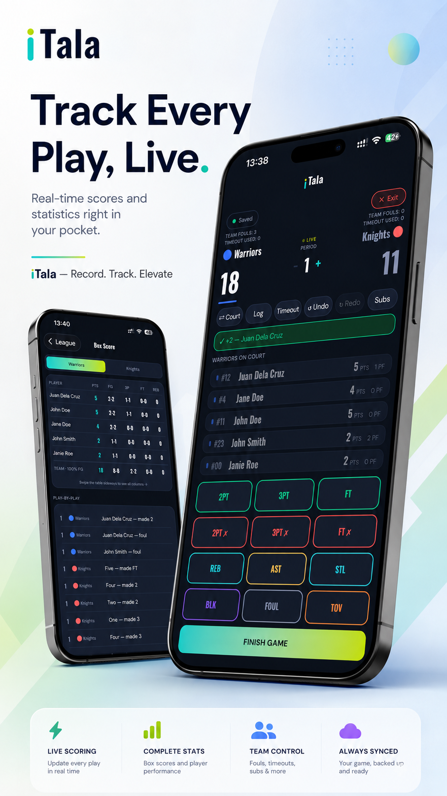

# iTala

[](https://github.com/heeaaa/iTala-official/actions/workflows/ci.yml?query=branch%3Amain)
[](package.json)
[](package.json)

**Record. Track. Elevate.**

iTala is a mobile basketball scoring and league-management app for local, amateur,
recreational and community competitions. It helps scorekeepers record every play,
turn games into complete statistics, and give players and teams a season they can
follow and share.

<p align="center">
  
</p>

## Why iTala

- **Fast live scoring.** A basketball-focused two-tap flow keeps attention on the
  court instead of on data entry.
- **A complete record.** Box scores, play-by-play, standings, leaders and player
  profiles are calculated from each game's event history.
- **Built for unreliable venues.** Active games are saved on the device first, so
  scoring can continue through a weak or interrupted connection.
- **Useful after the buzzer.** iTala produces season records and shareable game and
  player achievement cards, not just a final score.
- **Clear league roles.** League owners manage teams, rosters and league settings,
  while authorized scorekeepers create, run and finalize scheduled or drop-in games.

## Features

### Live games

- Starting-lineup selection and on-court substitutions
- Made and missed field goals, free throws and three-pointers
- Rebounds, assists, steals, blocks, turnovers and fouls
- Team fouls, timeouts, periods, undo/redo and play-by-play
- FIBA-style foul-out handling with a configurable league limit
- Score-only opponents for games where a full away roster is unavailable

### Leagues and statistics

- League, team and roster management, including bulk roster import
- Games grouped by date with finished and live-game states
- Automatic box scores, shooting totals and quarter line scores
- Standings, point differential, streaks and player leaderboards
- Player profiles with averages, career highs and achievement cards; these cover
  the selected league, not a combined career across leagues
- Team profiles and end-of-season recaps

### Sharing and safety

- Box-score and player cards through the native share sheet
- Text sharing as a fallback when image capture or native sharing is unavailable
- In-app reporting for players, teams, games and leagues
- Optional explanation and contact email with a reference number after submission
- In-app account deletion for named accounts

## Connectivity and synchronization

**Set up online.** An internet connection is required for sign-in, creation-code
validation, league creation, team and player management, and drop-in/recreational game
creation. Complete setup and start the game while connected. Entering a valid creation
code does not make the subsequent league-creation form work offline: the server must
create the league and grant its owner permissions.

**Keep scoring through a connection loss.** Once the game and rosters are loaded and
the game is underway, live stat tracking can continue if the connection drops. Game
and event changes are saved on the device, queued for retry, and synchronized when a
connection to Supabase is restored and the server accepts the writes. Check the sync
status to confirm saving has completed; other devices cannot see unsynced changes.

League and roster setup changes do not have the same offline recovery guarantees as
live scoring. A newly created league appearing on-screen is not proof that the server
saved it. Keep setup online and confirm it has synchronized before relying on it.

The repository also has a separate local-only development configuration without
Supabase. It does not activate when a connected build loses Wi-Fi and does not provide
later synchronization. See [Architecture](docs/ARCHITECTURE.md) for its limitations.

Two scorekeepers should not edit the same game simultaneously. Concurrent edits use a
last-write-wins policy, while separate games can be scored independently. See
[Architecture](docs/ARCHITECTURE.md) for the data-flow and recovery model.

## Accounts, content and privacy

In a synced build, iTala creates an anonymous session for guest access and offers
Google sign-in, plus Apple sign-in on iOS, for named accounts. League permissions distinguish viewers,
scorekeepers, owners and platform administrators.

League and roster information is designed for spectator viewing. Any valid app
session, including an anonymous spectator session, can read synced rosters and game
statistics. League owners are responsible for having permission to publish player
information, photographs, team logos and sponsor material.

Users can report identifiable information from player, team, game and league screens.
Reports are stored in a private review queue and are not part of the public app data
model. Named users can delete their account from **Settings → Delete account**.

- [Privacy Policy](site/privacy/index.html)
- [Terms of Use](site/terms/index.html)
- [Content Policy](site/content-policy/index.html)
- [Support](site/support/index.html)

The hosted URLs for these documents must be entered in App Store Connect and Google
Play before release. Repository-relative links above intentionally do not claim a
production domain.

## Platforms and builds

The project targets iOS and Android with Expo SDK 54. The Expo configuration enables
iPad installation, but tablet layout and native integrations must still be verified on
real release hardware before submission.

Expo Go is useful only when its installed SDK matches the project. Native sign-in,
sharing, notifications and release configuration should be validated with a development,
preview or production build rather than treated as proven by Expo Go.

The main stack is Expo, React Native, TypeScript, AsyncStorage and Supabase. EAS provides
development, internal-preview and production build profiles.

## Development

### Requirements

- Node.js and npm compatible with Expo SDK 54
- Expo Go with a matching SDK, or an EAS development build
- Supabase only when testing synced functionality

Install the locked dependencies and start the project:

```bash
npm ci
npx expo start
```

Copy `.env.example` to `.env` and supply the documented Supabase public configuration
only when synced mode is required. Authentication and backend setup are covered in
[Authentication setup](docs/AUTH_SETUP.md) and [Deployment](docs/DEPLOYMENT.md).

### Tests

```bash
npm test
npm run lint
```

`npm test` runs the TypeScript check, reducer/stat/parser tests, a two-device sync suite,
structural repository checks and SQL tests. Database tests run when Postgres is available;
CI requires them rather than allowing a skip. Rendering, gestures, native modules,
screen-reader behavior and real Supabase policies still require the
[manual regression checklist](tests/MANUAL-REGRESSION.md).

GitHub Actions independently runs ESLint, the complete test suite against Postgres, and
a Metro/Hermes export check on pull requests and pushes to `main`.

## Production builds

The profiles in `eas.json` distinguish development clients, internal previews and store
builds:

```bash
eas build --platform ios --profile development
eas build --platform ios --profile preview
eas build --platform ios --profile production
eas submit --platform ios --profile production --latest
```

Building a signed artifact does not establish release readiness by itself. Complete the
reviewer instructions in [App Review preparation](docs/APP_REVIEW.md) before submission.

## Known limitations

- Offline league, team, player and drop-in game setup is not a supported workflow in
  synced builds. Prepare the game online before scoring through a connection loss.
- Local-only installations do not provide multi-device sync, invitations, accounts or
  the server-backed content-report queue.
- Native rendering, sharing, permissions, accessibility and real-device upgrade paths
  are covered by manual checks rather than end-to-end UI automation.
- Store availability and approval status cannot be established from this repository and
  are not claimed here.

## Documentation

| Document | Purpose |
| --- | --- |
| [Architecture](docs/ARCHITECTURE.md) | Local persistence, synchronization, statistics and authorization model |
| [Authentication setup](docs/AUTH_SETUP.md) | Supabase Auth, Google, Apple, anonymous sessions and administration |
| [Deployment](docs/DEPLOYMENT.md) | EAS builds, backend setup, store declarations and release operations |
| [App Review preparation](docs/APP_REVIEW.md) | Reviewer walkthrough, credentials template and submission checklist |
| [Troubleshooting](docs/TROUBLESHOOTING.md) | Development, connectivity and authentication problems |
| [Testing](tests/README.md) | Automated suite design and database-test setup |
| [Manual regression](tests/MANUAL-REGRESSION.md) | Real-device, accessibility and integration checks |
| [Public site](site/README.md) | Landing page, legal policies and support routes |
